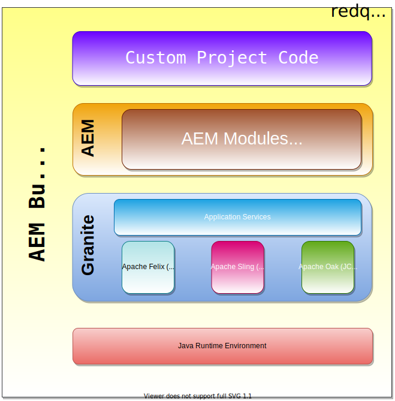

In the previous [post](https://redquark.org/aem/day-01-introduction-to-aem/), we discussed basics of AEM and the reason behind its hype in the Digital Marketing space. In this post, we will go a bit more technical and will try to understand the architecture and the basic building blocks of AEM.

Hence, without further ado, let's dive into the AEM architecture. 

Below is the high level diagram of AEM building blocks -

These blocks are explained below - 

## Java Runtime Environment (JRE) 
Since AEM is built on Java platform, JRE is required to run an AEM based application. JRE is a part of Java Development Kit (JDK) that contains and orchestrates the set of tools and libraries which are required to run a Java application.

Java applications need a runtime environment to load class files, verify access to the memory, and retrieve system resources. JRE bridges the gap between the OS and the application, acting as a layer that runs on top of the OS and smooths over any bumps in service by providing additional resources specific to Java.

Read more about JRE in this [excellent article](https://www.infoworld.com/article/3304858/what-is-the-jre-introduction-to-the-java-runtime-environment.html).

Modern versions of AEM require at least Java 8 and the latest version (6.5) also supports Java 11.

## Granite
Granite is Adobe's **Open Web Stack**. A web stack is nothing but a compilation of software applications, often needed for web development i.e., for the development of web apps and websites. There are usually four major components of any web stack — 
- Operating system
- Database
- Programming language
- Web server

Granite includes the following components — 
- Application server (Jetty)
- OSGi container (Apache Felix)
- JCR API's implementation — CRX (Apache Oak)
- Apache Sling Framework (For RESTful applications)

OSGi what...? Sling what...? :confused: I know these terms are confusing and to be honest they are the jargon which you will almost never hear in any other software applications except AEM. Perhaps OSGi but not others. But fret not, we will discuss them below and as we will move forward with this developer series, you will get more information about these :relieved: technologies.

### Application Server
We all know any web application requires a server to run, and this server may be Apache Tomcat, Jetty, JBoss etc. AEM jar file installation uses **[Apache Jetty](https://www.eclipse.org/jetty/)** which is packaged inside the jar. When we install AEM using jar (by double-clicking the jar or by using the **java -jar** command), then AEM as a web application runs on Jetty.

If you don't want to run AEM on Jetty but on any other application server, you can do that as well. In that case, you just have to get **AEM war** file and deploy it on the application server of your choice. How, you ask? Read [here](https://docs.adobe.com/content/help/en/experience-manager-65/deploying/deploying/application-server-install.html).

### OSGi Container
Now, you might be asking what on earth is OSGi (pronounced as “Oh-es-gee-eye” and not "Osgee")? It is nothing but a set of specifications/rules that defines an architecture for modular applications. In other words, using OSGi we can break our complex applications into simpler modules and can easily manage dependencies among them.

Modules in OSGi are called "Bundles" :package:.

- Bundles are nothing but jar files with a special manifest file. OSGi is a dynamic module system which means bundles can be installed, started, stopped, updated on the fly without shutting down the JVM.
- OSGi manages the lifecycle of bundles and dependencies among them securely. A bundle needs to tell the OSGi container which java packages it imports (the packages this bundle needs) and which java packages it exports (the packages this bundle provides for other bundles to use).
- OSGi even lets you have more than one version of the same package so that we are saved from the **[JAR Hell](https://en.wikipedia.org/wiki/Java_Classloader#JAR_hell)** problem.
- Developing on the OSGi platform means first building your application using OSGi APIs, then deploying it in an OSGi container.
- The OSGi specification defines two things:
    1. A set of services that an OSGi container must implement.
    2. Contract between the container and your application.

What kind of applications benefit from OSGi?

Any application that is designed in a modular fashion where it is necessary to start, stop, update individual modules/bundles with minimal impact on other modules. 

Bundles can define their own transitive dependencies without the need to resolve these dependencies at the container level.

Common OSGi implementations are [Equinox](https://www.eclipse.org/equinox/), [Knopflerfish](https://www.knopflerfish.org/) and [Apache Felix](https://felix.apache.org/). AEM uses Apache Felix as the OSGi container.

I know that these are not enough details that justify using OSGi for AEM but as we will progress in the blog series, we will get to know more about it. Also, you can check out this excellent book from [Neil Bartlett](http://njbartlett.github.io/osgibook.html).

### Java Content Repository (JCR)
The JCR API provides a standard way to access content repositories. Content repositories is a super set of a traditional data repository that adds features such as author based versioning, full text searching, and allows storing of structured and unstructured data.

It can handle structured as well as semi-structured information. It is said that JCR gives us the ***best of both worlds***, which means it combines attributes of file systems and databases.

JCR stores data in the form of nodes and properties.

- Nodes are used to organize the content and can be addressed via a path just like the path of any file in file system.
- Properties store the actual data using simple types (String, Boolean, Number etc) or as binary streams for storing files.

AEM stores its data in JCR. JCR has a rich set of APIs which lets developers to interact with content repository elegantly. Read more about JCR [here](https://docs.adobe.com/docs/en/spec/jcr/2.0/index.html).

### Apache Oak
[Apache Jackrabbit](https://jackrabbit.apache.org/) is an implementation of JCR which implements the entire JCR API. It works well with traditional websites and the integrated content management apps. However, due to the increasing demands (like personalized, interactive, collaborative content, lots of data, distributed applications) of modern websites have rendered some Jackrabbit original design obsolete.

To combat this, [Apache Oak](https://jackrabbit.apache.org/oak/docs/index.html) was introduced. Apache Oak is a scalable, high-performance hierarchical content repository designed for use as the foundation of modern world-class websites and other demanding content applications.

The latest versions of AEM (6.0 and above) use Apache Oak as their JCR implementation.

### Apache Sling
The [Apache Sling](https://sling.apache.org/) lets us access nodes in the content repository using RESTful HTTP requests. In other words, Sling exposes content in the content repository as HTTP resources, fostering a RESTful style application architecture.

Everything in Apache Sling is a **resource** which can be accessed by proper URLs.

Apache Sling uses scripts(JavaScript, Groovy), template language (HTL) or Java Servlets to process HTTP requests and JCR (Apache Oak) as its data store.
 
- **OSGi** — The Sling application is built using OSGi bundles and uses OSGi core services.
- **Sling API** — This API extends the Servlet API and provides functionality to work on the content.
- **Request Processing** — The request URL is first resolved to a resource and then based on resource, a script or servlet is executed to handle the request.
- **Resources** — Sling revolves around *resource*. While handling the request, resource is resolved and then the appropriate script or servlet is executed.
- **Scripts and Servlets** — They are represented as resource themselves and are accessible via resource path.
- **Launchpad** — This launches Sling as a web application.

## AEM Modules
In the above section, we discussed the technologies on which AEM is built. AEM as a CMS has different modules on which all the action happens. In this section, we will discuss two most important modules in AEM — Sites and Assets.

### Sites
Using this module, an organization can develop websites with rich features. These websites are sophisticated, consistent and easily manageable. This module provides abstraction to site creation process such that non-technical digital marketers can create web pages with rich experience without any reliance on software developers.

AEM Sites has three main components -

- **Templates** — Using templates we can specify layout of a web page. These are highly customizable and consistent. We can have both static and editable templates.
- **Pages** — Any number of pages can be created using template(s). Actual content of the website goes on the pages.
- **Components** — These are the building blocks of web-pages. These define a small portion of the page and can be dragged and dropped. Editing content in the components is as easy as editing a Facebook post. Examples of components are — Text, Image, Video, Carousel, Accordion etc.

The development team has to develop the components once, and then they can be used multiple times on any page :star_struck:.

### Assets
Assets mean any media or content. This module helps organization create, store, deliver content for any screen or device. It allows us to store our content and manage our visual assets on cloud, enabling our teams to access project files from multiple locations. This centralized storage improves work efficiency to a great extent.

An author can also edit the assets and their metadata using **out-of-the-box** functionality provided by the AEM. These assets can be used on the website pages and are easily manageable.

## Custom Project Code
After learning about the AEM's in built building blocks, in this section, we will learn about the custom code.

When an organization gets AEM license from Adobe and run the JAR file in their system, AEM can be accessed as a web application with a plethora of features ad a default site. Since one organization has different requirements than the other, they build their custom websites on top of AEM.

They can create their own —
- Templates
- Pages
- Components
- Assets
- Workflows
- Social Media Integrations
- Tags
- ... and many more.

Here, the development teams come into picture. They develop their custom code based on the requirements of the organization using AEM APIs. After completion, this code is deployed on top of AEM. Once the code is deployed, the content authors/digital marketers can edit the contents of the components, pages, templates etc. without any reliance on the development team. THIS IS THE POWER OF AEM :muscle:.

In this developer series, we will be doing the same — develop custom code on top of AEM.

## Conclusion
This is a long post and with a lot of theory :tired_face:. But this theory is essential to understand the concepts behind AEM. So, I hope you are still enthusiastic about AEM.

I would love to hear your thoughts on this post and would like to have suggestions from you to make this post better.

Happy Learning 😊 and Namaste :pray:.

