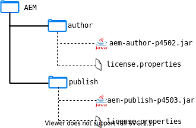
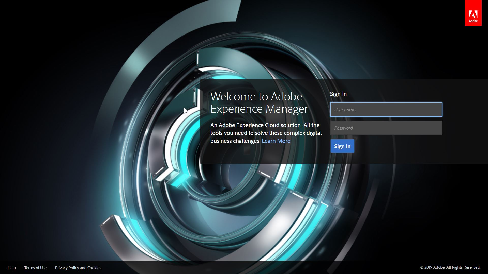
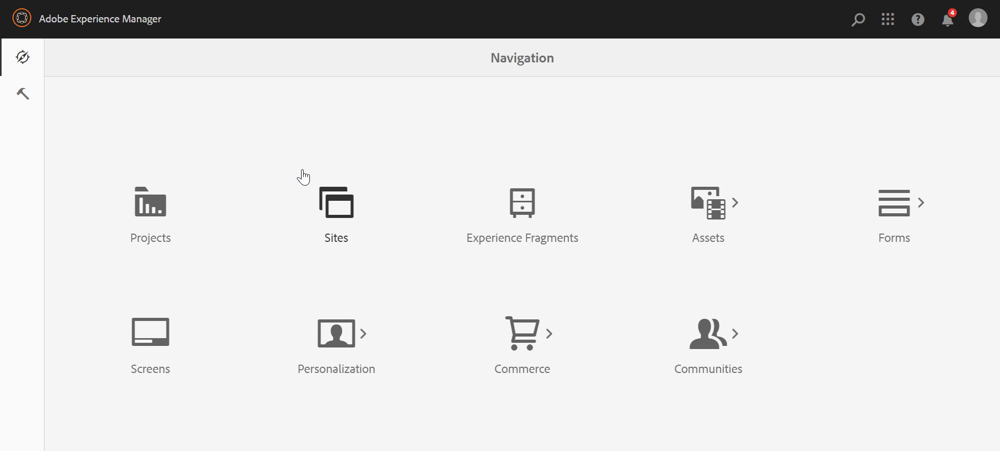
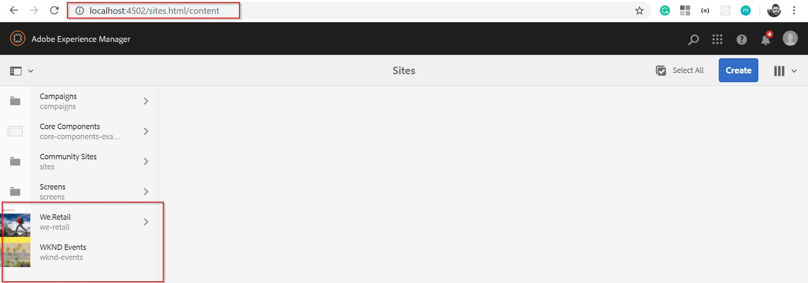
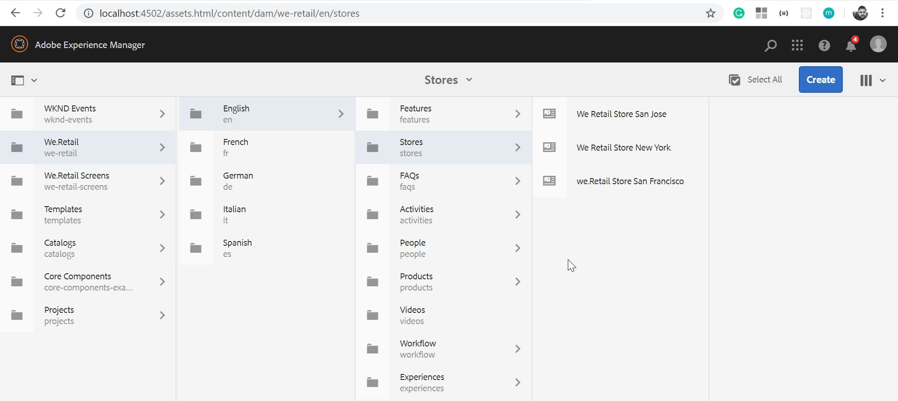
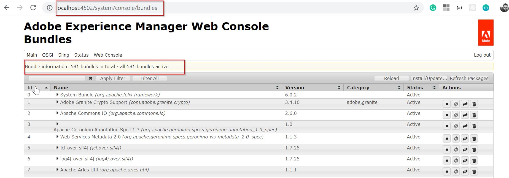
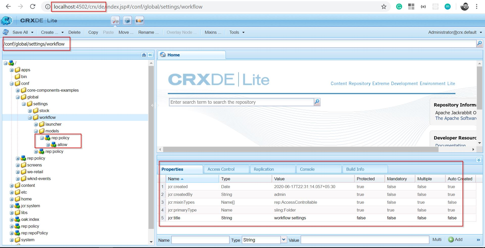

Hola amigos :wave:! In this post, we will discuss how to run a local AEM instance and what are some useful consoles in it. So, without further ado, let's have fun :sunglasses:.

## Install AEM
So first things first, let's see how can we install AEM on our local system. There are two ways to do that -
- Install AEM JAR file directly
- Deploy AEM WAR file on some application server.

In this article, we are going to look into only the first way as it is the most popular and easy way to install AEM.

### Install AEM as a JAR file

**Prerequisites**
- Java 8 or 11 (11 only for AEM 6.5)
- AEM >= 6.3 (6.3, 6.4 or 6.5), in this tutorial I am using AEM 6.5
- RAM >= 4GB (for better performance)

**Steps**
1. Create a directory in your system at your desired location and name it as - AEM.
2. Create two directories in the above created directory. Name them as author and publish.
3. Paste your AEM jar file along with your license.properties file.
- In the author folder, name the jar file as - aem-author-p4502.jar.
- In the publish folder, name the jar file as - aem-publish-p4503.jar.
4. After this, your directory structure should look like this -

5. AEM has two types of servers - author, where content authors make changes to the content and publish, where the end user of the website sees the content. To replicate content from author to the publish instance, we used in built AEM process - Replication.
6. You must have noticed the names of the jar files - it is a standard to use such names which define the mode (author or publish) and ports (4502 or 4503). You can name your file anything but this is the convention we are gonna use in this series.
7. Now, navigate to the author directory and run the following command -
'''shell
java -agentlib:jdwp=transport=dt_socket,address=8000,server=y,suspend=n -jar aem-author-p4502.jar -gui
'''
This command runs the AEM in debug mode; which means you can debug your code while developing. While developing on the local environment, it is always useful to run AEM in debug mode.
If you don't want to run AEM in debug mode then just run the following command -
'''shell
java -jar aem-author-p4502.jar -gui
'''
8. When you first run this command, it will take some time to create the CRX repository and load all the required stuff. After a few minutes, a browser window will automatically open on '''http://localhost:4502/''' and you will see something like this -

9. Login using following credentials
'''
Username: admin
Password: admin
'''
10. You will now see the start screen of AEM at '''http://localhost:4502/aem/start.html/'''. The steps are similar for the publish instance. For this tutorial, we are not going to need publish instance.

Congratulations :handshake:! you have successfully installed AEM on your local system. You should be proud of yourself :clap:.

## AEM Consoles
Now, we have AEM server up and running, we can explore it and see what it offers. We will see important consoles one by one. You will get to know about rest of the consoles as you go deeper into AEM stuff.

### AEM Home Screen
Here, we can icons for different consoles in AEM. It looks like as follows -

### AEM Sites Console
This console will display the pages of the websites that we will create. In a normal installation, a sample website called **We.Retail** is present. You can go ahead and play with it.

### AEM Assets Console
This console will display all the assets in your organization. It lets you store, update, create, or delete assets.

### Felix Console
This console is the one where you can see all the OSGi bundles - out of the box as well as your custom ones. It has various other consoles which we will see gradually.

### CRX/DE
CRX DE stands for **Content Repository eXtreme Development Environment**. It is an implementation of JCR and here we can see the nodes and properties. We can also develop code here.

<i style="margin-top:40px; margin-bottom: 40px;">There are many other consoles in AEM but these four are the most important and a developer interacts with them frequently.</i>

## Conclusion
In this short post, we did our first hands-on on AEM. It's not very interesting but doing this is essential before getting our hands dirty with some code.

In the next post, we will set up our AEM development environment and will get familiar with some tools which are important for enjoyable AEM development.

I would love to hear your thoughts on this post and would like to have suggestions from you to make this post better.

Happy Learning 😊 and Namaste :pray:.

<h6>Note: all AEM related icons/imagery are property of Adobe Systems.</h6>