Hola amigos/amigas :wave:! So far in this AEM development series we have discussed the following questions — 
- What is AEM?
- Why do we need AEM?
- What are the building blocks of AEM?
- ... and a few more.

In this post, we will set up a development environment for AEM and discuss in detail about a general AEM project structure. So, without wasting any time, let's do it.

## Prerequisites

### Java 8 or 11 (for AEM 6.5)
Since AEM is basically a web application based on Java, JDK should be installed in our local system. Read this [official documentation](https://docs.oracle.com/en/java/javase/11/install/) for installing Java. This document is for Java 11, but steps should be similar to Java 8.

Once you have installed Java, open command prompt in your system and execute the following command
```shell
java -version
```

If you have installed Java correctly, the output should show your installed Java version like this -
```shell
java version "1.8.0_251"
Java(TM) SE Runtime Environment (build 1.8.0_251-b08)
Java HotSpot(TM) 64-Bit Server VM (build 25.251-b08, mixed mode)
```

### Maven 3.3.9 or higher
Maven is a build tool which is needed to compile Java based projects. The AEM project we are going to create will also be a Java based project, therefore, having maven installed in your system is a must.
Read this [official documentation](https://maven.apache.org/install.html) for the steps to install maven in your local system.

Once you have installed maven, execute following command in the command prompt
```shell
mvn -version
```

If the installation was correct, you should see your installed maven version something like this -

```shell
Apache Maven 3.6.3
Maven home: D:\Apps\apache-maven-3.6.3\bin\..
Java version: 1.8.0_241, vendor: Oracle Corporation, runtime: C:\Program Files\Java\jdk1.8.0_241\jre
Default locale: en_IN, platform encoding: Cp1252
OS name: "windows 10", version: "10.0", arch: "amd64", family: "windows"
```

#### Setup settings.xml file
Once the maven is installed, we need to set up ```settings.xml``` file which will contain the information of maven repository and other related metadata. Therefore, create a file named `settings.xml` at to **~/.m2/settings.xml** and paste the following text in it.
```xml
<?xml version="1.0" encoding="UTF-8"?>
<settings xmlns="https://maven.apache.org/SETTINGS/1.0.0" 
          xmlns:xsi="https://www.w3.org/2001/XMLSchema-instance" 
          xsi:schemaLocation="https://maven.apache.org/SETTINGS/1.0.0
          https://maven.apache.org/xsd/settings-1.0.0.xsd">
    <profiles>
        <!-- ====================================================== -->
        <!-- A D O B E   P U B L I C   P R O F I L E                -->
        <!-- ====================================================== -->
        <profile>
            <id>adobe-public</id>
            <activation>
                <activeByDefault>true</activeByDefault>
            </activation>
            <properties>
                <releaseRepository-Id>adobe-public-releases</releaseRepository-Id>
                <releaseRepository-Name>Adobe Public Releases</releaseRepository-Name>
                <releaseRepository-URL>https://repo.adobe.com/nexus/content/groups/public</releaseRepository-URL>
            </properties>
            <repositories>
                <repository>
                    <id>adobe-public-releases</id>
                    <name>Adobe Public Repository</name>
                    <url>https://repo.adobe.com/nexus/content/groups/public</url>
                    <releases>
                        <enabled>true</enabled>
                        <updatePolicy>never</updatePolicy>
                    </releases>
                    <snapshots>
                        <enabled>false</enabled>
                    </snapshots>
                </repository>
            </repositories>
            <pluginRepositories>
                <pluginRepository>
                    <id>adobe-public-releases</id>
                    <name>Adobe Public Repository</name>
                    <url>https://repo.adobe.com/nexus/content/groups/public</url>
                    <releases>
                        <enabled>true</enabled>
                        <updatePolicy>never</updatePolicy>
                    </releases>
                    <snapshots>
                        <enabled>false</enabled>
                    </snapshots>
                </pluginRepository>
            </pluginRepositories>
        </profile>
    </profiles>
    <activeProfiles>
        <activeProfile>adobe-public</activeProfile>
    </activeProfiles>
</settings>
```

Now, run the following command -
```shell
mvn help:effective-settings
```

In the output, at the end, if you see ```<activeProfile>adobe-public</activeProfile>```, it means everything is fine. If not, then revisit the above steps carefully.

### IntelliJ IDEA
The IntelliJ IDEA is a modern IDE used for Java based application development. You can download it from the [official website](https://www.jetbrains.com/idea/download/) of JetBrains.

### NodeJS
Latest AEM projects also includes front end modules (front end JavaScript based applications). Therefore, to build those, we also need to have the latest NodeJS and NPM installed in our system. See this [official documentation](https://nodejs.org/en/download/) to do this.

Once installed, run following two commands in the command prompt - 
```
node -v
npm -v
```

The output will be the versions of NodeJS and NPM respectively.
```
v13.8.0
6.13.6
```

## Create AEM Project

After performing above steps, we will now create a new AEM project using IntelliJ IDEA using below steps -

1. Launch IntelliJ-Idea by clicking on the icon. You will see welcome screen of IntelliJ as below - 
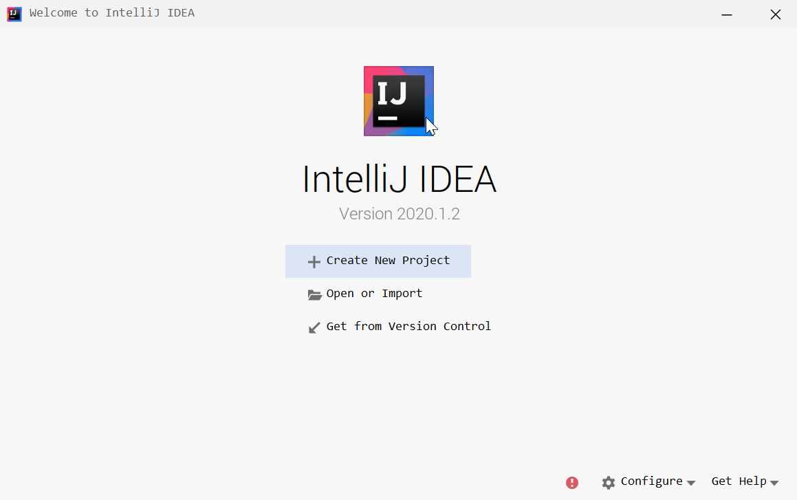

2. Click on the **Configure** icon in the bottom right corner and select **Plugins**.

3. Next screen will show you the installed plugins. Type **AEM** in the search bar. You will see two plugins ***AEM IDE Tooling 4 IntelliJ*** (this is paid now - this is not a must and you should be able to navigate through this tutorial without much issue) and ***AEM IntelliJ Plugin***. Install both and restart IDE.
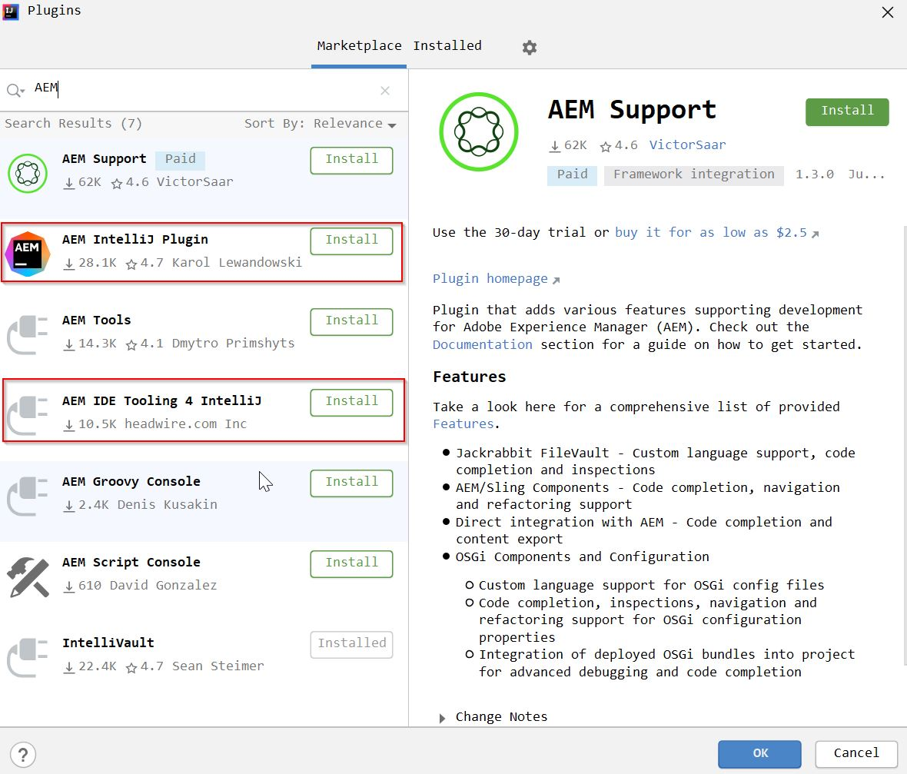

4. Once restarted, you will see welcome screen again. Click on **Create New Project** and select **Maven** from the side rail. Select **Java SDK** and check **Create from archetype**.
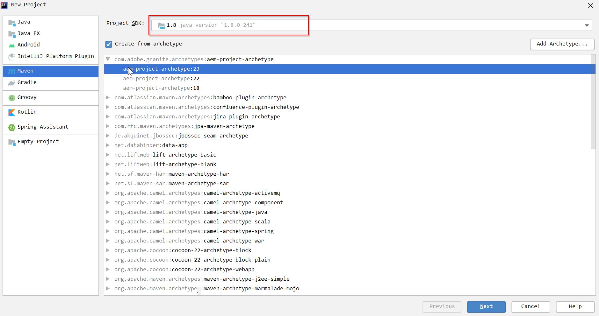

5. Select **com.adobe.granite.archetypes:aem-project-archetype** and select **aem-project-archetype:23** (or whichever is newer) from the list. Click **Next**.

6. In this screen, enter the details as below and click **Next**.
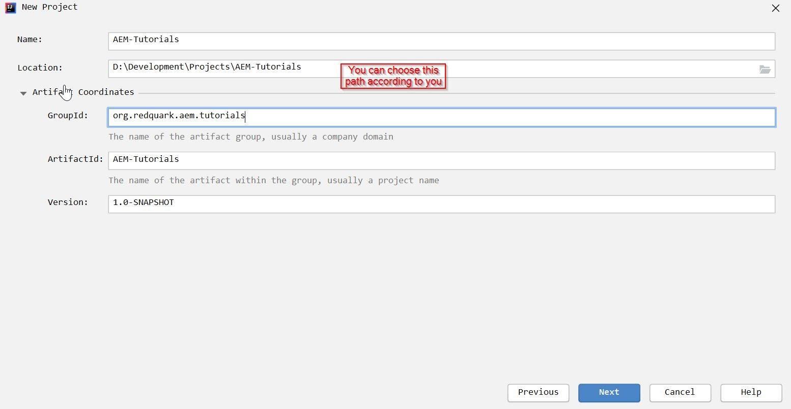

7. On the next screen, enter project details as below and click **Finish**.
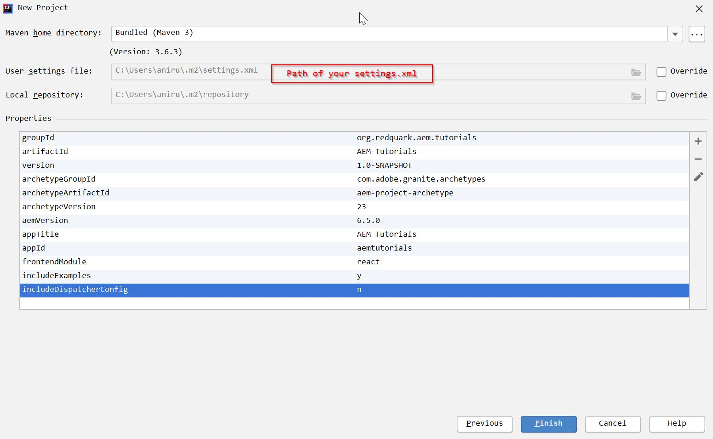

8. As soon as you click on **Finish**, a maven build will kick off which will download all the required dependencies for your project.

9. Once the build is successful, you will have the following project structure in your IDE. In the below screenshot, you can see different modules in an AEM project and also the maven profiles which will be used for building and deploying the code.
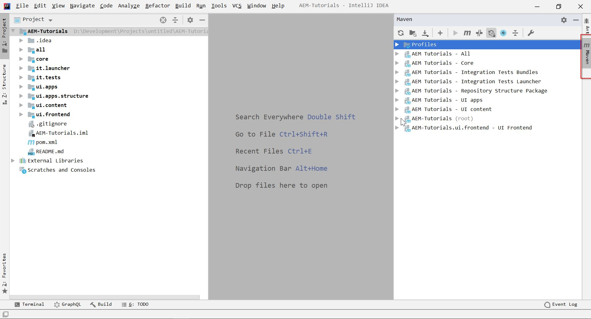

<p style="margin-top: 40px; margin-bottom: 40px;">Congratulations :clap:! You have created your first AEM project successfully. You should be proud of yourself. In the next section we will understand the purpose of different modules in an AEM project.</p>

***Note:*** If you face any issue while creating the project in IntelliJ, then you can follow [this](https://github.com/adobe/aem-project-archetype) document and import it in IntelliJ once created.

## AEM Project Modules

Let's discuss briefly about different parts of AEM project -

### core
All the OSGi related code sits in here. This is actually the bundle part of your AEM project that is deployed on AEM. Thus, all the Java implementations reside here. All the dependencies needed for the **core** bundle to work lie in the ```~/core/pom.xml```. The core bundle is installed as a part of **ui.apps** module, but we can install then independently also (however, this is very rare).

You can install the bundle directly on AEM using following command - 

```shell
mvn -PautoInstallBundle clean install
```

If installed successfully, you can view this in Apache Felix Console or System Console at - http://<host>:<port>/system/console/bundles. [Read more](http://localhost:8000/aem/day-03-aem-consoles/#felix-console).

### ui.apps
This module contains all the rendering code which includes — HTL (Sightly scripts), JavaScript, CSS (normally in the form of clientlibs). The components (building blocks of web pages) also lie here. Along with these, we have our templates, OSGi configurations as well. 

This module also contain Java code, but this practice is rarely used. As a rule of thumb, all Java code goes into the **core** module and all rendering code goes into **ui.apps** module.

This module stores our project structure that is present in the ```/apps``` in [JCR (or CRXDE)](https://redquark.org/aem/day-03-aem-consoles/#crxde). This lets us store our code easily in version control.

All the dependencies needed for the code in this module to work along with the core bundle location are found in ```~/ui.apps/pom.xml``` file.

Not only the repository structure under **/apps** can be changed but also other paths as well using ```~/ui.apps/src/main/content/META-INF/vault/filter.xml``` file.

```xml
<?xml version="1.0" encoding="UTF-8"?>
<workspaceFilter version="1.0">
    <filter root="/apps/aemtutorials"/>
    <filter root="/var/aemtutorials"/>
</workspaceFilter>
```
For e.g., in the above code, two paths will be maintained in the version control — **/apps/aemtutorials** and **/var/aemtutorials**. Similarly, we can add other paths using the ```<filter>...</filter>``` tag.

### ui.content
This includes our websites' content (pages and templates). Nodes under this path can be easily modified in the AEM instance directly.

All our AEM pages are stored under **/content/** and all templates and their policies are stored under **/conf**; thus the ```~/ui.content/src/main/content/META-INF/vault/filter.xml``` file normally contains the following code -

```xml
<?xml version="1.0" encoding="UTF-8"?>
<workspaceFilter version="1.0">
    <filter root="/conf/aemtutorials" mode="merge"/>
    <filter root="/content/aemtutorials" mode="merge"/>
    <filter root="/content/dam/aemtutorials" mode="merge"/>
    <filter root="/content/experience-fragments/aemtutorials" mode="merge"/>
</workspaceFilter>
```

### it.tests
As the name suggests, this is an OSGi bundle which contains unit tests, and it is not deployed in the production. This is not important for our application, and we will remove this module altogether.

### it.launcher
It helps us to trigger the remote JUnit in **it.tests**. This is also not important to our application, and we will remove this module also.

### ui.frontend
This is an optional thing. In modern AEM applications, we have a dedicated front-end build mechanism using Webpack. We can leverage modern web development frameworks like React, Angular, Vue etc for creating our websites' layouts and deploy them on AEM.

You must remember that when we were creating project, we chose ```frontendModule = react```. Thus, if you inspect the ```~/ui.frontend/src```, you will see React based components. Similarly, we can use ```frontendModule = angular``` for Angular based project structure. 

Thus, now the AEM project is divided into two parts — Frontend using **ui.frontend** module and Backend using **core** module. 

Once we build the **ui.frontend** module, it is deployed into AEM as a part of **ui.apps** in the form of client libraries.

### all
This is an empty module. Its only job is to combine all the maven modules and deploy them on AEM as a single package.

### root
The root module of the AEM project is the parent of all the modules we discussed above. It defines configurations specifying all the child modules, default AEM login credentials dependencies and plugins.

```xml
<modules>
    <module>all</module>
    <module>core</module>
    <module>ui.frontend</module>
    <module>ui.apps</module>
    <module>ui.apps.structure</module>
    <module>ui.content</module>
    <module>it.tests</module>
    <module>it.launcher</module>
</modules>
```
As you can see, the ```<modules>...</modules>``` tag contains all the children modules. If we want to add/remove a module, this is the place where we must do it.


## Core Components Inclusion
If you inspect the parent pom.xml or ```~/pom.xml```, you will find something like this - 

```xml

<core.wcm.components.version>${enter latest version}</core.wcm.components.version>
                    .
                    .
                    .
<dependency>
    <groupId>com.adobe.cq</groupId>
    <artifactId>core.wcm.components.core</artifactId>
    <version>${core.wcm.components.version}</version>
</dependency>
<dependency>
    <groupId>com.adobe.cq</groupId>
    <artifactId>core.wcm.components.content</artifactId>
    <type>zip</type>
    <version>${core.wcm.components.version}</version>
</dependency>
<dependency>
    <groupId>com.adobe.cq</groupId>
    <artifactId>core.wcm.components.config</artifactId>
    <type>zip</type>
    <version>${core.wcm.components.version}</version>
</dependency>
<dependency>
    <groupId>com.adobe.cq</groupId>
    <artifactId>core.wcm.components.examples</artifactId>
    <type>zip</type>
    <version>${core.wcm.components.version}</version>
</dependency>
```

These are the dependencies for **AEM Core Components** which are a set of standardized Web Content Management (WCM) components for AEM to speed up development time and reduce maintenance cost of your websites. These are developed using best practices and these can be leveraged in your projects.

The dependencies mentioned above will deploy the core components as part of your project, so you needn't worry about the separate package deployment for them. You can check the latest version of core components and their compatibility [here](https://docs.adobe.com/content/help/en/experience-manager-core-components/using/introduction.html).


## Project Clean Up
Every AEM project comes with some boilerplate code. We will not be needing it as we are going to create everything from the scratch hence we will remove the stuff that we don't need.

1. Go to parent pom ```~/pom.xml``` and remove **it.launcher** and **it.tests** from the module. Now, the <modules> tag will look like this.
```xml
<modules>
    <module>all</module>
    <module>core</module>
    <module>ui.frontend</module>
    <module>ui.apps</module>
    <module>ui.apps.structure</module>
    <module>ui.content</module>
</modules>
```

2. Go to ```~/core/src/main/java/org.redquark.aem.tutorials/``` and delete all the packages.

3. Go to ```~/core/src/test/java/org.redquark.aem.tutorials/``` and delete all the packages.

4. Go to ```~/ui.apps/src/main/content/jcr_root/apps/aemtutorials/components/``` and delete all the components except **page**.

5. Delete ```~/ui.apps/src/main/content/jcr_root/apps/aemtutorials/components/config/author```, ```~/ui.apps/src/main/content/jcr_root/apps/aemtutorials/components/config/stage``` and ```~/ui.apps/src/main/content/jcr_root/apps/aemtutorials/components/config/prod```.


## Deploy Code to AEM
Our project is now ready to be deployed on AEM.

1. Start your AEM Server. How? See [here](https://redquark.org/aem/day-03-aem-consoles/#install-aem).

2. Click on **Maven** in the right of your IntelliJ IDEA screen, you will see something like this -
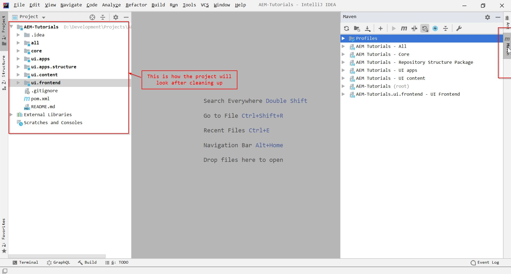

3. Expand **Profiles** in the Maven view and select ```autoInstallSinglePackage```.

4. Now, expand **AEM Tutorials (root)** and click on **clean**. Let the build process run.

5. Once the build is successful, click on **install**. Now, the project will be built after downloading dependencies and install the project on AEM.


6. If everything is correct, you will see following in your console

```
Package installed in 22861ms.
[INFO] ------------------------------------------------------------------------
[INFO] Reactor Summary for AEM-Tutorials 1.0-SNAPSHOT:
[INFO] 
[INFO] AEM-Tutorials ...................................... SUCCESS [  0.670 s]
[INFO] AEM Tutorials - Core ............................... SUCCESS [  5.771 s]
[INFO] AEM-Tutorials.ui.frontend - UI Frontend ............ SUCCESS [09:14 min]
[INFO] AEM Tutorials - Repository Structure Package ....... SUCCESS [  2.371 s]
[INFO] AEM Tutorials - UI apps ............................ SUCCESS [ 11.667 s]
[INFO] AEM Tutorials - UI content ......................... SUCCESS [  6.047 s]
[INFO] AEM Tutorials - All ................................ SUCCESS [ 26.404 s]
[INFO] ------------------------------------------------------------------------
[INFO] BUILD SUCCESS
[INFO] ------------------------------------------------------------------------
[INFO] Total time:  10:10 min
[INFO] Finished at: 2020-06-23T00:45:47+05:30
[INFO] ------------------------------------------------------------------------
```

7. Once installed, navigate to [CRXDE](http://localhost:4502/crx/de) and you will see the following under ```~/apps```.
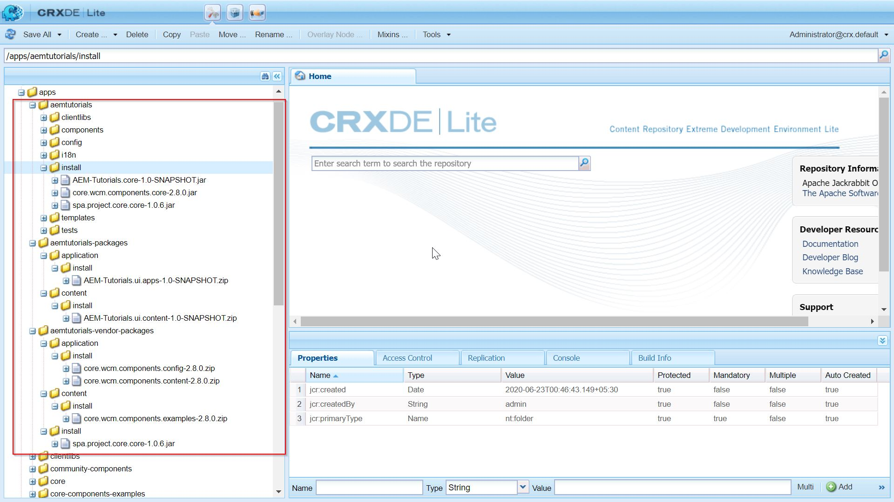

8. Now, navigate to [Apache Felix Console](http://localhost:4502/system/console/bundles) and you will see that your bundles are installed. Make sure they are in the **Active** state.
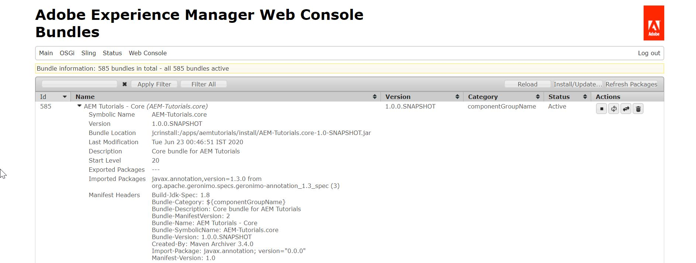

## Sync AEM instance with IntelliJ

When we will develop, there will be cases where we need to sync our AEM server with our developed code. One trivial way to do is run maven build and deploy the code which is a little cumbersome.

Fortunately, we live in modern times when we have the liberty to use awesome plugins created by the software community. There is one such plugin called [IntelliVault](https://plugins.jetbrains.com/plugin/7328-intellivault) which takes all the burden of syncing AEM server with our developed code (This is not applicable for Java code, though) :grimacing:.

Below are the steps to leverage this plugin -

1. Go to this [link](https://repo1.maven.org/maven2/org/apache/jackrabbit/vault/vault-cli/3.4.4/) and download the FileVault zip and extract it your favorite location.

2. Now go to this [link](https://plugins.jetbrains.com/plugin/7328-intellivault) and download the IntelliVault.jar file

3. Go to IntelliJ IDEA and File :arrow_right: Settings... :arrow_right: Plugins :arrow_right: Settings icon :arrow_right: Install Plugin from Disk... :arrow_right: Apply :arrow_right: OK.
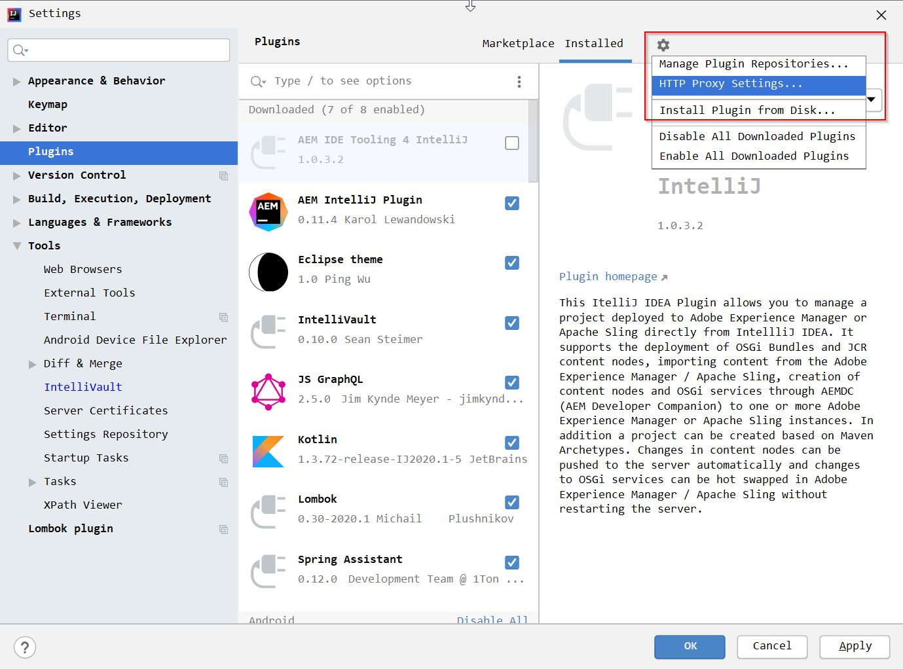

4. Once done, restart the IDE.

5. Go to File :arrow_right: Settings... :arrow_right: Tools :arrow_right: IntelliVault and configure as show in the below screenshot. "Vault Directory" is the path for zip file that you downloaded in step #1.
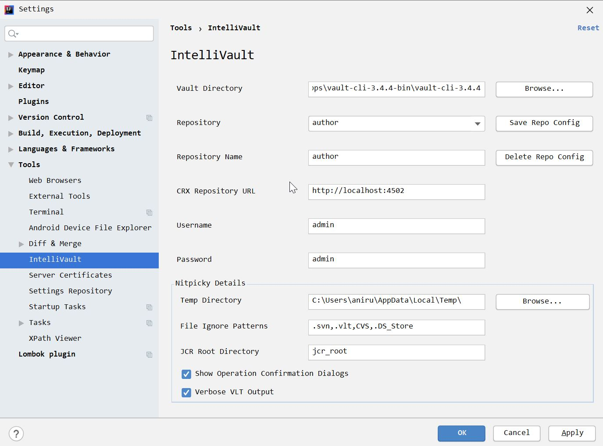

6. Now, to test your installation, go to ```~/ui.apps/src/main/content/jcr_root/apps/aemtutorials/clientlibs``` :arrow_right: IntelliVault :arrow_right: Pull from CRX... and follow the instructions on the screen.
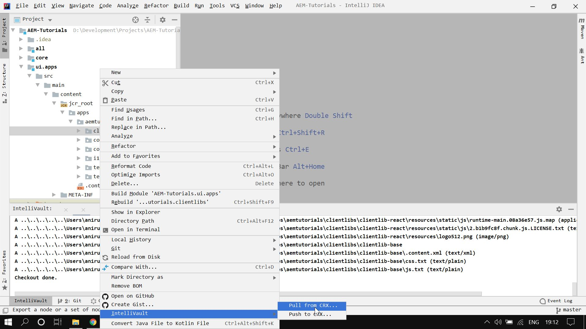

If everything is working as expected up to this point, then you should pat yourself on the back :ok_hand:. You have set up your AEM development environment in local. Congratulations :clap:!

## Conclusion
Phew! it was a long post :weary:. We battled our way to set up an AEM development environment in this post.

I have pushed this project on the GitHub — [AEM Tutorials](https://github.com/ani03sha/AEM-Tutorials). You can refer to it in case you miss something. Also, if you like the post then fork it, star it and contribute into it.

I would love to hear your thoughts on this post and would like to have suggestions from you to make this post better.

Happy Learning 😊 and Namaste :pray:.