Howdy fellow developers :wave:. In this post, we will finally get our hands dirty with code by creating components for pages and templates for creating pages. Before we begin, let's see what are components and templates in AEM.

## Components
In previous posts, we discussed that digital marketers use AEM to show content of their website to the end users. The content creation process in AEM is hassle-free and quick. Those digital marketers can also change the website content on the fly. All of this is possible with components which provide maximum level of abstraction for non-technical users.

Components are the basic building blocks of an AEM website. They can be easily dragged and dropped on to a page. The digital marketers (or content authors) add content (which can be anything — text, image, video, tables etc.) via these components on the websites. Content authors don't have to worry about the internal details of the implementation of these components.

It is the job of AEM developers to convert the business requirements into a fully functional component. Once a component is developed, it can be configured to use anywhere on the website any number of times.

## Templates
Any website is composed of webpages. In AEM, these webpages are created by content authors, and they use components on these pages for putting content. But as you must have seen, most websites have common layout in many webpages; only the content is different on different pages. For e.g., header, footer, navigation, sidebar etc. are same in almost every page of a website. The content in these components doesn't usually change.

It is obviously not a good idea to create these common components on every page again and again. I mean where is reusability :thinking:? Wouldn't it be great if we create this common content once and use it on every page automatically? Yes, of course :heart_eyes:.

AEM templates are the blueprint for every page on the website. In simpler terms, we can create many pages based on a template and all these pages will have the same layout. We can have multiple templates also. For e.g., we can have different templates for creating product details and landing pages. This is cool, ain't it :star_struck:? Well to be honest, AEM is all about cool things.

## Create components for templates
In this section, we will be creating components for our template i.e., those components which will be common to all the pages based on a template.

1. Navigate to [http://localhost:4502/crx/de]

<p style='margin-top: 40px; margin-bottom: 40px;'></p>

2. Go to ```/apps/aemtutorials/components``` :arrow_right: right click :arrow_right: Create... :arrow_right: Create Folder... :arrow_right: Save (CTRL + S).
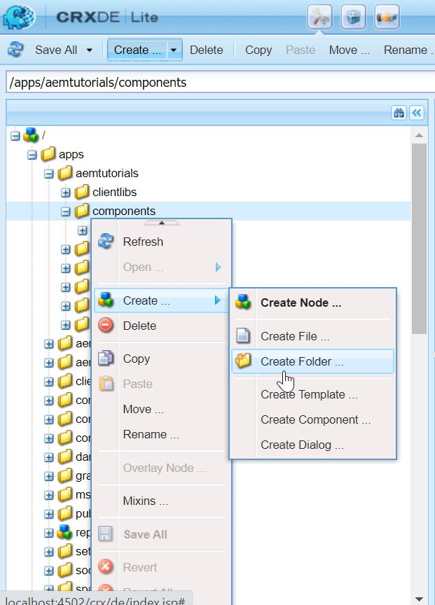

<p style='margin-top: 40px; margin-bottom: 40px;'></p>

3. Enter the name as **structure**.

<p style='margin-top: 40px; margin-bottom: 40px;'></p>

4. Now, select ```/apps/aemtutorials/components/structure``` :arrow_right: Create... :arrow_right: Create Component... and add following details in the dialog :arrow_right: Next :arrow_right: OK :arrow_right: Save.
Here we are using **Group** as **.hidden**. It means this component is not for content the authors to use. This component will be used for creating the template which rarely needs to be changed. If it is necessary to change it, only *super admin* should be able to do it.

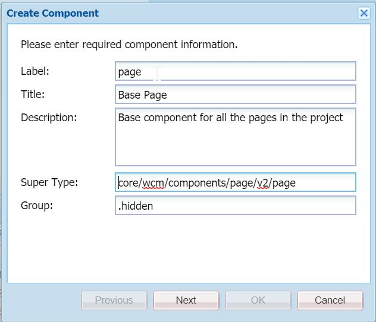

<p style='margin-top: 40px; margin-bottom: 40px;'></p>

5. Delete the **page.jsp** file under the page component. And your **page** component is ready.

### Sling resource super type
You must have noticed while creating component we set **Super Type** property as `core/wcm/components/page/v2/page`. What does this mean :thinking:?

It means we are leveraging Core Components (discussed [here](https://redquark.org/aem/day-04-setup-aem-dev-environment/#core-components-inclusion)). By using `sling:resourceSuperType` property we are inheriting the properties of the **core component's page component** in our page component. It works similar to the OOP concept of inheritance i.e., if some property is not present in the current entity, it will use the same properties defined in the parent of the entity. 

Since for this tutorial, we are not going to create our custom layout, hence we deleted the **page.jsp** file. In real world scenarios, we put our custom implementations including scripts, styles etc. in the component. This can be done by overriding the behavior of core page component.

## Create template
1. Navigate to ```/conf/aemtutorials/settings/wcm/template-types``` and create a new node **base-page** of type of `cq:Template` with the following properties - 

```xml
<?xml version="1.0" encoding="UTF-8"?>
<jcr:root xmlns:cq="http://www.day.com/jcr/cq/1.0" xmlns:jcr="http://www.jcp.org/jcr/1.0" xmlns:mix="http://www.jcp.org/jcr/mix/1.0"
    jcr:mixinTypes="[mix:lockable]"
    jcr:primaryType="cq:Template"
    ranking="{Long}1">
    <jcr:content
        jcr:description="Base template for creating pages"
        jcr:primaryType="cq:PageContent"
        jcr:title="Base Template Type"/>
</jcr:root>
```

2. Now, create a new node **initial** under **base-page** with the following properties - 

```xml
<?xml version="1.0" encoding="UTF-8"?>
<jcr:root xmlns:sling="http://sling.apache.org/jcr/sling/1.0" xmlns:cq="http://www.day.com/jcr/cq/1.0" xmlns:jcr="http://www.jcp.org/jcr/1.0"
    jcr:primaryType="cq:Page">
    <jcr:content
        jcr:primaryType="cq:PageContent"
        sling:resourceType="aemtutorials/components/structure/page"/>
</jcr:root>
```
3. Create another node **policies** under **base-page** with the following properties - 

```xml
<?xml version="1.0" encoding="UTF-8"?>
<jcr:root xmlns:sling="http://sling.apache.org/jcr/sling/1.0" xmlns:cq="http://www.day.com/jcr/cq/1.0" xmlns:jcr="http://www.jcp.org/jcr/1.0" xmlns:nt="http://www.jcp.org/jcr/nt/1.0"
    jcr:primaryType="cq:Page">
    <jcr:content
        jcr:primaryType="nt:unstructured"
        sling:resourceType="wcm/core/components/policies/mappings">
        <root
            jcr:primaryType="nt:unstructured"
            sling:resourceType="wcm/core/components/policies/mapping"/>
    </jcr:content>
</jcr:root>
```

4. Finally, create another node **structure** under **base-page** with the following properties - 

```xml
<?xml version="1.0" encoding="UTF-8"?>
<jcr:root xmlns:sling="http://sling.apache.org/jcr/sling/1.0" xmlns:cq="http://www.day.com/jcr/cq/1.0" xmlns:jcr="http://www.jcp.org/jcr/1.0" xmlns:nt="http://www.jcp.org/jcr/nt/1.0"
    jcr:primaryType="cq:Page">
    <jcr:content
        cq:deviceGroups="[mobile/groups/responsive]"
        jcr:primaryType="cq:PageContent"
        sling:resourceType="aemtutorials/components/structure/page">
        <root
            jcr:primaryType="nt:unstructured"
            sling:resourceType="wcm/foundation/components/responsivegrid"/>
        <cq:responsive jcr:primaryType="nt:unstructured">
            <breakpoints jcr:primaryType="nt:unstructured">
                <phone
                    jcr:primaryType="nt:unstructured"
                    title="Smaller Screen"
                    width="{Long}650"/>
                <tablet
                    jcr:primaryType="nt:unstructured"
                    title="Tablet"
                    width="{Long}1200"/>
            </breakpoints>
        </cq:responsive>
    </jcr:content>
</jcr:root>
```

5. Save all, and now you are ready to create a new template.

<p style='margin-top: 40px; margin-bottom: 40px;'></p>

6. Now, go to [http://localhost:4502/libs/wcm/core/content/sites/templates.html/conf/aemtutorials](http://localhost:4502/libs/wcm/core/content/sites/templates.html/conf/aemtutorials).

<p style='margin-top: 40px; margin-bottom: 40px;'></p>

7. Click on **Create** button and on the next screen select **Base Template Type** and **Next**.

<p style='margin-top: 40px; margin-bottom: 40px;'></p>

8. Enter the values as shown in the below screenshot and click on **Create** and then **Open**.
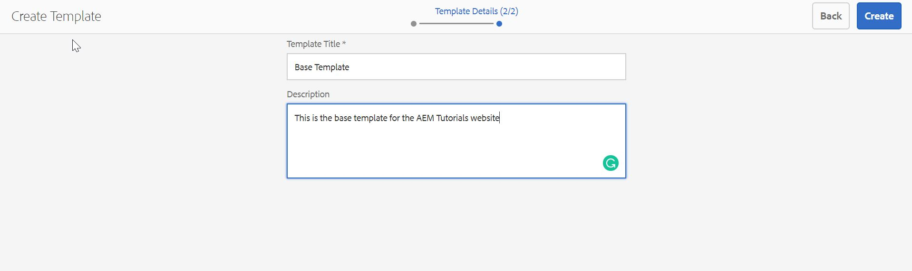

<p style='margin-top: 40px; margin-bottom: 40px;'></p>

9. When the template it opened, click on the :lock: icon and unlock it/
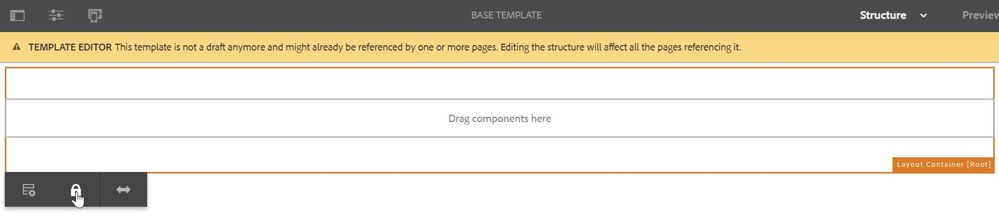

<p style='margin-top: 40px; margin-bottom: 40px;'></p>

10. You will see our template in the **Draft** status. Hover on it and enable it.
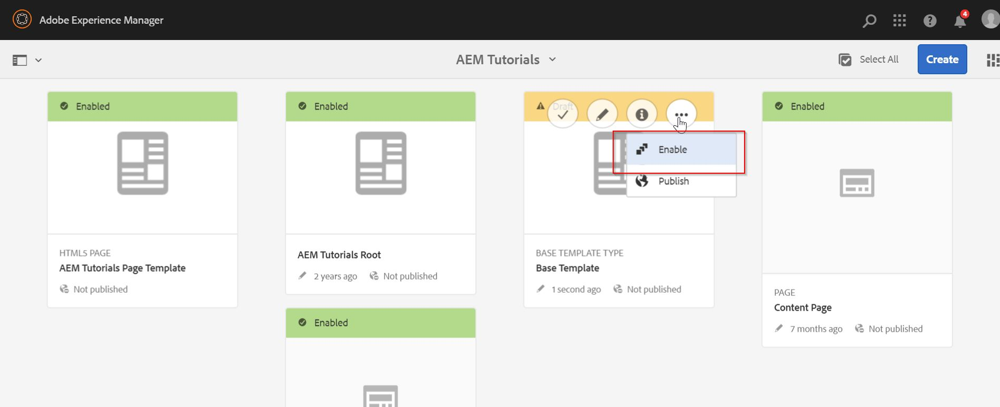

<p style='margin-top: 40px; margin-bottom: 40px;'></p>

11. Now our template is ready for creating pages.

## Create component and page
Now, we have our template ready, we will create a sample component and a page (based on the template created above) to put component on it.

1. Navigate to `/apps/aemtutorials/components` in CRXDE and create a new folder named **content**.

<p style='margin-top: 40px; margin-bottom: 40px;'></p>

2. Now, select `/apps/aemtutorials/components/content` :arrow_right: Create... :arrow_right: Create Component... and add following details in the dialog :arrow_right: Next :arrow_right: OK :arrow_right: Save.
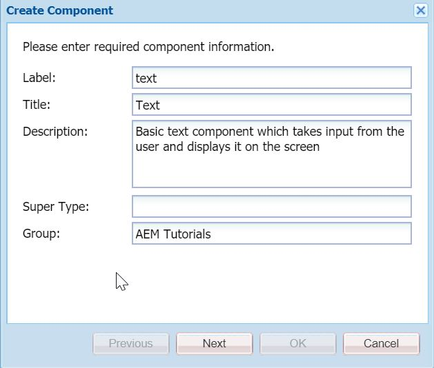

<p style='margin-top: 40px; margin-bottom: 40px;'></p>

3. Rename **text.jsp** to **text.html** under the node `/apps/aemtutorials/components/content/text` and delete everything in it.

<p style='margin-top: 40px; margin-bottom: 40px;'></p>

4. Paste the following code in the `text.html` file - 

```html
<sly data-sly-use.template="core/wcm/components/commons/v1/templates.html" />
<sly data-sly-call="${template.placeholder @ isEmpty=!properties.text}" />
<sly data-sly-test="${properties.text}">
        <h3>Text entered by the user is: ${properties.text}</h3>
</sly>
```

You must be wondering what is this weird looking code :thinking:? This is HTL (HTML Template Language), a language developed by Adobe on top of plain HTML. You can use JavaScript type syntax in it for basic operations such as conditionals, loops, operators etc. But remember, HTL still enables markup, therefore, it has limited capabilities as far as business logic is concerned.

The first two lines of above code are used for putting a placeholder until the component's field(s) are not configured. It uses HTML5's `data-*` attribute to store information with HTL specific `sly`.

Line 3 is using a basic conditional `data-sly-test` which acts as truthy/falsy conditions in JavaScript. In this case, if `properties.text` exists, then only it will display the `<h3>` tag in the markup.

We will discuss HTL in more detail in the later part of this development series.

<p style='margin-top: 40px; margin-bottom: 40px;'></p>

5. Create a new node **cq:dialog** under the `/apps/aemtutorials/components/content/text` of type **nt:unstructured** with the following children nodes and properties - 

```xml
<?xml version="1.0" encoding="UTF-8"?>
<jcr:root 
        xmlns:sling="http://sling.apache.org/jcr/sling/1.0" 
        xmlns:cq="http://www.day.com/jcr/cq/1.0" 
        xmlns:jcr="http://www.jcp.org/jcr/1.0" 
        xmlns:nt="http://www.jcp.org/jcr/nt/1.0"
        jcr:primaryType="nt:unstructured"
        jcr:title="Text"
        sling:resourceType="cq/gui/components/authoring/dialog">
        <content
            jcr:primaryType="nt:unstructured"
            sling:resourceType="granite/ui/components/foundation/container">
            <items jcr:primaryType="nt:unstructured">
                <text
                    jcr:primaryType="nt:unstructured"
                    jcr:title="Text"
                    sling:resourceType="granite/ui/components/foundation/section">
                    <layout
                        jcr:primaryType="nt:unstructured"
                        sling:resourceType="granite/ui/components/foundation/layouts/fixedcolumns"
                        margin="{Boolean}false"/>
                    <items jcr:primaryType="nt:unstructured">
                        <column
                            jcr:primaryType="nt:unstructured"
                            sling:resourceType="granite/ui/components/foundation/container">
                            <items jcr:primaryType="nt:unstructured">
                                <text
                                    jcr:primaryType="nt:unstructured"
                                    sling:resourceType="granite/ui/components/coral/foundation/form/textfield"
                                    fieldDescription="Enter the text of your choice"
                                    fieldLabel="Text"
                                    name="./text"
                                    useFixedInlineToolbar="{Boolean}true"/>
                            </items>
                        </column>
                    </items>
                </text>
            </items>
        </content>
</jcr:root>
```

**cq:dialog** is the node that defines the component's dialog and its properties. Thus, whenever a user opens the component's dialog for editing, fields mentioned in the **cq:dialog** will be shown. In this case, there is only one field named **Text**.

Also, see this definition carefully - 

```xml
<text
    jcr:primaryType="nt:unstructured"
    sling:resourceType="granite/ui/components/coral/foundation/form/textfield"
    fieldDescription="Enter the text of your choice"
    fieldLabel="Text"
    name="./text"
    useFixedInlineToolbar="{Boolean}true"/>
```

Here the **name** property defines the identifier which signify the name under which field value is saved in the JCR. This can be accessed in the code using **properties** (predefined) object.

**sling:resourceType** defines the path in the JCR which denotes the location of scripts used to render the fields/components.

<p style='margin-top: 40px; margin-bottom: 40px;'></p>

6. Now, our component is ready to be used on our webpages.

## Create page and add component to it
1. Navigate to [http://localhost:4502/sites.html/content/aemtutorials/us/en](http://localhost:4502/sites.html/content/aemtutorials/us/en) and click on **Create**. This is the basic site structure created by the AEM project.

<p style='margin-top: 40px; margin-bottom: 40px;'></p>

2. Select **Page** from the options and select **Base Template** on the next screen (remember this is the template we created in the previous section) and **Next**.

<p style='margin-top: 40px; margin-bottom: 40px;'></p>

3. Enter the title of the page as **Base Page** and name of the page as **base-page** and click on **Create**. Now click **Open**.

<p style='margin-top: 40px; margin-bottom: 40px;'></p>

4. Once the page is opened, you will see something like this - 
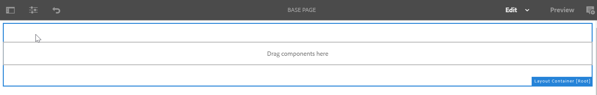

<p style='margin-top: 40px; margin-bottom: 40px;'></p>

5. Now, click in the top left corner and select **Edit Template**.
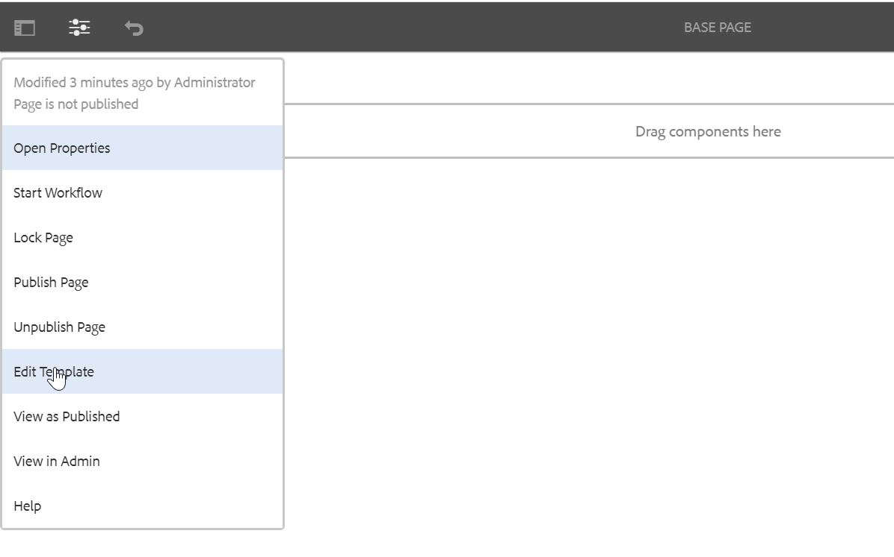

<p style='margin-top: 40px; margin-bottom: 40px;'></p>

6. Once the page is opened, you will see that this is actually the **Base Page** template from which we created the page. Now, we can select which components are allowed in the pages created by this template. Click on the **Policy** icon as show below - 
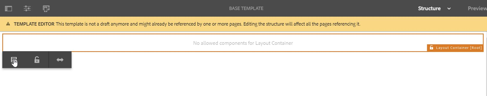

<p style='margin-top: 40px; margin-bottom: 40px;'></p>

7. Enter the new policy name and select the **AEM Tutorials** group from the list. Notice this is the same group we put in the **componentGroup** property while creating the Text component.
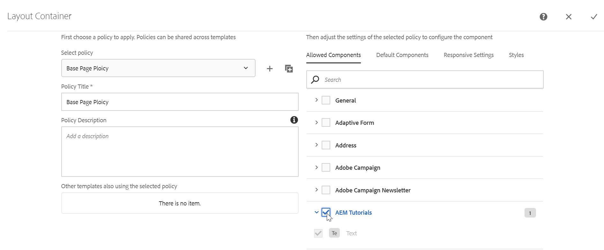

<p style='margin-top: 40px; margin-bottom: 40px;'></p>

8. Go to your page and refresh.

<p style='margin-top: 40px; margin-bottom: 40px;'></p>

9. Click on the **Drag Components Here** area and click on the plus :heavy_plus_sign: sign.

<p style='margin-top: 40px; margin-bottom: 40px;'></p>

10. You will see **Text** component in the list. Click on it, and it will be added on the page. You will see something like this - 
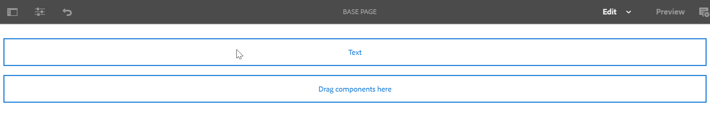
Since we have not yet configured the component, default text is being shown here (from the first two lines in the text.html file).

<p style='margin-top: 40px; margin-bottom: 40px;'></p>

11. Click on the **Text** component and click on the **wrench** :wrench: icon.
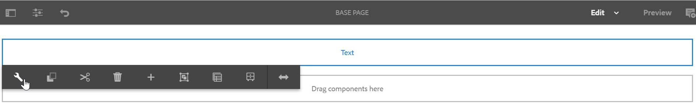

<p style='margin-top: 40px; margin-bottom: 40px;'></p>

12. The component's icon will open, and you will see only one text field which we added while creating the component. Add some text to it and save by clicking on the :heavy_check_mark: icon.
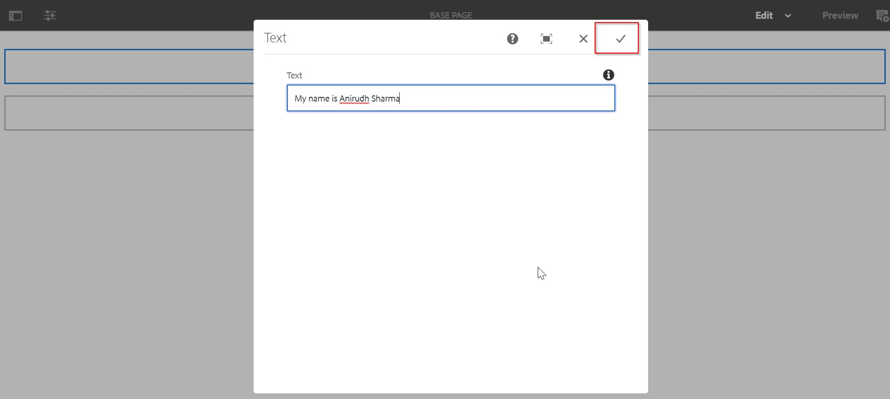

<p style='margin-top: 40px; margin-bottom: 40px;'></p>

13. You will see the output on the screen as below - 
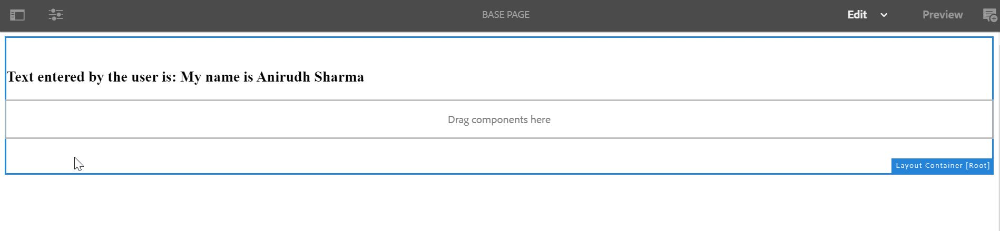

Congratulations :clap: :clap: :clap: :clap: we have created your first AEM component. It's time to pat our backs.

## Sync up code with IntelliJ IDEA
1. Navigate to your folder structure in IDE and right click `~/ui.apps/src/main/content/jcr_root/apps/aemtutorials` :arrow_right: IntelliVault :arrow_right: Pull from CRX...

2. Repeat this step for `~/ui.content/src/main/content/jcr_root/conf/aemtutorials/` and `/ui.content/src/main/content/jcr_root/content/aemtutorials`.

## Note
Since this post only discusses the basics of creating a component in AEM, the component only has basic functionality without any fancy styling. As we will dive deeper into AEM development, we will discuss these things also.

## Conclusion
Phewww :tired_face: this was a long post and a lot of work. But we didn't give up and created our first AEM template, page and component. We should be proud of ourselves :smile:.

I have pushed this project on GitHub — [AEM Tutorials](https://github.com/ani03sha/AEM-Tutorials). You can refer to it in case you miss something. Also, if you like the post then fork it, star it and contribute into it.

I would love to hear your thoughts on this post and would like to have suggestions from you to make this post better.

Happy Learning 😊 and Namaste :pray:.

