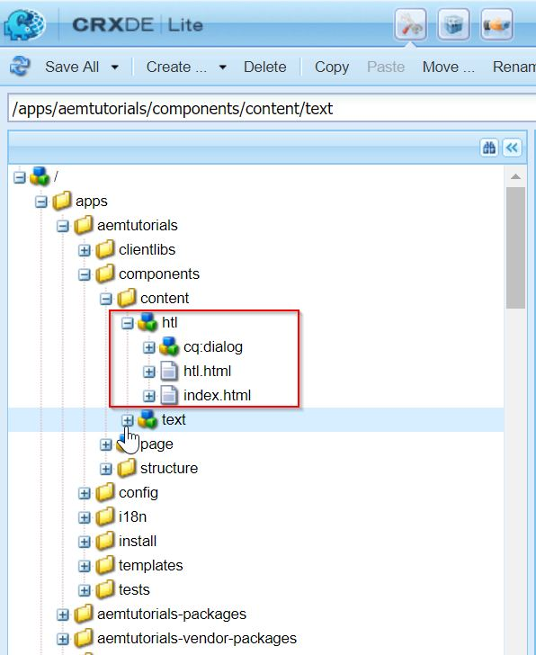
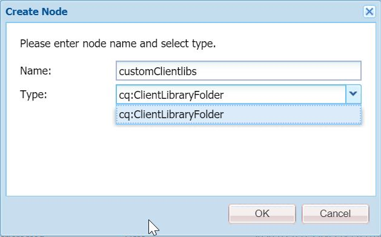
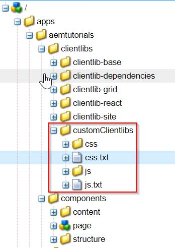
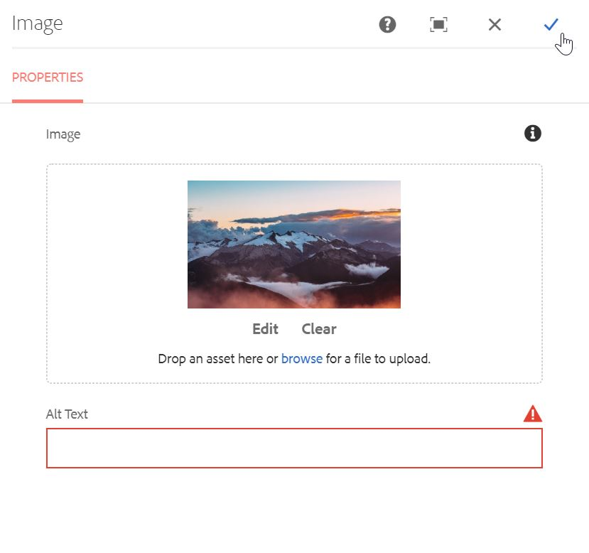

Howdy fellow developers :wave:. In the [last post](https://redquark.org/aem/day-05-develop-components-templates/) we created our first AEM component. There we discussed HTL in brief and our component did not have any styles.

In this post, first we will dive into HTL basics via code examples and in the later part, we will understand the concepts of clientlibs in AEM.

## HTL Basics
In ancient times, JSPs were used to render AEM components on pages. Since then, we have evolved and nowadays developing components using HTL is the preferred way to implement the component's rendering logic. We also use popular frontend frameworks like **React** and **Angular** for this purpose but that is out of the scope for this developer series.

### What is HTL?
HTL stands for **HTML Template Language**. As the name suggests, it is a template language that lets us perform minor logical or computational operations in the HTML code itself. HTL uses an expression language to insert content in the rendered output. It also uses [HTML5 data](https://developer.mozilla.org/en-US/docs/Learn/HTML/Howto/Use_data_attributes) attributes to define conditions and iterations in the markup.

### Advantages of HTL 
1. Since this is only a markup code, front end developers can use it without having any dependency on the backend developers. This makes the process efficient and cheap.
2. It is secure by default as it applies the **context-aware** escaping automatically. HTL understands the HTML and adjusts the required escaping based on this knowledge. [Context-aware escaping](https://cheatsheetseries.owasp.org/cheatsheets/Cross_Site_Scripting_Prevention_Cheat_Sheet.html#xss-prevention-rules) can be done in JSPs also but there developers have to ensure it which causes chances of errors.
3. In HTL, we can use our Java and/or JavaScript object easily and use the data present in those objects as per need.
4. HTL can be used with JSPs as well i.e., if you have some code written in JSP then you can use it with HTL without breaking anything. This helps in enhancing the existing functionality with the latest standards without having to worry about compatibility.

### Expression Language
These are the expressions in HTML code which evaluate to a value. We can use Java and JavaScript objects in these. Objects can be out of the box (which are provided by the default AEM APIs) as well as custom objects (which are provided by the custom code).

These expressions are enclosed between ```$``` and ```{}```. Following are some examples - 

***Example 1:***

```html
<h1>Title of the page is: ${currentPage.title}</h1>
```

The above code is using the `currentPage` to find out the title of the current page. Here `currentPage` is out-of-the-box object which is automatically imported in every HTL file.

***Example 2:***

```html
<h3>Sling Resource Type property of the component node: ${properties.sling:resourceType}</h3>
```

In the above example, we are extracting the `sling:resourceType` property of the component's node in the JCR. Out of the box object `properties` is one of the most widely used out-of-the-box object to get all the values stored in the JCR nodes.

***Example 3:***

```html
<h3>Array join: ${['Batman', 'Superman', 'Flash'] @ join='-'}</h3>
```

Above code will join the values in the array via delimiter **`-`**.

### Block statements
As the name suggests, block statements are used to define a block of code. Block statements allow us to implement simple behaviors in HTML code like conditionals, iterations etc. Following are the few examples - 

1. **data-sly-test**
This is used to test a condition in HTML. It is analogous to the `if` clause in any programming language. If the expression inside `${...}` evaluates to true then the HTML code will be included otherwise not. It evaluates expressions similar to the **truthy/falsy** values in the vanilla JavaScript.

***Example 4:***

```html
<sly data-sly-test="${wcmmode.edit}">
	<h3>We are in the edit mode</h3>
</sly>
<sly data-sly-test="${wcmmode.preview}">
	<h3>We are in the preview mode</h3>
</sly>
```

In the above code, we are testing the authoring modes. If we are in the **Edit** mode then the output will be `We are in the edit mode` and if we are in the **Preview** mode then the output will be `We are in the preview mode`.
The tag `sly` is HTL specific, and it is normally used when we want to test some condition.

2. **data-sly-list**

```html
<sly data-sly-list="${currentPage.parent.listChildren}">
    <ul>
        <li>
            <h3>${item.title}</h3>
        </li>
    </ul>
</sly>
```

This is the most widely used statement when we need to iterate on some list or array. In the above code, we are getting list of all the children pages of the parent of the current page. Notice that we are using `item` identifier which is a local variable that represents elements of the list/array.

Later on, we are extracting title of each element present in the list using this `item` object. It is also one of the predefined objects in HTL which is used with `data-sly-list`.

The following default variables are available within the scope of the list:

```
A. item : The current item in the iteration.
B. itemList : Object holding the following properties:
C. index : zero-based counter ( 0...length-1 ).
D. count : one-based counter ( 1...length ).
E. first : true if the current item is the first item.
F. middle : true if the current item is neither the first nor the last item.
G. last : true if the current item is the last item.
H. odd : true if index is odd.
I. even : true if index is even.
```

3. **data-sly-text**

```html
<h3 data-sly-text="${currentPage.title}">This text will be replaced.</h3>
```

This will replace the content between the tags with the output of the expression.

4. **data-sly-attribute**

```html
<h3 data-sly-attribute.title=${currentPage.title}>Attributes are set for this element</h3>
```

This sets the specified attribute in the element. In the above code, the `title` attribute will be set for the `h3` element. We can check this in the browser's dev tools.

5. **data-sly-repeat**

```html
<h3 data-sly-repeat="${currentPage.parent.listChildren}">${item.name}</h3>
```

This repeats the element in which it is specified multiple times based on the number of elements in the list. In the above, code `h3` element will be repeated multiple times.

6. **data-sly-resource**

```html
<div data-sly-resource="${'text' @ resourceType='aemtutorials/components/content/text'}"></div>
```

This uses the Sling Resolution concept (will be discussed later) to render the specified resource as a part of the current resource. In the above example, we are adding the text component created in the [previous article](https://redquark.org/aem/day-05-develop-components-templates/) as part of the current code. You should be able to see it in the Edit mode.

7. **data-sly-include**
This will include the specified script which is outside the HTL file and render it accordingly.
For e.g., suppose we need to include the following HTML file (index.html) - 

```html
<style>
	.h2-class {
		color: blue;
    }
</style>
<h2 class='h2-class'>
	    This file will be included in the component.
</h2>
```
And then we will include it like this - 
```html
<sly data-sly-include="index.html" />
```

8. **data-sly-template** and **data-sly-call**
These are often used in conjunction. Template blocks can be used like functions which can be called by Call blocks.

```html
<sly data-sly-template.object>
	    This can be called by using 'call'
</sly>
<h3 data-sly-call="${object}"></h3>
```

The output of this will be - 

```html
<h3>
	This can be called by using 'call'
</h3>
```

9. **data-sly-use**
When we need to use Java or JavaScript objects in our code then we use this block statement. AEM has a concept called **Use API** which lets data flow from backend (Java or server side JavaScript) to the frontend.
Let's say we have a Java POJO that returns a user object with some data as -

```java
user.getFirstName(); // returns Anirudh
user.getLastName(); // returns Sharma
user.getAddress(); // returns India
user.getContact(); // returns 1234567890
```

Then we can use it in our HTL code as - 

```html
<sly data-sly-use.user="${org.redquark.aem.tutorials.core.models.User}" />
<h3>Name: ${user.name}</h3>
<h3>Address: ${user.address}</h3>
<h3>Contact: ${user.contact}</h3>
```

We will see this element in more detail when we will learn about sling models.

So, these are some of the most common used expressions and block statements in HTL. I'd highly recommend going through the official specification of HTL [here](https://github.com/adobe/htl-spec/blob/master/SPECIFICATION.md).

All the above code examples are present in a sample component (named 'htl') I created in our project. The final HTL file will look like below - 

```html
<h1>HTL Code Snippets</h1>


<h2><u>Example 1:</u></h2>
<h3>Title of the page is: ${currentPage.title}</h3>


<h2><u>Example 2:</u></h2>
<h3>Sling Resource Type property of the component node: ${properties.sling:resourceType}</h3>


<h2><u>Example 3:</u></h2>
<h3>Array join: ${['Batman', 'Superman', 'Flash'] @ join='-'}</h3>


<h2><u>Example 4:</u></h2>
<sly data-sly-test="${wcmmode.edit}">
	<h3>We are in the edit mode</h3>
</sly>
<sly data-sly-test="${wcmmode.preview}">
	<h3>We are in the preview mode</h3>
</sly>


<h2><u>Example 5:</u></h2>
<sly data-sly-list="${currentPage.parent.listChildren}">
	<ul>
    	<li>
        	<h3>${item.title}</h3>
     	</li>
    </ul>
</sly>


<h2><u>Example 6:</u></h2>
<h3 data-sly-text="${currentPage.title}">This text will be replaced.</h3>


<h2><u>Example 7:</u></h2>
<h3 data-sly-attribute.title=${currentPage.title}>Attributes are set for this element</h3>


<h2><u>Example 8:</u></h2>
<h3 data-sly-repeat="${currentPage.parent.listChildren}">${item.name}</h3>


<h2><u>Example 9:</u></h2>
<div data-sly-resource="${'text' @ resourceType='aemtutorials/components/content/text'}"></div>


<h2><u>Example 10:</u></h2>
<sly data-sly-include="index.html" />


<h2><u>Example 11:</u></h2>
<sly data-sly-template.object>
	This can be called by using 'call'
</sly>
<h3 data-sly-call="${object}"></h3>
```

And the final JCR structure of component will look like below - 



## Clientlibs Basics
Let us say you want to create a new website for your Teddy Bear product. You want this side to be attractive and beautiful along with cool features. To achieve this you will have to write a lot of CSS and JavaScript.

With the complexity of your website, your code complexity will also increase. With this, it becomes more and more difficult to maintain your JavaScript and CSS code. A website made on top of AEM also faces this issue. To combat this, AEM provides a cool feature called **Client Libraries**.

Client libraries allow us to manage our client-side code including JS and CSS and provide options to debug, minify, merge and GZIP the client-side code.

### Steps to create a clientlib

1. Navigate to `/apps/aemtutorials/clientlibs` and create a node named `customClientlibs` of type **cq:ClientLibraryFolder** :arrow_right: Save.


<p style='margin-top: 40px; margin-bottom: 40px;'></p>

2. Now we need to add the categories for the clientlib. **Categories** is the identifier used to directly include this clientlib from a content page or to embed it in other clientlibs. We can categorize our clientlibs using this property to manage files easily and only load whatever we need. The **categories** property, being multi-valued, allows a library folder to be the part of more than one category. Add the **categories** property to the clientlibs node.

```
Name: categories     
Type: String[]    
Value: cq.authoring.dialog
```

3. Create the following structure in the `customClientlibs` folder


<p style='margin-top: 40px; margin-bottom: 40px;'></p>

As you can see, we have created **js** and **css** folders (all JS files will go under `js` folder and all CSS files will go under `css` folder) along with two text files **js.txt** and **css.txt**.

4. Create a new component named **image** at the path `/apps/aemtutorials/components/content` with the following configuration and Save.


<p style='margin-top: 40px; margin-bottom: 40px;'></p>

5. Create a new node under your component **cq:dialog** of type **nt:unstructured**. Now create its children nodes as per the below configuration.

```xml
<?xml version="1.0" encoding="UTF-8"?>
<jcr:root 
        xmlns:sling="http://sling.apache.org/jcr/sling/1.0" 
        xmlns:cq="http://www.day.com/jcr/cq/1.0" 
        xmlns:jcr="http://www.jcp.org/jcr/1.0" 
        xmlns:nt="http://www.jcp.org/jcr/nt/1.0"
        jcr:primaryType="nt:unstructured"
        jcr:title="Image"
        sling:resourceType="cq/gui/components/authoring/dialog">
        <content
            jcr:primaryType="nt:unstructured"
            sling:resourceType="granite/ui/components/foundation/container">
            <layout
                jcr:primaryType="nt:unstructured"
                sling:resourceType="granite/ui/components/foundation/layouts/tabs"
                type="nav"/>
            <items jcr:primaryType="nt:unstructured">
                <tab1
                    jcr:primaryType="nt:unstructured"
                    jcr:title="Properties"
                    sling:resourceType="granite/ui/components/foundation/container">
                    <layout
                        jcr:primaryType="nt:unstructured"
                        sling:resourceType="granite/ui/components/foundation/layouts/fixedcolumns"/>
                    <items jcr:primaryType="nt:unstructured">
                        <columns
                            jcr:primaryType="nt:unstructured"
                            sling:resourceType="granite/ui/components/foundation/container">
                            <items jcr:primaryType="nt:unstructured">
                                <imageSrc
                                    jcr:primaryType="nt:unstructured"
                                    sling:resourceType="cq/gui/components/authoring/dialog/fileupload"
                                    autoStart="{Boolean}false"
                                    class="cq-droptarget field-bgvalue"
                                    fieldDescription="Drag &amp; Drop Image"
                                    fieldLabel="Image"
                                    fileNameParameter="./imageName"
                                    fileReferenceParameter="./imageRef"
                                    id="file-upload-special"
                                    mimeTypes="[image]"
                                    multiple="{Boolean}false"
                                    name="./image"
                                    title="Image"
                                    uploadUrl="${suffix.path}"
                                    useHTML5="{Boolean}true"/>
                                <altText
                                    jcr:primaryType="nt:unstructured"
                                    sling:resourceType="granite/ui/components/foundation/form/textfield"
                                    class="field-prereq"
                                    fieldDescription="Please describe the image for screen readers."
                                    fieldLabel="Alt Text"
                                    id="alt-special"
                                    name="./altText"
                                    validation-error-msg="This field is required when the Image is set."
                                    validation-prereq=".field-bgvalue img"
                                    validation-prereq-attr="src"/>
                            </items>
                        </columns>
                    </items>
                </tab1>
            </items>
        </content>
</jcr:root>
```

This component has one **fileupload** widget and one **textfield**. Our goal is to put validation on the Alt text field. We want the Alt Text field is required only if we author the Image in the **fileupload** widget.

6. For the validation, we have to write some JS code. Therefore, create a new file named `altTextValidation.js` in the js folder and paste the following code in it.

```javascript
$(window).adaptTo("foundation-registry")
.register(
        "foundation.validation.validator", {
        selector : "#alt-special", // validates the specific alt field
        validate : function(el) {
            var $el = $(el);
            var $form = $el.closest('form'); // get the form
            var $upload = $form.find("coral-fileupload[name$=image]"); // find the file upload widget
            if ($upload.hasClass('is-filled') && !$el.val()) { // if class exists, return the validation message
                return "Enter Alt Text";
            } else {
                return;
            }
        }
});
```

This code searches the required class and if the class is found, then the validation passes and the edit dialog will be saved, otherwise, it won't.

7. Now open the js.txt file and paste the following code in it. 

```
#base=js
altTextValidation.js
```

The first line determines the path of the JS files relative to the **js.txt**. The second line determines the JS file be included in the client library. Each JS file we want to include has to be written in a new line.

8. Now open the dialog and try to save it after authoring image but the Alt Text field is empty. The dialog will not save and show validation error.


<p style='margin-top: 40px; margin-bottom: 40px;'></p>

9. Thus, our client libraries are including. Similarly, we can write CSS and include it in the css.txt.

### Other properties in clientlibs
Apart from the few properties discussed in the above section, we have a few other important properties.

1. ***dependencies***
Let's say **clientlibA** depends on **clientlibB** which depends on **clientlibC**, then on the page which is referring to **clientlibA**, all **clientlibC**, **clientlibB** and **clientlibA** will be included. Thus, dependency property signifies if a one clientlib file depends on others.

2. ***embed***
For the minifying purpose, AEM will merge all the clientlibs in the current one. If **clientlibA** embeds **clientlibB** which further embeds **clientlibC**, then **clientlibA** will be loaded by embedding **clientlibB**'s code and **clientlibC** will not be embedded.

### Clientlib configuration
If you navigate to [http://localhost:4502/system/console/configMgr](http://localhost:4502/system/console/configMgr) and search for Adobe Granite HTML Library Manager and open it then you will see it has configurations for Minify, Debug and GZip.


## Conclusion
Congratulations!! 🙋 today we have worked with HTL and Clientlibs along with their basic structures and properties. I hope you enjoyed this post.

I have pushed this project on GitHub - [AEM Tutorials](https://github.com/ani03sha/AEM-Tutorials). You can refer to it in case you miss something. Also, if you like the post then fork it, star it and contribute into it.

I would love to hear your thoughts on this post and would like to have suggestions from you to make this post better.

Happy Learning 😊 and Namaste :pray:.