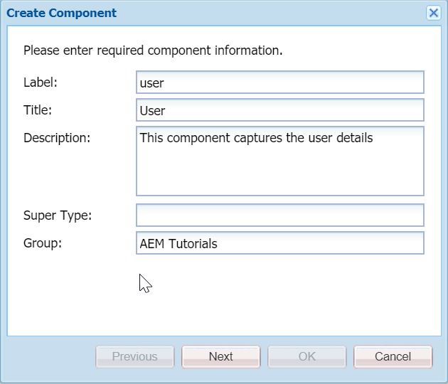
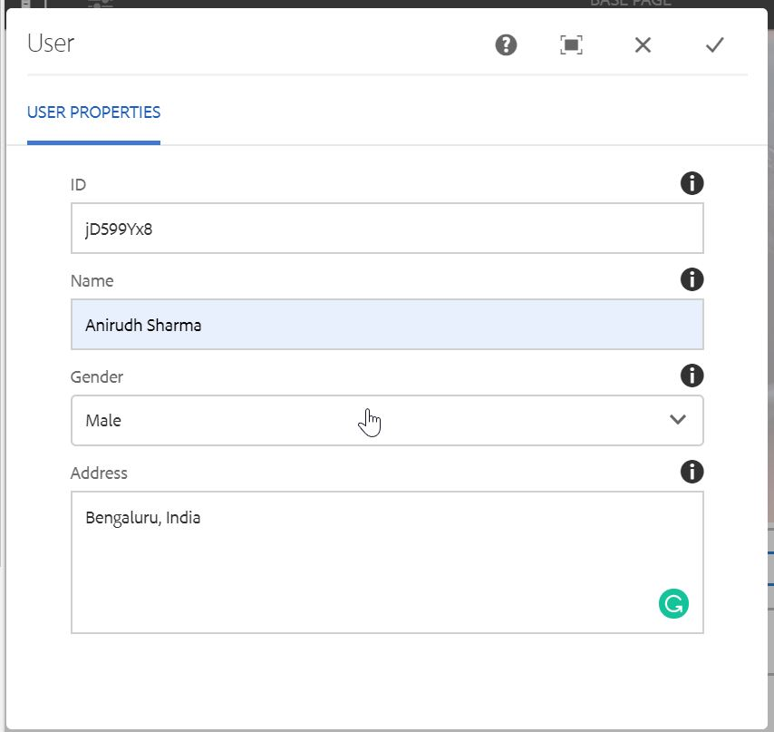

Howdy fellow developers :wave:! In the [last post](https://redquark.org/aem/day-06-htl-clientlibs/), we learned the basics of HTL and clientlibs. Both HTL and clientlibs are responsible for rendering an AEM component on the frontend. But there are times when we need to perform complex business logic on the backend.

<div style="margin-top: 40px; margin-bottom: 40px;"></div>

AEM uses the [OSGi](https://www.osgi.org/developer/what-is-osgi/) framework for its backend activities and as we know from [part 2](https://redquark.org/aem/day-02-aem-building-blocks/#osgi-container) of this developer series, we write our Java code in OSGi bundle and deploy it to AEM.

<div style="margin-top: 40px; margin-bottom: 40px;"></div>

In this post, we will create a simple component and perform some business logic on it using Java and after that we will render the output on the page. For the business logic, we will use a special construct called the **Sling Model**.

## Sling Models
Wouldn't it be great if we have a direct way to map your JCR node properties to our model class? Of course, it would be awesome :sunglasses:. Sling Models lets us do that in AEM.

<div style="margin-top: 40px; margin-bottom: 40px;"></div>

Sling Models are **pure** POJOs which map Sling objects (`resources`, `request` objects etc.).

<div style="margin-top: 40px; margin-bottom: 40px;"></div>

Since Sling Models are annotation-driven Plain Old Java Objects (POJOs), annotations are used a lot. They allow us to map resource properties, assign default values, inject OSGi services and much more.

### Basic Usage
The simplest form of using Sling Models is in which the class is annotated with `@Model`, and with at least one `adaptable`. The fields which need to be injected are annotated with `@Inject`. The injected fields are normally the properties of a component (which the content authors normally set via component dialog).

A simple Sling Model can look like this - 

```java
@Model(adaptables = Resource.class)
public class User {
    
    @Inject
    private String name;

    @Inject
    private String address;

    @Inject
    private String contact;
}
```

In the above code, we are adapting the class with the `org.apache.sling.api.resource.Resource`. A `Resource` is a piece of content on which Sling acts. In this case, a resource is the JCR node for the `User` component added on the page. Everything in Sling is a resource. Here, we are mapping the properties stored in the node represented by the current resource to the private fields `name`, `address` and `contact` (provided they are stored with same name in the JCR. If they are not, we can use `@Named` annotation to resolve this).

<div style="margin-top: 40px; margin-bottom: 40px;"></div>

In the case of interfaces, the field names are replaced by their respective methods.

```java
@Model(adaptables = Resource.class)
public interface User {
 
    @Inject
    String getName();

    @Inject
    String getAddress();

    @Inject
    String getContact();
}
```

Now, if we want to use this class/interface in our client code, it is as simple as using any adapter framework. For example, we can do something like below - 

```java
import org.apache.sling.api.resource.Resource;
.
.
.
Resource resource = ...
.
User user = resource.adaptTo(User.class)
```

As with any **AdapterFactories**, if the adaptation cannot be made, the `adaptTo` method will return null.

### Usage in HTL
We can call our Sling Models in component's HTL code using `data-sly-use` construct by giving the fully qualified name of our model class. A sample code is below - 

```html
<sly data-sly-use.user="org.redquark.aem.tutorials.core.models.User" />
<h3><u>User Details</u></h3>
<p>Name: ${user.name}</p>
<p>Address: ${user.address}</p>
<p>Contact: ${user.contact}</p>
```

In the above code, we are getting the reference of our Sling Model in `user` object, and then we are getting the properties values using the `dot(.)` operator on that object.

### PostConstruct Methods
These methods are annotated with `@PostConstruct` annotation and are invoked as soon as all the injections are completed. If the injection fails, then the method won't be called. We can perform our business logic here.

```java
@Model(adaptables = Resource.class)
public class User {
    
    @Inject
    private String name;

    @Inject
    private String address;

    @Inject
    private String contact;

    private String details;

    @PostConstruct
    protected void init() {
        details = name + "|" + contact + "|" + address;
    }

    public String getDetails() {
        return details;
    }
}
```

There are many other useful properties of Sling Models. You can have a look at them in the official [documentation](https://sling.apache.org/documentation/bundles/models.html).


## Code Example
After discussing the basics of Sling Models, we are now ready to create our component and wire it with the Sling Model.

1. Navigate to `/apps/aemtutorials/components/content` and create a new component (How? See [here](https://redquark.org/aem/day-05-develop-components-templates/#create-component-and-page)) with the following details - 


2. Create a new node **cq:dialog** of type **nt:unstructured** at path `/apps/aemtutorials/components/content/user` with the following definition - 

```xml
<?xml version="1.0" encoding="UTF-8"?>
<jcr:root xmlns:jcr="http://www.jcp.org/jcr/1.0" xmlns:nt="http://www.jcp.org/jcr/nt/1.0" xmlns:cq="http://www.day.com/jcr/cq/1.0" xmlns:sling="http://sling.apache.org/jcr/sling/1.0"
    jcr:primaryType="nt:unstructured"
    jcr:title="User"
    sling:resourceType="cq/gui/components/authoring/dialog">
    <content
        jcr:primaryType="nt:unstructured"
        sling:resourceType="granite/ui/components/foundation/container">
        <layout
            jcr:primaryType="nt:unstructured"
            sling:resourceType="granite/ui/components/foundation/layouts/tabs"
            type="nav"/>
        <items jcr:primaryType="nt:unstructured">
            <properties
                jcr:primaryType="nt:unstructured"
                jcr:title="User Properties"
                sling:resourceType="granite/ui/components/foundation/container">
                <layout
                    jcr:primaryType="nt:unstructured"
                    sling:resourceType="granite/ui/components/foundation/layouts/fixedcolumns"/>
                <items jcr:primaryType="nt:unstructured">
                    <columns
                        jcr:primaryType="nt:unstructured"
                        sling:resourceType="granite/ui/components/foundation/container">
                        <items jcr:primaryType="nt:unstructured">
                            <id
                                jcr:primaryType="nt:unstructured"
                                sling:resourceType="granite/ui/components/foundation/form/textfield"
                                class="field-whitespace"
                                fieldDescription="Auto generated id - you can author this as well"
                                fieldLabel="ID"
                                name="./id"
                                required="{Boolean}true"/>
                            <name
                                jcr:primaryType="nt:unstructured"
                                sling:resourceType="granite/ui/components/foundation/form/textfield"
                                class="field-whitespace"
                                fieldDescription="Please enter the name"
                                fieldLabel="Name"
                                name="./name"/>
                            <gender
                                jcr:primaryType="nt:unstructured"
                                sling:resourceType="granite/ui/components/foundation/form/select"
                                fieldDescription="Select your gender"
                                fieldLabel="Gender"
                                name="./gender">
                                <items jcr:primaryType="nt:unstructured">
                                    <male
                                        jcr:primaryType="nt:unstructured"
                                        text="Male"
                                        value="Male"/>
                                    <female
                                        jcr:primaryType="nt:unstructured"
                                        text="Female"
                                        value="Female"/>
                                    <other
                                        jcr:primaryType="nt:unstructured"
                                        text="Other"
                                        value="Other"/>
                                </items>
                            </gender>
                            <address
                                jcr:primaryType="nt:unstructured"
                                sling:resourceType="granite/ui/components/foundation/form/textarea"
                                class="field-whitespace"
                                fieldDescription="Please enter the complete address"
                                fieldLabel="Address"
                                name="./address"/>
                        </items>
                    </columns>
                </items>
            </properties>
        </items>
    </content>
</jcr:root>
```

3. Navigate to your Java project and create a new Java interface `org.redquark.aem.tutorials.core.models.User` with the following code in it - 

```java
package org.redquark.aem.tutorials.core.models;
public interface User {
        /**
        * @return unique id of the user
        */
        String getId();
        /**
        * @return String to represent the name of the user
        */
        String getName();
        /**
        * @return String to represent the gender of the user
        */
        String getGender();

        /**
        * @return String to represent the address of the user
        */
        String getAddress();
}
```

Here we are designing a user information model with four properties —` id`, `name`, `gender` and `address`. Out of these four, **Id** is the one which will be automatically generated by the backend code (However, we can also make it authorable).

4. As an implementation of the above interface, create a new class `org.redquark.aem.tutorials.core.models.impl.UserImpl` with the following code - 

```java
package org.redquark.aem.tutorials.core.models.impl;
import org.apache.sling.api.SlingHttpServletRequest;
import org.apache.sling.models.annotations.DefaultInjectionStrategy;
import org.apache.sling.models.annotations.Model;
import org.apache.sling.models.annotations.injectorspecific.SlingObject;
import org.apache.sling.models.annotations.injectorspecific.ValueMapValue;
import org.redquark.aem.tutorials.core.models.User;
import org.redquark.aem.tutorials.core.utils.IDGenerator;
import org.slf4j.Logger;
import org.slf4j.LoggerFactory;
import javax.annotation.PostConstruct;
import javax.jcr.Node;
import javax.jcr.RepositoryException;
import javax.jcr.Session;
import java.util.Objects;
@Model(
        adaptables = {SlingHttpServletRequest.class},
        adapters = {User.class},
        resourceType = {UserImpl.RESOURCE_TYPE},
        defaultInjectionStrategy = DefaultInjectionStrategy.OPTIONAL
)
public class UserImpl implements User {

        protected static final String RESOURCE_TYPE = "aemtutorials/components/content/user";
        private static final Logger LOGGER = LoggerFactory.getLogger(UserImpl.class);
        private static final String TAG = UserImpl.class.getSimpleName();

        @ValueMapValue
        String id;

        @ValueMapValue
        String name;

        @ValueMapValue
        String gender;

        @ValueMapValue
        String address;

        @SlingObject
        SlingHttpServletRequest request;

        @PostConstruct
        protected void init() {
            // Get the unique id from generator
            String generatedId = IDGenerator.generateUniqueID(8);
            LOGGER.debug("{}: Generated id is: {}", TAG, generatedId);
            // Getting the reference of the current node
            Node currentNode = request.getResource().adaptTo(Node.class);
            // Stored id, if any
            String storedId;
            // Getting the current session
            Session session = request.getResourceResolver().adaptTo(Session.class);
            try {
                if (currentNode != null && !currentNode.hasProperty("id")) {
                    currentNode.setProperty("id", generatedId);
                } else {
                    // Getting the stored id from the node
                    storedId = Objects.requireNonNull(currentNode).getProperty("id").getString();
                    if (storedId == null || storedId.isEmpty()) {
                        Objects.requireNonNull(currentNode).setProperty("id", generatedId);
                    }
                }
                // Saving the session
                Objects.requireNonNull(session).save();
            } catch (RepositoryException e) {
                LOGGER.error("{}: Error occurred: {}", TAG, e.getMessage());
            }
        }

        @Override
        public String getId() {
            return id;
        }

        @Override
        public String getName() {
            return name;
        }

        @Override
        public String getGender() {
            return gender;
        }

        @Override
        public String getAddress() {
            return address;
        }
}
```

Here, we have adapted the class with `@Model` annotation which will make the OSGi container treat this class as a Sling Model. In the `@Model` annotation, we have four properties - 

```java
// Defines which type of adaptable we are dealing with. Generally, there are two -
// 1. Resource
// 2. SlingHttpServletRequest
adaptables
// Defines under which type(s) the model implementation should be registered in the Models Adapter Factory.
adapters
// With which resource this model class is associated with. In our case, it is associated with the "User" component
resourceType
// Specifies attributes that are required to be injected by default
defaultInjectionStrategy
```

We are mapping all the fields in the dialog with the variables of the class using `@ValueMapValue` which injects a `ValueMap` value. If **via** is not set, it will automatically take resource if the adaptable is the **SlingHttpServletRequest**, if **name** is not set the name is derived from the method/field name.

In the `@PostConstruct` annotated method `init()`, we are getting unique ID from a utility class `IDGenerator` and setting it in the `id` field in the component. Remember this will be executed as soon as all the field are injected.

5. Now, create a utility class `org.redquark.aem.tutorials.core.utils.IDGenerator` with the following code in it - 
```java
package org.redquark.aem.tutorials.core.utils;
import java.nio.charset.StandardCharsets;
import java.util.Random;
public class IDGenerator {

        /**
        * @return Unique id
        */
        public static String generateUniqueID(int n) {
            // Length is bounded by 256 Character
            byte[] array = new byte[256];
            new Random().nextBytes(array);

            String randomString = new String(array, StandardCharsets.UTF_8);
            // Create a StringBuffer to store the result
            StringBuilder r = new StringBuilder();

            // Append first 20 alphanumeric characters
            // from the generated random String into the result
            for (int k = 0; k < randomString.length(); k++) {
                char ch = randomString.charAt(k);
                if (((ch >= 'a' && ch <= 'z') || (ch >= 'A' && ch <= 'Z') || (ch >= '0' && ch <= '9')) && (n > 0)) {
                    r.append(ch);
                    n--;
                }
            }
            // return the resultant string
            return r.toString();
        }
}
```

This is standard Java implementation of generating a unique ID of `n` length.

6. Now, go to `/apps/aemtutorials/components/content/user/user.html` and paste the following code in it - 

```html
<sly data-sly-use.user="org.redquark.aem.tutorials.core.models.User"></sly>
<sly data-sly-use.template="core/wcm/components/commons/v1/templates.html"></sly>
<sly data-sly-call="${template.placeholder @ isEmpty=!user.name}"></sly>
<div data-sly-test="${user.id}">
        <h3 data-sly-test="${user.id}">ID: ${user.id}</h3>
        <h3 data-sly-test="${user.name}">Name: ${user.name}</h3>
        <h3 data-sly-test="${user.gender}">Gender: ${user.gender}</h3>
        <h3 data-sly-test="${user.address}">Address: ${user.address}</h3>
</div>
```

In the first line, we are getting reference of our `User` Sling Model in `user` object using `data-sly-use` construct. Then using this object we are getting field values from the Sling Model and rendering them on the page.

7. Deploy this code to AEM using maven

```shell
mvn -PautoInstallSinglePackage clean install
```

8. Once deployed, go to the page we created in [Part 5](https://redquark.org/aem/day-05-develop-components-templates/) and add the `User` component. It should look like below - 


9. You will notice that the **ID** field is already filled. We can now author the component and the details should be visible on the page after saving the dialog.


## Conclusion
Congratulations!! 🙋 we have dueled with Sling Model classes. I hope you enjoyed this post.

As always, you can find the complete code of this project on my [GitHub](https://github.com/ani03sha/AEM-Tutorials). Feel free to fork or open issues, if any.

I would love to hear your thoughts on this and would like to have suggestions from you to make it better. 

Happy coding and Namaste :smile:.
