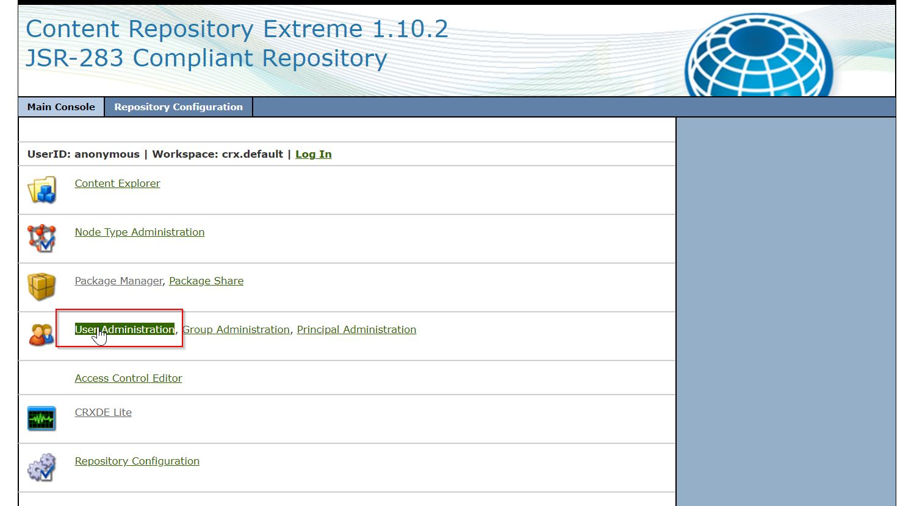
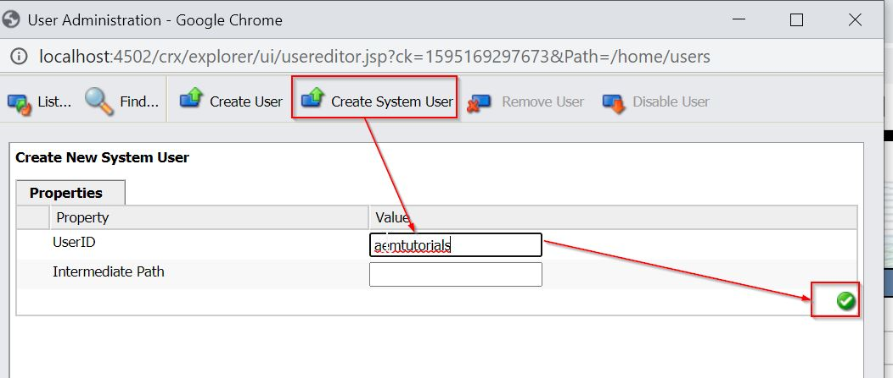
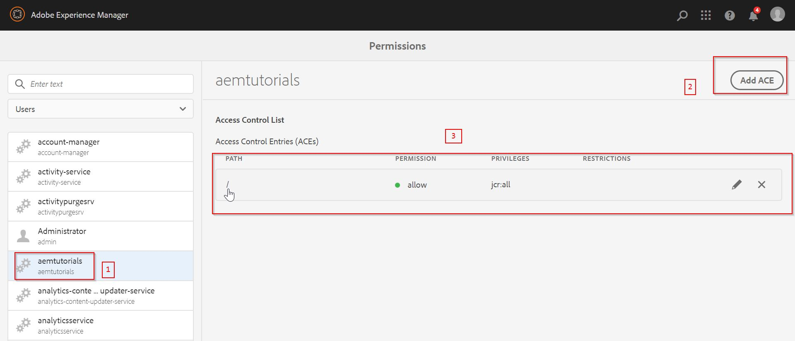
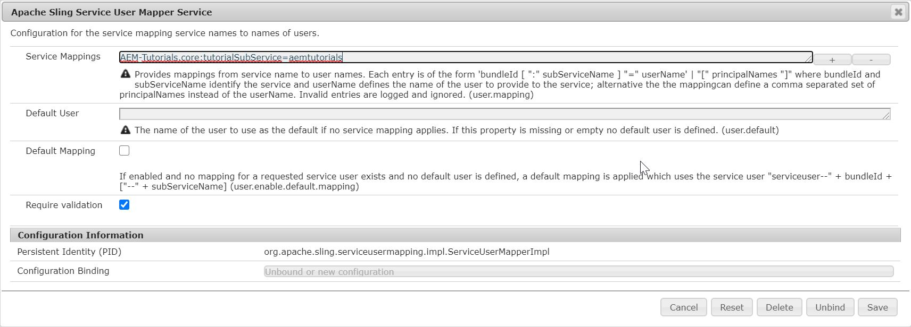
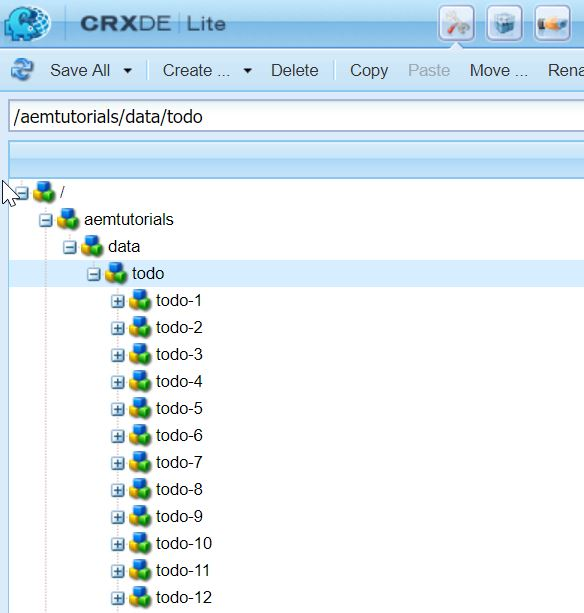

Hello fellow developers :wave:! In this post, we will dive into the basic entities of an OSGi bundle - **Components** and **Services** (remember OSGi Components are different from AEM authoring component).

## Software Modularity
In modern times, complex software can be thought of as a collection of various modules or components. These modules are normally independent of each other and modification in one module does not affect the other modules.

These modules interact with each other via an API. The API is defined as a set of classes and methods which can be used from other components.

If a module uses an API from another module, it has a dependency on the other module, i.e., it requires the other module exists and works correctly.

A module which is used by other components should try to keep its API stable. This avoids that a change affects other modules. But it should be free to change its internal implementation.

## OSGi in short
OSGi stands for **Open Service Gateway initiative**. It is a Java framework for developing and deploying modular software programs and libraries.

OSGi has two parts - 
1. The first part is a specification for modular components called bundles, which are commonly referred to as plug-ins. The specification defines an infrastructure for a bundle's life cycle and determines how bundles will interact.  
2. The second part of OSGi is a Java Virtual Machine (JVM)-level service registry that bundles can use to publish, discover and bind to services in a service-oriented architecture (SOA). 
The components and services can be dynamically installed, activated, de-activated, updated and uninstalled.

The OSGi specification has several implementations, for example, Equinox, Knopflerfish, and Apache Felix. AEM uses Apache Felix implementation. A bundle is the smallest unit of the modularization which means in OSGi, a software component is a bundle. 

## OSGi Services and Components
A service is an object that is registered in the OSGi Service Registry and can be looked up using its interface name(s). The only prerequisite is that a service should implement some interface. For example, I could register a runnable object under the `java.lang.Runnable` interface and clients could look it up using that interface name.

A "component" tends to be an object whose lifecycle is managed, usually by a component framework such as Declarative Services (DS), Blueprint or iPOJO.

A component may have any of the following features, in combination or alone:
1. A component may be started and stopped; this would be considered an "active" component, though that is also an informal term. A component that doesn't need to be started or stopped is called passive.
2. A component may publish itself as an OSGi service.
3. A component may bind to or consume OSGi services.
4. In general, using a component framework is the easiest way to work with OSGi services because the framework will manage the binding to the services that we want to consume. For example, we could say that our component "depends on" a particular service, in which case the component will only be created and activated when that service is available and also it will be destroyed when the service becomes unavailable.

## Code Example
To understand above concepts in detail, we will be creating a functionality in our AEM project that will fetch the data from an external [API](https://jsonplaceholder.typicode.com/todos/) and save this data in JCR.

while creating this functionality, we will be creating OSGi components and services. So without further ado, let's dirty our hands with code :smile:.

### OSGi Component - FetchTODO
As we discussed earlier, an OSGi component is the entity whose lifecycle will be managed by the OSGi container. To make a class act as component, we annotate it with `@Component`. We can start, stop and configure the component using **Apache Felix Web Console**.

Create a new class `org.redquark.aem.tutorials.core.components.FetchTODO` and put the following code in it -
```java
package org.redquark.aem.tutorials.core.components;

import org.apache.commons.lang3.StringUtils;
import org.apache.http.HttpEntity;
import org.apache.http.HttpResponse;
import org.apache.http.client.HttpClient;
import org.apache.http.client.methods.HttpGet;
import org.apache.http.impl.client.HttpClientBuilder;
import org.apache.http.util.EntityUtils;
import org.osgi.service.component.annotations.Activate;
import org.osgi.service.component.annotations.Component;
import org.osgi.service.component.annotations.Reference;
import org.redquark.aem.tutorials.core.services.WriteTODOService;
import org.slf4j.Logger;
import org.slf4j.LoggerFactory;

import java.io.IOException;
import java.time.LocalDateTime;

import static org.redquark.aem.tutorials.core.components.FetchTODO.COMPONENT_NAME;
import static org.redquark.aem.tutorials.core.constants.AppConstants.TODO_ENDPOINT;
import static org.redquark.aem.tutorials.core.constants.AppConstants.TODO_THREAD_SLEEP_TIME;

/**
 * @author Anirudh Sharma
 * <p>
 * This component fetches to-do list for different users from external API and store them
 * in the JCR repository
 */
@Component(immediate = true, name = COMPONENT_NAME)
public class FetchTODO {

    private static final String TAG = FetchTODO.class.getSimpleName();
    private static final Logger LOGGER = LoggerFactory.getLogger(FetchTODO.class);
    protected static final String COMPONENT_NAME = "Fetch Todo Component";

    @Reference
    WriteTODOService writeTODOService;

    @Activate
    protected void activate() {
        LOGGER.info("{}: {} - activated", TAG, COMPONENT_NAME);
        Runnable task = () -> {
            try {
                Thread.sleep(TODO_THREAD_SLEEP_TIME);
                while (!Thread.currentThread().isInterrupted()) {
                    // Get output from the API
                    String todoData = fetchData();
                    // Call the OSGi service which will write data into the repository
                    writeTODOService.writeData(todoData);
                    LOGGER.info("{}: Trying to write TODO data in repository at: {}", TAG, LocalDateTime.now());
                }
            } catch (InterruptedException e) {
                LOGGER.error("{}: Exception occurred: {}", TAG, e.getMessage());
            }
        };
        // Create a new Thread with the above Runnable
        Thread todoThread = new Thread(task);
        // Set the name of the thread
        todoThread.setName("TODO Thread");
        // Start the thread
        todoThread.start();
    }

    private String fetchData() {
        HttpClient httpClient = HttpClientBuilder.create().build();
        // Output in String format
        String output = StringUtils.EMPTY;
        try {
            // GET Request
            HttpGet request = new HttpGet(TODO_ENDPOINT);
            // Set the API media type in http accept header
            request.setHeader("accept", "application/json");
            // Send the request, It will immediately return the response in HttpResponse object
            HttpResponse response = httpClient.execute(request);
            // Get the status code
            int statusCode = response.getStatusLine().getStatusCode();
            if (statusCode != 200) {
                throw new RuntimeException(TAG + ": Failed with error code: " + statusCode);
            }
            // Pull back the response object
            HttpEntity httpEntity = response.getEntity();
            // Getting output in String
            output = EntityUtils.toString(httpEntity);
        } catch (IOException e) {
            LOGGER.error("{}: Exception occurred: {}", TAG, e.getMessage());
        }
        return output;
    }
}
```

In the above code, we are creating a new OSGi component by annotating the class with `@Component` with two properties - 
1. `immediate` - This signifies that as soon as the bundle is activated, the component will be activated.
2. `name` - User specified name of the component

**`@Reference`** - This identifies the annotated member or parameter as a reference of a Service Component. in simpler words, it will inject the reference of the field (much like `@Autowired` in Spring). Here, we are getting reference of `WriteTODOService` (which we will create later in this tutorial).

**`@Activate`**
Method annotated with this annotation executes as soon as the Component becomes active. In this method, we are creating a `java.lang.Runnable` task which is getting the data from the API which is mentioned in the method `fetchData()`. The method `fetchData()` is a simple method which is calling an endpoint and receiving data in response. 

Once we get data, we are calling `WriteTODOService` which is responsible for storing the API data in JCR.

### OSGi Service - WriteTODOService
Since every service is represented by its interface, let's create an interface `org.redquark.aem.tutorials.core.services.WriteTODOService` and paste following code in it.
```java
package org.redquark.aem.tutorials.core.services;

public interface WriteTODOService {

    void writeData(String todoData);
}
```

Let's create an implementation of this interface `org.redquark.aem.tutorials.core.services.impl.WriteTODOServiceImpl` and paste the following code in it -
```java
package org.redquark.aem.tutorials.core.services.impl;

import org.apache.sling.api.resource.ResourceResolver;
import org.json.JSONArray;
import org.json.JSONException;
import org.json.JSONObject;
import org.osgi.framework.Constants;
import org.osgi.service.component.annotations.Component;
import org.osgi.service.component.annotations.Reference;
import org.redquark.aem.tutorials.core.services.ResourceResolverService;
import org.redquark.aem.tutorials.core.services.WriteTODOService;
import org.slf4j.Logger;
import org.slf4j.LoggerFactory;

import javax.jcr.Node;
import javax.jcr.RepositoryException;
import javax.jcr.Session;
import java.util.Objects;

import static org.redquark.aem.tutorials.core.constants.AppConstants.FORWARD_SLASH;

@Component(service = WriteTODOService.class, property = {
        Constants.SERVICE_ID + "= Write TODO Service",
        Constants.SERVICE_DESCRIPTION + "= This service writes todo data in JCR"
})
public class WriteTODOServiceImpl implements WriteTODOService {

    private static final String TAG = WriteTODOServiceImpl.class.getSimpleName();
    private static final Logger LOGGER = LoggerFactory.getLogger(WriteTODOServiceImpl.class);

    private static final String USER_ID = "userId";
    private static final String ID = "id";
    private static final String TITLE = "title";
    private static final String COMPLETED = "completed";
    private static final String TODO_DATA_NODE = "aemtutorials/data/todo";

    @Reference
    ResourceResolverService resourceResolverService;

    @Override
    public void writeData(String todoData) {
        // Check if data is not empty
        if (todoData != null && !todoData.isEmpty()) {
            // Get instance of ResourceResolver
            ResourceResolver resourceResolver = resourceResolverService.getResourceResolver();
            // Adapt this resource resolver to JCR session object
            Session session = resourceResolver.adaptTo(Session.class);
            // Get the reference of the node where we want to store data
            try {
                if (session != null) {
                    // Get the reference of the root node
                    Node node = session.getRootNode();
                    if (!session.nodeExists(FORWARD_SLASH + TODO_DATA_NODE)) {
                        String[] nodePaths = TODO_DATA_NODE.split(FORWARD_SLASH);
                        for (String path : nodePaths) {
                            node = node.addNode(path);
                            session.save();
                        }
                    } else {
                        node = node.getNode(FORWARD_SLASH + TODO_DATA_NODE);
                    }
                    JSONArray jsonArray = new JSONArray(todoData);
                    for (int i = 0; i < jsonArray.length(); i++) {
                        JSONObject jsonObject = jsonArray.getJSONObject(i);
                        Node currentNode;
                        if (!Objects.requireNonNull(node).hasNode("todo-" + jsonObject.getInt(ID))) {
                            currentNode = Objects.requireNonNull(node).addNode("todo-" + jsonObject.getInt(ID));
                            Objects.requireNonNull(currentNode).setProperty(USER_ID, jsonObject.getInt(USER_ID));
                            currentNode.setProperty(ID, jsonObject.getInt(ID));
                            currentNode.setProperty(TITLE, jsonObject.getString(TITLE));
                            currentNode.setProperty(COMPLETED, jsonObject.getBoolean(COMPLETED));
                        }
                    }
                    session.save();
                }
            } catch (RepositoryException | JSONException e) {
                LOGGER.error("{}: Exception occurred: {}", TAG, e.getMessage());
            }
        } else {
            LOGGER.error("{}: No data to be saved in the repository", TAG);
        }
    }
}
```

Here, if you see we have similar annotation `@Component` which has following properties - 
1. `service` - This signifies the name of the interface by which this service is bound to. This property is one that defines a component as a service. Remember this, this is very important. It also implies that - ***Every service is a component but the vice versa is not true***.
2. `property` - Defines the general properties for a service.

**`@Reference`** - Here we are injecting another service `ResourceResolver` service which will be used to get the JCR session object. Later we are using `javax.jcr.Node` API to iterate through the JSON data and creating nodes and properties in the JCR.

> Since JCR node level operations are costly, we should be very careful about writing anything to repository. I am using this example just to show concepts. Please refrain using this example in Production as is.

### OSGi Service - ResourceResolverService
Create a new interface `org.redquark.aem.tutorials.core.services.ResourceResolverService` and post the following code in it - 
```java
package org.redquark.aem.tutorials.core.services;

import org.apache.sling.api.resource.ResourceResolver;

public interface ResourceResolverService {

    /**
     * This method returns the instance of resource resolver
     *
     * @return {@link ResourceResolver}
     */
    ResourceResolver getResourceResolver();
}
```

And now create its implementation `org.redquark.aem.tutorials.core.services.impl.ResourceResolverServiceImpl` and paste the following code in it - 
```java
package org.redquark.aem.tutorials.core.services.impl;

import org.apache.sling.api.resource.LoginException;
import org.apache.sling.api.resource.ResourceResolver;
import org.apache.sling.api.resource.ResourceResolverFactory;
import org.osgi.framework.Constants;
import org.osgi.service.component.annotations.Activate;
import org.osgi.service.component.annotations.Component;
import org.osgi.service.component.annotations.Reference;
import org.redquark.aem.tutorials.core.services.ResourceResolverService;
import org.slf4j.Logger;
import org.slf4j.LoggerFactory;

import java.util.HashMap;
import java.util.Map;

import static org.redquark.aem.tutorials.core.constants.AppConstants.SUB_SERVICE;

@Component(
    service = ResourceResolverService.class,
    property = {
        Constants.SERVICE_ID + "= AEM Tutorial Resource Resolver Service",
        Constants.SERVICE_DESCRIPTION + "= This service is responsible for returning an instance of ResourceResolver"
})
public class ResourceResolverServiceImpl implements ResourceResolverService {

    private static final String TAG = ResourceResolverServiceImpl.class.getSimpleName();
    private static final Logger LOGGER = LoggerFactory.getLogger(ResourceResolverServiceImpl.class);

    @Reference
    ResourceResolverFactory resourceResolverFactory;

    private ResourceResolver resourceResolver;

    @Activate
    protected void activate() {
        try {
            // Service User map
            Map<String, Object> serviceUserMap = new HashMap<>();
            // Putting sub-service name in the map
            serviceUserMap.put(ResourceResolverFactory.SUBSERVICE, SUB_SERVICE);
            // Get the instance of Service Resource Resolver
            resourceResolver = resourceResolverFactory.getServiceResourceResolver(serviceUserMap);
        } catch (LoginException e) {
            LOGGER.error("{}: Exception occurred while getting resource resolver: {}", TAG, e.getMessage());
        }
    }

    @Override
    public ResourceResolver getResourceResolver() {
        return resourceResolver;
    }
}
```

**`ResourceResolverFactory`** - factory class which gives instance of `ResourceResolver`.

**`ResourceResolver`** - This defines the API which may be used to resolve Resource objects and work with such resources like creating, editing or updating them. The resource resolver is available to the request processing servlet through the SlingHttpServletRequest.getResourceResolver() method. A resource resolver can also be created through the `ResourceResolverFactory` service. The `ResourceResolver` is also an Adaptable to get adapters to other types. A JCR based resource resolver might support adapting to the JCR Session used by the resolver to access the JCR Repository.

**`Service User`** - A service user is a JCR user with no password set and a minimal set of privileges that are necessary to perform a specific task. Having no password set means that it will not be possible to login with a service user. Read more about it [here](https://docs.adobe.com/content/help/en/experience-manager-64/administering/security/security-service-users.html).

### Constants
The app constants are created in class `org.redquark.aem.tutorials.core.constants` as follows -
```java
package org.redquark.aem.tutorials.core.constants;

public final class AppConstants {

    public static final String FORWARD_SLASH = "/";

    // TO-DO related constants
    public static final String TODO_ENDPOINT = "https://jsonplaceholder.typicode.com/todos/";
    public static final long TODO_THREAD_SLEEP_TIME = 14400000;

    // Resource Resolver Factory sub-service
    public static final String SUB_SERVICE = "tutorialSubService";
}

```

At this point, we are done with our code. Now, it's time to deploy :sunglasses: using maven
`mvn -PautoInstallSinglePackage clean install`

### Create a service user
1. Navigate to CRX Explorer - [http://localhost:4502/crx/explorer/index.jsp](http://localhost:4502/crx/explorer/index.jsp) and **Login**.
2. Click on **User Administration** as shown below -

3. Create system user as shown below -

4. Navigate to [http://localhost:4502/security/permissions.html/principal/aemtutorials?filter=user](http://localhost:4502/security/permissions.html/principal/aemtutorials?filter=user) and add `jcr:all` permissions on root `/` path as shown below - 


### Configure system user
1. Navigate to config manager [http://localhost:4502/system/console/configMgr](http://localhost:4502/system/console/configMgr) and search for **Apache Sling Service User Mapper Service**.
2. Configure it as follows - 


And that's it... We are done with the code and configuration. Now, if we go to [CRX DE](http://localhost:4502/crx/de), we will see that the nodes are created as shown in the figure below -


## Conclusion
Awesome :sunglasses:! we have dealt with OSGi components and services in this post. I hope you enjoyed the journey.

As always, you can find the complete code of this project on my [GitHub](https://github.com/ani03sha/AEM-Tutorials). Feel free to fork or open issues, if any.

I would love to hear your thoughts on this and would like to have suggestions from you to make it better. 

Happy coding and Namaste :smile:.

<h6>Reference: <a href="https://stackoverflow.com/a/8887216/7920195">StackOverflow</a>