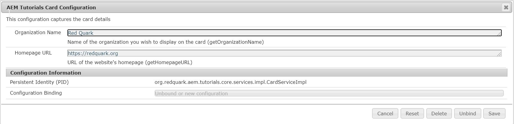
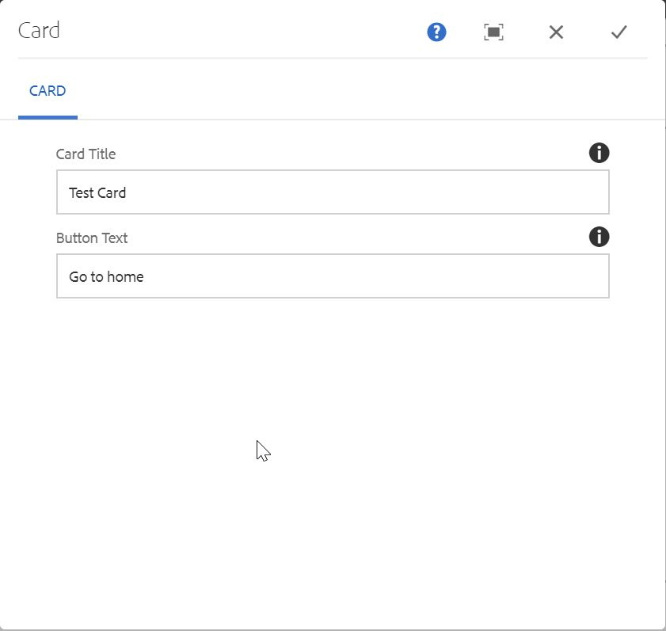

Howdy fellow devs :wave:! We have learned in previous posts of this series about bundles and the framework on which they are built. **Apache Felix** is the OSGi implementation which is used by AEM.

OSGi provides a way to manage bundles and configurations. We can find all the Out of the box OSGi configurations at - [http://localhost:4502/system/console/configMgr](http://localhost:4502/system/console/configMgr). Apart from out of the box configurations, we can also create our custom configurations. In this post, we are going to do just that.

Let's take a use case where we want to create a simple HTML card component in which we would like to use following four things - 
1. Card Title
2. Organization Name
3. Button Text
4. Organization's Homepage URL

Since **Card Title** and **Button Text** will be different for different cards, therefore, we will configure them in the component's dialog. On the other hand, **Organization Name** and **Homepage URL** will be same for all the cards, it's only wise to read these two properties from the OSGi configuration. Cool, eh :sunglasses:?

Similar to the above use case, we can leverage OSGi configurations for read properties that are supposed to be used at many places etc.

Without further ado, let's get our hands dirty with the code.

## Code Example

1. Create a new component named **Card** at the path `~/apps/aemtutorials/components/content/` with the following properties - 
```xml
<?xml version="1.0" encoding="UTF-8"?>
<jcr:root 
    xmlns:jcr="http://www.jcp.org/jcr/1.0" 
    xmlns:cq="http://www.day.com/jcr/cq/1.0"
    jcr:description="This component shows article card"
    jcr:primaryType="cq:Component"
    jcr:title="Card"
    componentGroup="AEM Tutorials"/>
```

2. Now create a new node **cq:dialog** under `/apps/aemtutorials/components/content/card` with the following properties - 
```xml
<?xml version="1.0" encoding="UTF-8"?>
<jcr:root xmlns:jcr="http://www.jcp.org/jcr/1.0" xmlns:nt="http://www.jcp.org/jcr/nt/1.0" xmlns:cq="http://www.day.com/jcr/cq/1.0" xmlns:sling="http://sling.apache.org/jcr/sling/1.0"
    jcr:primaryType="nt:unstructured"
    jcr:title="Card"
    sling:resourceType="cq/gui/components/authoring/dialog">
    <content
        jcr:primaryType="nt:unstructured"
        sling:resourceType="granite/ui/components/foundation/container">
        <layout
            jcr:primaryType="nt:unstructured"
            sling:resourceType="granite/ui/components/foundation/layouts/tabs"
            type="nav"/>
        <items jcr:primaryType="nt:unstructured">
            <properties
                jcr:primaryType="nt:unstructured"
                jcr:title="Card"
                sling:resourceType="granite/ui/components/foundation/container">
                <layout
                    jcr:primaryType="nt:unstructured"
                    sling:resourceType="granite/ui/components/foundation/layouts/fixedcolumns"/>
                <items jcr:primaryType="nt:unstructured">
                    <columns
                        jcr:primaryType="nt:unstructured"
                        sling:resourceType="granite/ui/components/foundation/container">
                        <items jcr:primaryType="nt:unstructured">
                            <cardTitle
                                jcr:primaryType="nt:unstructured"
                                sling:resourceType="granite/ui/components/foundation/form/textfield"
                                class="field-whitespace"
                                fieldDescription="Title of the card"
                                fieldLabel="Card Title"
                                name="./cardTitle"
                                required="{Boolean}true"/>
                            <buttonText
                                jcr:primaryType="nt:unstructured"
                                sling:resourceType="granite/ui/components/foundation/form/textfield"
                                class="field-whitespace"
                                fieldDescription="Button Text"
                                fieldLabel="Button Text"
                                name="./buttonText"/>
                        </items>
                    </columns>
                </items>
            </properties>
        </items>
    </content>
</jcr:root>
```

3. Rename the file `card.jsp` to card.html and put following code in it - 

```html
<sly data-sly-use.card="org.redquark.aem.tutorials.core.models.Card"></sly>
<sly data-sly-use.template="core/wcm/components/commons/v1/templates.html"></sly>
<sly data-sly-call="${template.placeholder @ isEmpty=!card.cardTitle}"></sly>

<sly data-sly-use.clientlib="/libs/granite/sightly/templates/clientlib.html"></sly>
<sly data-sly-call="${clientlib.css @ categories='aemtutorials.card'}"></sly>

<div class="card ph1">
  <div class="overlay">
    <h2 class="title">${card.organizationName}</h2>
    <h2 class="title">${card.cardTitle}</h2>
    <a class="link" href=${card.homepageURL}>${card.buttonText}</a>
  </div>
</div>
```

In this code, first we are referencing our Sling Model and then we are creating object for using clientlibs in our code. Please check [Day 07 - Sling Models](https://redquark.org/aem/day-07-sling-models/) and [Day 06 - HTL and Clientlibs](https://redquark.org/aem/day-06-htl-clientlibs/) to know more about these concepts.

4. Create a new node named **clientlib** under `/apps/aemtutorials/components/content/card` with the following properties - 
```xml
<?xml version="1.0" encoding="UTF-8"?>
<jcr:root xmlns:jcr="http://www.jcp.org/jcr/1.0" xmlns:cq="http://www.day.com/jcr/cq/1.0"
    jcr:primaryType="cq:ClientLibraryFolder"
    allowProxy="{Boolean}true"
    categories="[aemtutorials.card]"/>
```

Here, we are using `categories = [aemtutorials.card]` which is the same we are using in our HTL file in step 3. Another property `allowProxy = true` allows us the clientlib to serve code from `/etc` instead of `/apps`.

5. Create another folder named **css** under `/apps/aemtutorials/components/content/card` and create a file named **style.css** underneath. Put following code in the **style.css** - 

```css
*{margin:0px;padding:0px;-webkit-box-sizing: border-box;-moz-box-sizing: border-box;box-sizing: border-box;font-family: 'Roboto';}

/* --- card ---- */

.card{
  position: relative;
  display: inline-block;
  width: 300px;
  height: 300px;
  margin: 1em;
  background-size: cover;
  border-radius: 10px;
  box-shadow: 0px 25px 50px rgba(0, 0, 0, 0.5);
  overflow: hidden;
  -moz-transition: 0.5s;-o-transition: 0.5s;-webkit-transition: 0.5s;transition: 0.5s;
}
.card.ph1{background: url('//cs622627.vk.me/v622627615/26cdb/sBCCzAw79Cw.jpg') center no-repeat ;background-size: cover;}
.card.ph2{background: url('//cs622627.vk.me/v622627615/26ce5/L2xeil9_uqg.jpg') center no-repeat;background-size: cover;}

.card .overlay{
  width: 100%;
  height: 100%;
  position: absolute;
  padding: 1em;
  top: 0;
  z-index: 10;
  color: #fff;
  -moz-transition: 0.5s;-o-transition: 0.5s;-webkit-transition: 0.5s;transition: 0.5s;
}

.card .overlay h2{
  position: relative;
  margin: 2em 0px;
  top: -200px;
  -moz-transition: 0.5s;-o-transition: 0.5s;-webkit-transition: 0.5s;transition: 0.5s;
}

.card .overlay a{
  position: relative;
  width: 60%;
  top: 200px;
  padding: 0.5em 2em;
  border: 2px solid #fff;
  text-decoration: none;
  color:#FFFFFF;
  border-radius: 3px;
  -moz-transition: 0.5s;-o-transition: 0.5s;-webkit-transition: 0.5s;transition: 0.5s;
}
.card a:hover{background: #fff;color:#5c5c5c;}

.card:hover .overlay{background: rgba(92, 92, 92, 0.8);}
.card:hover h2{top: 0px;}
.card:hover a{top: 0px;}

@media screen and (max-width: 700px){

  .card{
    position: relative;
    display:block;
    width: 100%;
    height: 300px;
    margin: 3em 0em;
    border-radius: 0px;
    box-shadow: 0px 25px 50px rgba(0, 0, 0, 0.5);
    overflow: hidden;
    transition: all .4s ease;
  }
}
```

6. Create a new file named **css.txt** under `/apps/aemtutorials/components/content/card/clientlib` and paste following code in it -
```
#base=css
style.css
```

Here, we are specifying the base folder under which our CSS files is present and in the next line, we are specifying the name of the css file. We can also mention multiple files (each in a new line).

7. At this point, we are done with our component's front end code, let's now work on our backend code. Create a new interface named `org.redquark.aem.tutorials.core.configs.CardConfiguration` and paste the following code in it -

```java
package org.redquark.aem.tutorials.core.configs;

import org.osgi.service.metatype.annotations.AttributeDefinition;
import org.osgi.service.metatype.annotations.ObjectClassDefinition;

@ObjectClassDefinition(
        name = "AEM Tutorials Card Configuration",
        description = "This configuration captures the card details"
)
public @interface CardConfiguration {

    @AttributeDefinition(
            name = "Organization Name",
            description = "Name of the organization you wish to display on the card"
    )
    String getOrganizationName();

    @AttributeDefinition(
            name = "Homepage URL",
            description = "URL of the website's homepage"
    )
    String getHomepageURL();
}
```

This code serves as our OSGi configuration. It is annotated with `@ObjectClassDefinition` which makes it behave as a meta type resource. So, in this case, our class will behave as an OSGi configuration with name **AEM Tutorials Card Configuration** in the `~/system/console/configMgr`.

Inside this class, we have two fields, **Organization Name** and **Homepage URL** which are configurable. By default, they take String parameters.

8. After we have created the configuration, we will require an OSGi service which will read the values present in the OSGi configuration which we will later use in our component's sling model. Create a new interface at `org.redquark.aem.tutorials.core.services.CardService` with the following code in it - 

```java
package org.redquark.aem.tutorials.core.services;

public interface CardService {

    /**
     * @return name of the organization
     */
    String getOrganizationName();

    /**
     * @return URL of the home page
     */
    String getHomepageURL();
}
```

9. Let's now create implementation of the `CardService` at `org.redquark.aem.tutorials.core.services.impl.CardServiceImpl` with the following code in it - 

```java
package org.redquark.aem.tutorials.core.services.impl;

import org.osgi.framework.Constants;
import org.osgi.service.component.annotations.Activate;
import org.osgi.service.component.annotations.Component;
import org.osgi.service.metatype.annotations.Designate;
import org.redquark.aem.tutorials.core.configs.CardConfiguration;
import org.redquark.aem.tutorials.core.services.CardService;
import org.slf4j.Logger;
import org.slf4j.LoggerFactory;

@Component(
        service = CardService.class,
        immediate = true,
        property = {
                Constants.SERVICE_ID + "=Card Service",
                Constants.SERVICE_DESCRIPTION + "=This service reads values from Card Configuration"
        })
@Designate(ocd = CardConfiguration.class)
public class CardServiceImpl implements CardService {

    private static final String TAG = CardServiceImpl.class.getSimpleName();
    private static final Logger LOGGER = LoggerFactory.getLogger(CardServiceImpl.class);

    private CardConfiguration configuration;

    @Activate
    protected void activate(CardConfiguration configuration) {
        this.configuration = configuration;
    }

    @Override
    public String getOrganizationName() {
        LOGGER.info("{}: reading organization name", TAG);
        return configuration.getOrganizationName();
    }

    @Override
    public String getHomepageURL() {
        LOGGER.info("{}: reading homepage url", TAG);
        return configuration.getHomepageURL();
    }
}
```

Here, we are using `immediate = true` which will activate this service as soon as the bundle is started. We require this because we want our configuration's values to be read as soon as the bundle starts.

This class is also annotated with `@Designate` which defines the OSGi configuration this service will be reading from. 

Then, we are initializing the instance of `CardConfiguration` in the `@Activate` method. Notice that we have getters which correspond to the two fields we are configuring from the  `CardConfiguration`. We can have other methods, but for these use case, these two are enough.

10. Now, it's time to code our sling model. Create a new interface - `org.redquark.aem.tutorials.core.models.Card` with the following code in it - 

```java
package org.redquark.aem.tutorials.core.models;

public interface Card {

    /**
     * @return the title of the card
     */
    String getCardTitle();

    /**
     * @return the text on the button
     */
    String getButtonText();

    /**
     * @return organization name from the osgi config
     */
    String getOrganizationName();

    /**
     * @return homepage url from the osgi config
     */
    String getHomepageURL();
}
```

11. Now, create the implementation of the above interface at - `org.redquark.aem.tutorials.core.models.impl.CardImpl` with the following code in it - 

```java
package org.redquark.aem.tutorials.core.models.impl;

import org.apache.sling.api.resource.Resource;
import org.apache.sling.models.annotations.DefaultInjectionStrategy;
import org.apache.sling.models.annotations.Model;
import org.apache.sling.models.annotations.injectorspecific.OSGiService;
import org.redquark.aem.tutorials.core.models.Card;
import org.redquark.aem.tutorials.core.services.CardService;
import org.slf4j.Logger;
import org.slf4j.LoggerFactory;

import javax.annotation.PostConstruct;
import javax.inject.Inject;

@Model(
        adaptables = {Resource.class},
        adapters = {Card.class},
        resourceType = {CardImpl.RESOURCE_TYPE},
        defaultInjectionStrategy = DefaultInjectionStrategy.OPTIONAL
)
public class CardImpl implements Card {

    protected static final String RESOURCE_TYPE = "aemtutorials/components/content/card";
    private static final Logger LOGGER = LoggerFactory.getLogger(CardImpl.class);
    private static final String TAG = CardImpl.class.getSimpleName();

    @Inject
    String cardTitle;

    @Inject
    String buttonText;

    @OSGiService
    CardService cardService;

    private String organizationName;

    private String homepageURL;

    @PostConstruct
    protected void init() {
        organizationName = cardService.getOrganizationName();
        homepageURL = cardService.getHomepageURL();
        LOGGER.info("{}: organization name: {}", TAG, organizationName);
        LOGGER.info("{}: homepage url: {}", TAG, homepageURL);
    }

    @Override
    public String getCardTitle() {
        return cardTitle;
    }

    @Override
    public String getButtonText() {
        return buttonText;
    }

    public String getOrganizationName() {
        return organizationName;
    }

    public String getHomepageURL() {
        return homepageURL;
    }
}
```

Here, we have four fields, two from the component's dialog and two from the OSGi configuration. This sling model is making use of `CardService` which is injected via annotation `@OSGiService`. 

And we are done!!! Now, deploy this code to your AEM instance.

12. It's now time to see our code in action. Navigate to [http://localhost:4502/system/console/configMgr](http://localhost:4502/system/console/configMgr) and search for **AEM Tutorials Card Configuration**. Open the configuration and put the values as shown in the below screenshot and save - 


13. Now, navigate to any of the page and add **Card** component on it. Open the dialog and put the values as shown in the below screenshot and save - 


14. Switch to preview mode and and hover on the component, you will see both dialog values and osgi config values on the card.


## Conclusion
And that's it :smile:! We have created our first custom OSGi configuration and we also got to learn a little more about clientlibs. I hope you enjoyed this post.

I have pushed this project on GitHub - [AEM Tutorials](https://github.com/ani03sha/AEM-Tutorials). You can refer to it in case you missed something. Also, if you like the post then fork it, star it and contribute into it.

I would love to hear your thoughts on this post and would like to have suggestions from you to make this post better.

Happy Learning 😊 and Namaste :pray:.