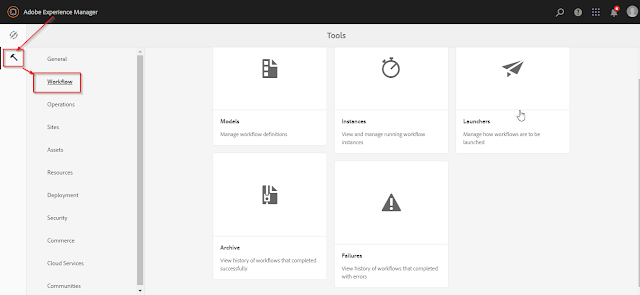

What's up fellow AEM devs :wave:! After learning OSGi configurations, now is the time to dive into another very important concept in AEM - the good ol' **WORKFLOWS**.

A workflow is nothing but a way to automate AEM activities by executing some steps in a specific order to achieve the desired results.

Each step performs an individual activity such as publishing a page, creating a version of the page, sending an email message etc.

For example, the most common activity in AEM is publishing the page from the author instance to the publish instance. But sometimes we want the approval of the changes by some reviewers before publishing. This can be easily achieved by implementing workflows in AEM.

There are many workflows provided out of the box in AEM. Apart from those, if we want, we can also define our custom workflows for our specific activities.

## Workflow Console

The workflow console is the centralized location for workflow management in AEM. There are five tabs in this console -

### Models: 
Lists the workflow models that are currently available. We can also create, edit and delete a new workflow here.

### Instances: 
This tab shows the details of the currently active workflow. These instances are also version dependent.

### Archive: 
This shows the list of terminated workflows, for whatever reason.

### Launcher: 
Allows us to define a workflow to be launched if a specific node has been updated. Sometimes launchers are used in place of JCR event listeners.

### Failures: 
This tab shows the details of the failed workflows along with their error trace and at which step it failed.

We can access the workflow console in your AEM instance from the Tools console in the Touch UI.

## Workflow Steps

For achieving a different set of activities in AEM we have different types of workflow steps. There are many situations where we need various behaviors in our workflows. AEM caters this by providing different types of steps. These steps can be implemented for the custom behaviors.

There are following types of steps in Workflows -

### Process Step
It executes an ECMA script or an OSGi service to perform automatic processing. It can be created by following the below steps -
1. Create an OSGi service implementing the interface `com.adobe.granite.workflow.exec.WorkflowProcess`.
2. Set the property `process.label`. This property determines the name by which our workflow step will be listed in the dropdown (while creating a workflow).
3. Implement the `execute(WorkItem workItem, WorkflowSession workflowSession, MetaDataMap metadataMap)` method with the implementation code.

### Participant Step
This type of step enables us to assign ownership for a particular action. The workflow will only proceed when the user has manually acknowledged the step. This is used when we want someone to take any action on the workflow. For e.g. a review step.

The user whom we assign the action must have access to the payload. For e.g. if a reviewer has the onus to review a page on which the workflow is initiated, the reviewer should have the appropriate rights on that page.

### Dialog Participant Step
This is used to collect information from the user who is assigned the work item. The data can be later used in the workflow.

Upon completing the step, the **Complete Work Item** dialog contains the fields that you define in your dialog. The data that is collected in the fields is stored in nodes of the workflow payload. Subsequent workflow steps can then read the value from the repository.

To configure the step, we specify the group or user to assign the work item to, and the path to the dialog.

### OR Split
This creates a split in the workflow, after which only one branch will be active (logical OR operation). This step enables us to introduce conditional processing paths into your workflow. We add workflow steps to each branch as required.

### AND Split
The AND Split creates a split in the workflow, after which both branches will be active (logical AND operation). We add workflow steps to each branch as required. This step enables us to introduce multiple processing paths into the workflow. For example, we can allow certain review steps to occur in parallel, so saving time.

### Container Step
A container step starts another workflow model that executes as a child workflow. This container can allow you to reuse workflow models to implement common sequences of steps. For example, a translation workflow model could be used in multiple editing workflows.

### GOTO Step
The Goto Step allows us to specify the next step in the workflow model to execute, dependent on the result of an ECMAScript: 

- true: The Goto Step completes and the workflow engine executes the specified step.
- false: The Goto Step completes and the normal routing logic determines the next step to execute. 

The Goto Step enables us to implement advanced routing structures in your workflow models. 
For example, to implement a loop, the Goto Step can be defined to execute a prior step in the workflow, with the script evaluating a loop condition.

## Conclusion
And that's it! In this short post, we learned what are workflows? why do we use them and much more. In the next post, we will see code examples on AEM workflows.

I would love to hear your thoughts on this post and would like to have suggestions from you to make this post better.

Happy Learning 😊 and Namaste :pray:.