Howdy fellow devs :wave:! In the previous post, we learned about basic stuff about AEM. In this post, we will see how can we create different steps in a workflow. We will mainly focus on two types of workflow steps - **Process Step** and **Participant Step**.

## Process Step

First we are going to discuss the most widely used Workflow step - the process step. This is generally used when we want our application to execute a certain logic.

It executes an ECMA script or an OSGi service to perform automatic processing. A process can be implemented using the following steps -
- Create an OSGi service implementing the interface com.adobe.granite.workflow.exec.WorkflowProcess.
- Set the property process.label. This is the String value by which our workflow needs to be listed.
- Implement the execute(WorkItem, WorkflowSession, MetaDataMap) method with the implementation code.

The execute() method has three parameters -
- **WorkItem** - It is the unit that is passed through a Workflow instance of a WorkflowModel. It contains the - WorkflowData. The instances act on and a reference to the WorkflowNode that describes the underlying workflow step.
- **WorkflowSession** - This class provides all functionality (depending on the users' rights) for managing WorkflowModels, Workflow instances and their execution.
- **MetaDataMap** - A value map for generic access to meta data values.

### Use Case
Awesome, so now we have understood what are the main aspects of a **Workflow Process Step**, we can now go ahead with our use case. The requirement is that the content authors want to update the metadata of all the assets that are being referenced on the web page whenever they want.

The first thing that comes to our mind is to create a workflow which the users can run on a page and the assets' metadata will be updated. Cool, eh :sunglasses:? Nothing much for the authors to do. The AEM will take care of that under the hood (of course, the development team will have to implement this functionality). Here's how we're gonna do that - 

1. Navigate to the `core` module of your AEM project and create a class `org.redquark.aem.tutorials.core.workflows.process.UpdateReferencedAssetsWorkflow` with the following code in it - 

```java
package org.redquark.aem.tutorials.core.workflows.process;

import com.adobe.granite.workflow.WorkflowSession;
import com.adobe.granite.workflow.exec.WorkItem;
import com.adobe.granite.workflow.exec.WorkflowProcess;
import com.adobe.granite.workflow.metadata.MetaDataMap;
import com.day.cq.dam.api.Asset;
import org.apache.commons.lang3.StringUtils;
import org.apache.sling.api.resource.ModifiableValueMap;
import org.apache.sling.api.resource.PersistenceException;
import org.apache.sling.api.resource.Resource;
import org.apache.sling.api.resource.ResourceResolver;
import org.osgi.service.component.annotations.Component;
import org.osgi.service.component.annotations.Reference;
import org.redquark.aem.tutorials.core.services.ReferencedAssetService;
import org.redquark.aem.tutorials.core.services.ResourceResolverService;
import org.slf4j.Logger;
import org.slf4j.LoggerFactory;

import java.util.Arrays;
import java.util.Map;
import java.util.Objects;

import static org.redquark.aem.tutorials.core.constants.AppConstants.EQUALS;
import static org.redquark.aem.tutorials.core.constants.AppConstants.PROCESS_LABEL;
import static org.redquark.aem.tutorials.core.workflows.process.UpdateReferencedAssetsWorkflow.PROCESS_LABEL_VALUE;

@Component(
        service = WorkflowProcess.class,
        property = {
                PROCESS_LABEL + EQUALS + PROCESS_LABEL_VALUE
        }
)
public class UpdateReferencedAssetsWorkflow implements WorkflowProcess {

    protected static final String PROCESS_LABEL_VALUE = "Update Referenced Asset";
    private static final String TAG = UpdateReferencedAssetsWorkflow.class.getSimpleName();
    private static final Logger LOGGER = LoggerFactory.getLogger(UpdateReferencedAssetsWorkflow.class);

    @Reference
    ReferencedAssetService referencedAssetService;

    @Reference
    ResourceResolverService resourceResolverService;

    @Override
    public void execute(WorkItem workItem, WorkflowSession workflowSession, MetaDataMap metaDataMap) {
        // Getting payload from Workflow - workItem -> workflowData -> payload
        String payloadType = workItem.getWorkflowData().getPayloadType();
        LOGGER.debug("{}: Payload type: {}", TAG, payloadType);
        // Check type of payload; there are two - JCR_PATH and JCR_UUID
        if (StringUtils.equals(payloadType, "JCR_PATH")) {
            // Get the JCR path from the payload
            String path = workItem.getWorkflowData().getPayload().toString();
            LOGGER.debug("{}: Payload path: {}", TAG, path);
            // Get process arguments which will contain the properties to update
            String[] processArguments = metaDataMap.get("PROCESS_ARGS", "default").split("=");
            // Get the referenced assets
            Map<String, Asset> referencedAssets = referencedAssetService.getReferencedAssets(path);
            LOGGER.debug("{}: Starting updating asset metadata with following values: {}", TAG, Arrays.toString(processArguments));
            // Get resource resolver
            ResourceResolver resourceResolver = resourceResolverService.getResourceResolver();
            try {
                // Loop for each referenced asset
                for (Map.Entry<String, Asset> entry : referencedAssets.entrySet()) {
                    // Asset path
                    String assetPath = entry.getKey();
                    LOGGER.debug("{}: Updating metadata for asset: {}", TAG, assetPath);
                    // Get resource corresponding to the path of asset
                    Resource assetResource = resourceResolver.getResource(assetPath);
                    // Get the metadata for the asset resource
                    Resource assetResourceMetadata = Objects.requireNonNull(assetResource).getChild("jcr:content/metadata");
                    // Get metadata properties as modifiable map
                    ModifiableValueMap modifiableValueMap = Objects.requireNonNull(assetResourceMetadata).adaptTo(ModifiableValueMap.class);
                    // Add the new property
                    Objects.requireNonNull(modifiableValueMap).put(processArguments[0], processArguments[1]);
                }
                resourceResolver.commit();
            } catch (PersistenceException e) {
                LOGGER.error("{}: exception occurred: {}", TAG, e.getMessage());
            }
        } else {
            LOGGER.warn("{}: payload type - {} is not valid", TAG, payloadType);
        }
    }
}
```

Here, we are implementing `WorkflowProcess` interface and our business logic is written in the `execute()` method. Here we are getting the type of payload from the `WorkflowData` object and then also getting the process arguments that a user might pass while using this process step.

Please make note of the **`process.label`** property that defines the identifier by which this process step will be listed among many process steps (this is explained later).

In the execute() method, we are just using a service `ReferencedAssetService` which will search for the assets referenced in the page passes as a payload. After getting the referenced assets, we are iterating through each of them and updating their respective metadata.

2. Update the `org.redquark.aem.tutorials.core.constants.AppConstants` class with the constant for *EQUAL* and *PROCESS_LABEL*. The final class will look like as below - 

```java
package org.redquark.aem.tutorials.core.constants;

public final class AppConstants {

    public static final String FORWARD_SLASH = "/";
    public static final String EQUALS = "=";

    // TO-DO related constants
    public static final String TODO_ENDPOINT = "https://jsonplaceholder.typicode.com/todos/";
    public static final long TODO_THREAD_SLEEP_TIME = 14400000;

    // Resource Resolver Factory sub-service
    public static final String SUB_SERVICE = "tutorialSubService";

    // Workflow Process Label
    public static final String PROCESS_LABEL = "process.label";
}
```

3. Now, it's time to create the service which will fetch the referenced assets from a path. Create a new interface `org.redquark.aem.tutorials.core.services.ReferencedAssetService` with the following code in it - 

```java
package org.redquark.aem.tutorials.core.services;

import com.day.cq.dam.api.Asset;

import java.util.Map;

public interface ReferencedAssetService {

    Map<String, Asset> getReferencedAssets(String pagePath);
}
```

4. Create the implementation of the above interface in the form of `org.redquark.aem.tutorials.core.services.impl.ReferencedAssetServiceImpl` with the following code in it - 

```java
package org.redquark.aem.tutorials.core.services.impl;

import com.day.cq.dam.api.Asset;
import com.day.cq.dam.api.DamConstants;
import com.day.cq.dam.commons.util.AssetReferenceSearch;
import org.apache.sling.api.resource.Resource;
import org.apache.sling.api.resource.ResourceResolver;
import org.osgi.framework.Constants;
import org.osgi.service.component.annotations.Component;
import org.osgi.service.component.annotations.Reference;
import org.redquark.aem.tutorials.core.services.ReferencedAssetService;
import org.redquark.aem.tutorials.core.services.ResourceResolverService;
import org.slf4j.Logger;
import org.slf4j.LoggerFactory;

import javax.jcr.Node;
import java.util.Map;
import java.util.Objects;

import static org.redquark.aem.tutorials.core.constants.AppConstants.EQUALS;

@Component(
        service = ReferencedAssetService.class,
        property = {
                Constants.SERVICE_ID + EQUALS + "Referenced Asset Service",
                Constants.SERVICE_DESCRIPTION + EQUALS + "Returns all the assets referenced"
        }
)
public class ReferencedAssetServiceImpl implements ReferencedAssetService {

    private static final String TAG = ReferencedAssetService.class.getSimpleName();
    private static final Logger LOGGER = LoggerFactory.getLogger(ReferencedAssetService.class);

    @Reference
    ResourceResolverService resourceResolverService;

    @Override
    public Map<String, Asset> getReferencedAssets(String pagePath) {
        LOGGER.debug("{}: Searching assets referenced on page path: {}", TAG, pagePath);
        // Get the resource resolver
        ResourceResolver resourceResolver = resourceResolverService.getResourceResolver();
        // Get the resource instance representing the path
        Resource resource = resourceResolver.getResource(pagePath);
        // Adapt this resource to the Node
        Node node = Objects.requireNonNull(resource).adaptTo(Node.class);
        // Create an instance of AssetReferenceSearch API
        AssetReferenceSearch assetReferenceSearch = new AssetReferenceSearch(node, DamConstants.MOUNTPOINT_ASSETS, resourceResolver);
        // Getting all the assets referenced
        Map<String, Asset> referencedAssets = assetReferenceSearch.search();
        LOGGER.debug("{}: number of assets found on page: {} are {}", TAG, pagePath, referencedAssets.size());

        return referencedAssets;
    }
}
```

> See for the complete code on [GitHub](https://github.com/ani03sha/AEM-Tutorials).

The different aspects of an OSGi service have already been discussed in [Day 08 - OSGi Components and Services](https://redquark.org/aem/day-08-osgi-components-services/). See that for more details.

5. And that's it! Our coding part is done. Now, it's time to configure this workflow in AEM. For that, first build and deploy the above code to your AEM instance using Maven.

6. Once, the code is deployed, navigate to [http://localhost:4502/libs/cq/workflow/admin/console/content/models.html](http://localhost:4502/libs/cq/workflow/admin/console/content/models.html). This is the console where we can create a brand new **Workflow Model** and click on the **Create** button.

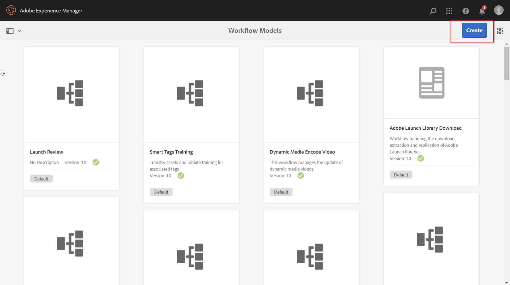

7. Now click on **Create Model** and enter the workflow details and **Done**.

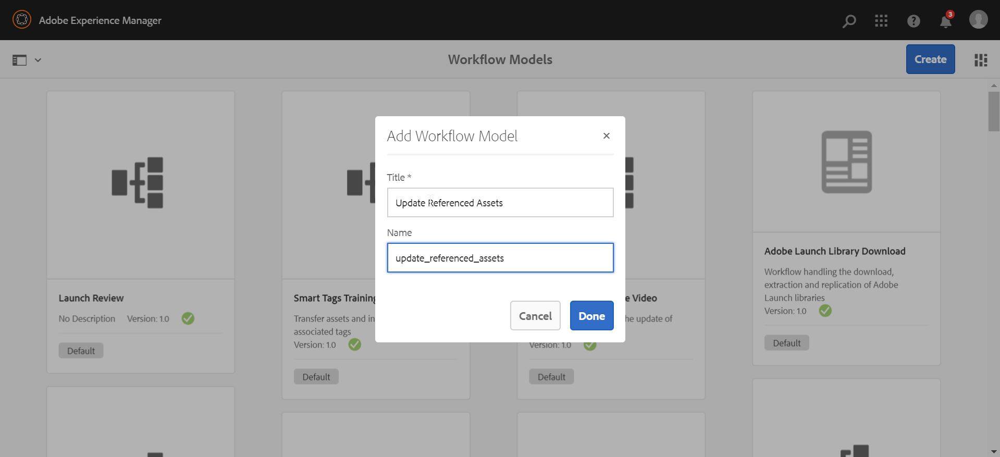

8. Select workflow model created and click on **Edit**.

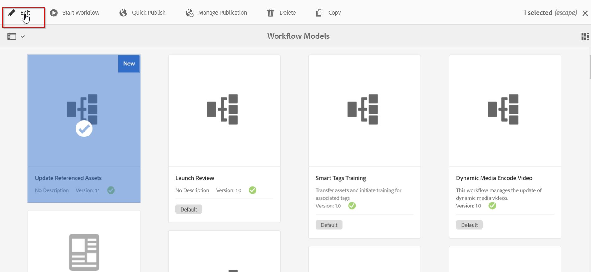

9. Now, you will see the workflow model with a sample step **Step 1**. We need to edit this model to use our process step. Delete **Step 1** by selecting it and clicking the :wastebasket: icon.

10. Now, click on the **Drag components here** and select the **Process Step** from the dropdown. Similarly, we can add many steps (process as well as others) in a workflow model. But for our demo, one should be enough.

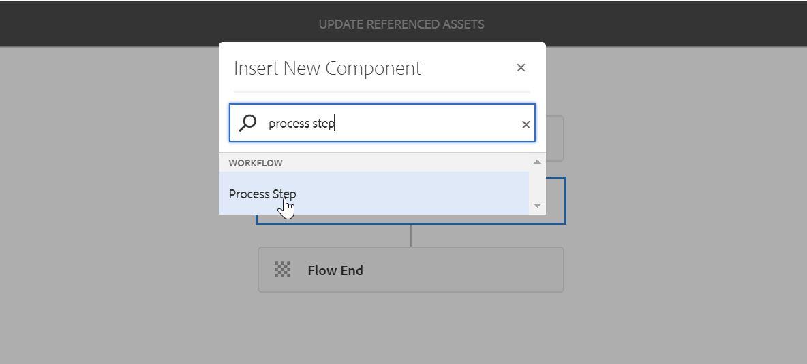

11. Edit the process step using the following configuration using :wrench: icon. Note that we selected the process which is similar to the value we have given in the `process.label` property. Here, following things are important.
    - `Process` - represents the process step which has a `process.label` value of *Update Referenced Asset* in the code.
    - `Handler Advance` - this will let the workflow flow move to the next step automatically after the current step is completed.
    - `Arguments` - these represent the arguments that the content author wants to pass in their process to be used by the workflow. For our use case, we are passing the property which we want to be added in our asset's metadata.
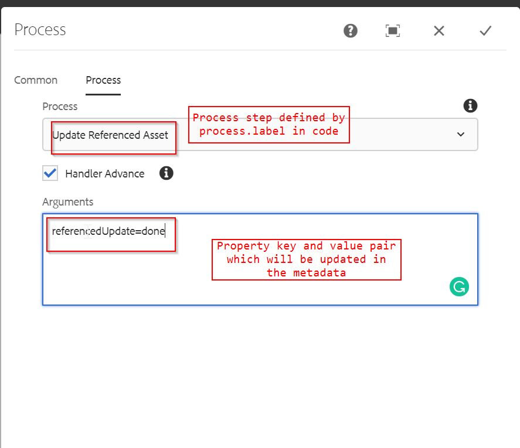

12. After saving the dialog, click on "Sync" in top right corner to save the workflow. Thus our workflow model is ready. Now, we can run it for any operation we want. The simplest example is to run this workflow model for a page.

13. Now, after our workflow configuration is done, it's time to see it in action. Navigate to sites console and select **Men** page. Open **Timeline** as shown in the figure below

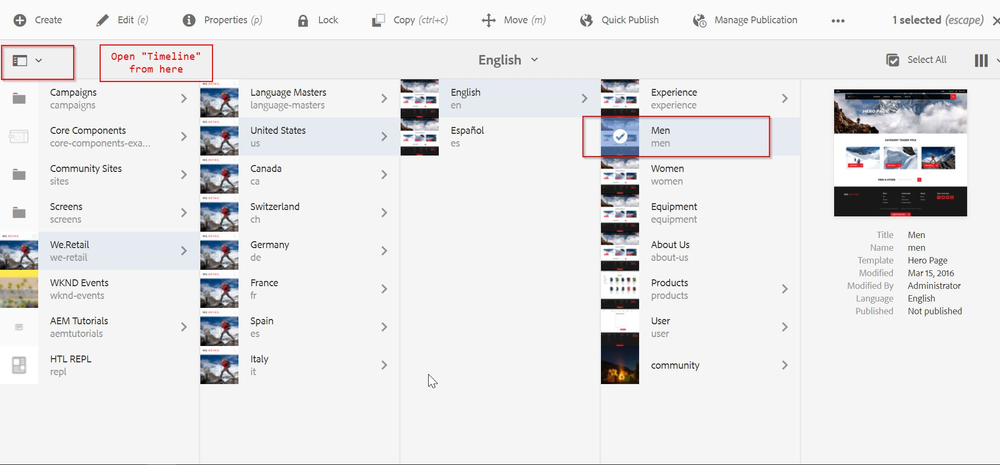

14. From the **Timeline** section, click on **Start Workflow**.

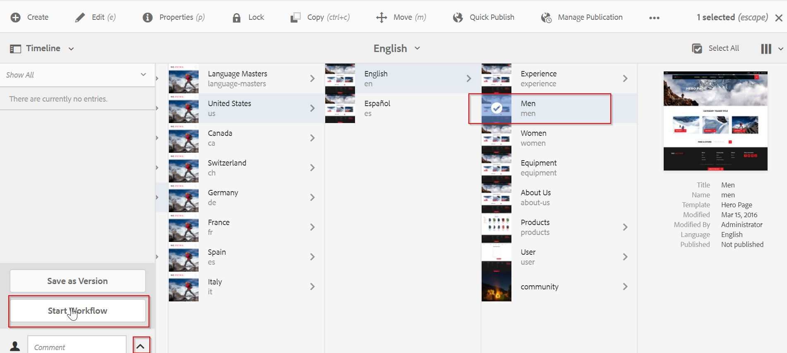

15. Select our workflow model **Update Referenced Asset**, give suitable title and click on **Next**.

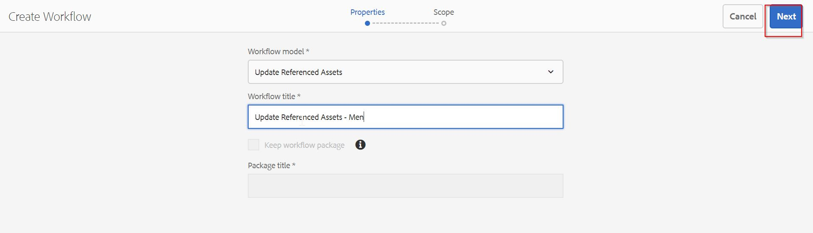

16. On the next screen, select the page and click on **Create**. Our workflow will be created and will be executed.

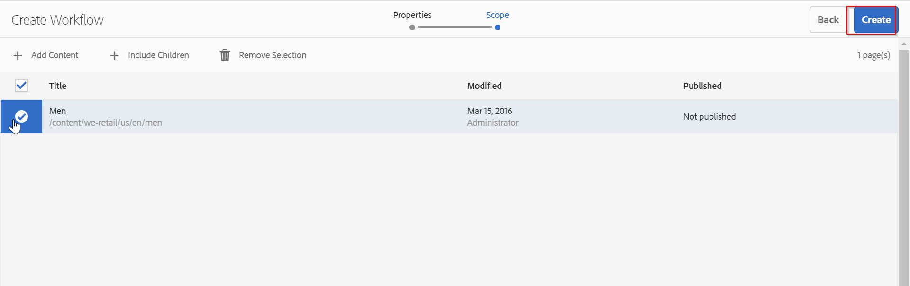

17. Now, navigate to [CRXDE](http://localhost:4502/crx/de/index.jsp) and search for the path `/content/dam/we-retail/en/activities/climbing/indoor-practicing.jpg/jcr:content/metadata` (this is one of the asset being used on the **Men** page). We now see a property `referencedUpdate = done`. This is the new property and the same that we passed in the process arguments in the workflow process step.

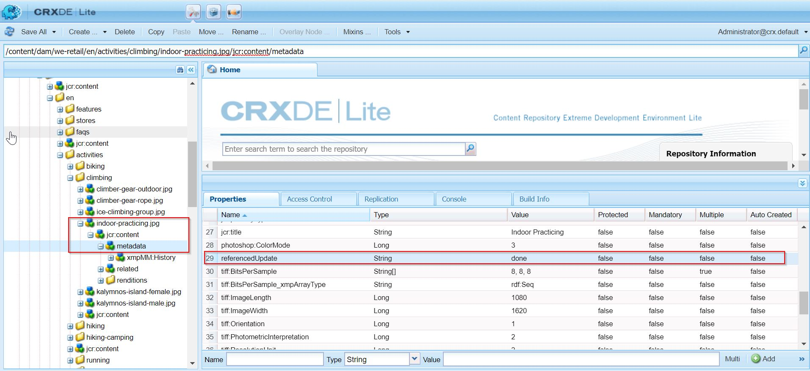

And yeah, that's it :clap:! We have created our first Workflow Process step and updated the metadata of an asset by just clicking a few buttons. Cool, right :sunglasses:?

After successfully creating a workflow step, we will now look into another type of workflow step - Dynamic Participant Step.


## Dynamic Participant Step

A participant is a step which enables a user to assign ownership of a task to another user. The workflow will only go further if that user manually acknowledges the step.

A simple use case of this workflow is a review step, i.e. if you have made some changes in an AEM page and then you want someone to review it then you can add it to the participant step and that user will get a notification in his/her inbox. Obviously, the reviewer should have access to the page in question.

**Dynamic Participant Step** is similar to the **Participant Step** with the exception that the user is selected at run time. There might be a use case where you want an item to be assigned to a user who has the lowest number of items to review.

The business logic of a Dynamic Participant Step can be written in a class that implements the **Participant Chooser** interface.

### Use Case

Let's say we wish our asset metadata to be reviewed by our **Content Authors** based on a condition that our payload path starts with `/content/aemtutorials`.

1. Create a new class `org.redquark.aem.tutorials.core.workflows.participant.ApprovePageContentStep` and paste following code in it -

```java
package org.redquark.aem.tutorials.core.workflows.participant;

import com.adobe.granite.workflow.WorkflowSession;
import com.adobe.granite.workflow.exec.ParticipantStepChooser;
import com.adobe.granite.workflow.exec.WorkItem;
import com.adobe.granite.workflow.metadata.MetaDataMap;
import org.apache.commons.lang3.StringUtils;
import org.osgi.service.component.annotations.Component;
import org.slf4j.Logger;
import org.slf4j.LoggerFactory;

import static org.redquark.aem.tutorials.core.constants.AppConstants.ADMINISTRATORS;
import static org.redquark.aem.tutorials.core.constants.AppConstants.CHOOSER_LABEL;
import static org.redquark.aem.tutorials.core.constants.AppConstants.CONTENT_AUTHORS;
import static org.redquark.aem.tutorials.core.constants.AppConstants.EQUALS;
import static org.redquark.aem.tutorials.core.workflows.participant.ApproveAssetMetadataStep.CHOOSER_LABEL_VALUE;

@Component(
        service = ParticipantStepChooser.class,
        property = {
                CHOOSER_LABEL + EQUALS + CHOOSER_LABEL_VALUE
        }
)
public class ApprovePageContentStep implements ParticipantStepChooser {

    private static final String TAG = ApproveAssetMetadataStep.class.getSimpleName();
    private static final Logger LOGGER = LoggerFactory.getLogger(ApproveAssetMetadataStep.class);

    private static final String CONTENT_PATH = "/content/aemtutorials";

    protected static final String CHOOSER_LABEL_VALUE = "Approve Asset Metadata";

    @Override
    public String getParticipant(WorkItem workItem, WorkflowSession workflowSession, MetaDataMap metaDataMap) {
        // Getting payload from Workflow - workItem -> workflowData -> payload
        String payloadType = workItem.getWorkflowData().getPayloadType();
        LOGGER.debug("{}: Payload type: {}", TAG, payloadType);
        // Check type of payload; there are two - JCR_PATH and JCR_UUID
        if (StringUtils.equals(payloadType, "JCR_PATH")) {
            // Get the JCR path from the payload
            String path = workItem.getWorkflowData().getPayload().toString();
            LOGGER.debug("{}: Payload path: {}", TAG, path);
            // Get process arguments which will contain the properties to update
            if (path.startsWith(CONTENT_PATH)) {
                LOGGER.debug("{}: selected user/group: {}", TAG, CONTENT_AUTHORS);
                return CONTENT_AUTHORS;
            }
        }
        return ADMINISTRATORS;
    }
}
```

This code is pretty simple - we are implementing `getParticipant()` method of `com.adobe.granite.workflow.exec.ParticipantStepChooser` interface which just checks if the payload is of type `JCR_PATH` and starts with `/content/aemtutorials` then we want our content authors to review it, else we want our administrators to review the page.

Please note that the property **`chooser.label`** is important as the value of this property determines by which name our step will be listed (similar to `process.label`). And we are done... easy peasy, right :smile:?

Also, the updated AppConstants.java as follows -

```java
package org.redquark.aem.tutorials.core.constants;

public final class AppConstants {

    public static final String FORWARD_SLASH = "/";
    public static final String EQUALS = "=";

    // TO-DO related constants
    public static final String TODO_ENDPOINT = "https://jsonplaceholder.typicode.com/todos/";
    public static final long TODO_THREAD_SLEEP_TIME = 14400000;

    // Resource Resolver Factory sub-service
    public static final String SUB_SERVICE = "tutorialSubService";

    // Workflow Process Label
    public static final String PROCESS_LABEL = "process.label";
    // Workflow Chooser Label
    public static final String CHOOSER_LABEL = "chooser.label";

    // User groups
    public static final String ADMINISTRATORS = "administrators";
    public static final String CONTENT_AUTHORS = "content-authors";
}
```

2. And that's it! Our coding part is done. Now, it's time to configure this workflow in AEM. For that, first build and deploy the above code to your AEM instance using Maven.

3. Once, the code is deployed, navigate to [http://localhost:4502/libs/cq/workflow/admin/console/content/models.html](http://localhost:4502/libs/cq/workflow/admin/console/content/models.html). This is the console where we can create a brand new **Workflow Model** and click on the **Create** button.


4. Now click on **Create Model** and enter the workflow details and **Done**.

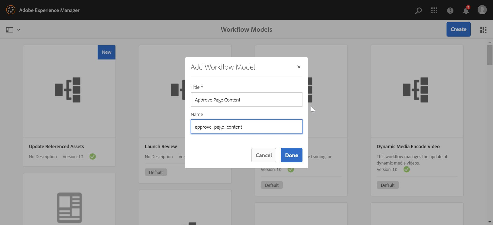

5. Select workflow model created and click on **Edit**.


6. Now, you will see the workflow model with a sample step **Step 1**. We need to edit this model to use our process step. Delete **Step 1** by selecting it and clicking the :wastebasket: icon.

7. Now, click on the **Drag components here** and select the **Dynamic Participant Step** from the dropdown. Similarly, we can add many steps (process as well as others) in a workflow model. But for our demo, one should be enough.

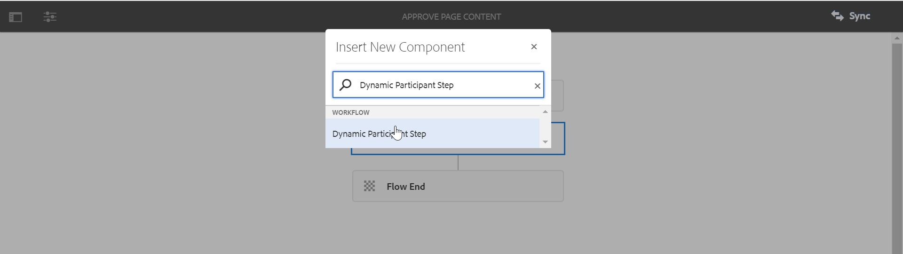

8. Update the dialog with the properties as follows and click on **Sync**.

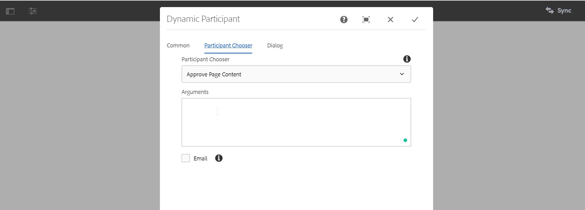

9. Now, after our workflow configuration is done, it's time to see it in action. Navigate to sites console and select **AEM Tutorials Home Page** page. Open **Timeline** as shown in the figure below


10. From the **Timeline** section, click on **Start Workflow**.

11. Select our workflow model **Approve Page Content**, give suitable title and click on **Next**.

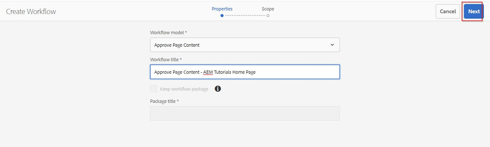

12. On the next screen, select the page and click on **Create**. Our workflow will be created and will be executed.

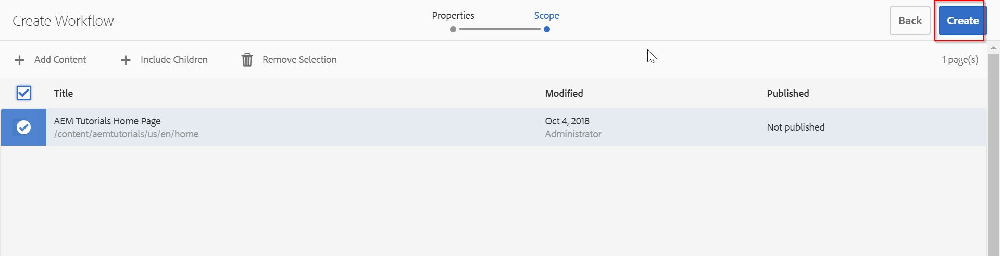

13. Since our page contains `/content/aemtutorials`, the users present in the `content-authors` group will receive a notification in their inbox. Once such user is **Carlene Avery (cavery)** (you can create your user and add it to the `content-authors` group). We now login using `cavery's` credentials (which you can set in `Tools -> Security`).

14. We will see a notification on the :bell: icon.

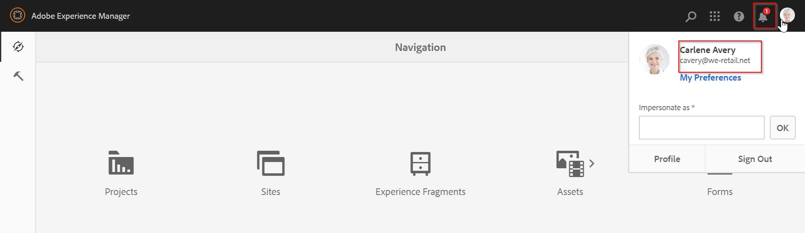

15. Click on the :bell: icon and we will be in the ***Inbox*** of the logged in user. There you will see the **Approve Page Content** step. Select it and click on **Complete**. One can also use other options to review the content.

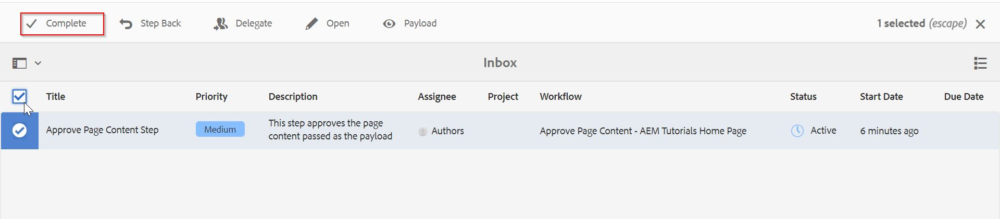

16. We will get a dialog with comments section. Provide your comments and done.

Awesome, we have completed creating our Dynamic Participant Step and you should be proud of yourself :clap:.


## Conclusion

Awesome blossom :sunglasses:!!! We have completed working with two of the mostly used steps in workflows.

It was a long post and we put in lot of efforts but I hope you enjoyed this post. I would love to hear your thoughts on this post and would like to have suggestions from you to make this post better.

As usual, you can find the complete code on my [GitHub](https://github.com/ani03sha/AEM-Tutorials). If you find it useful, consider giving it a star :star:.

Happy Learning 😊 and Namaste :pray:.