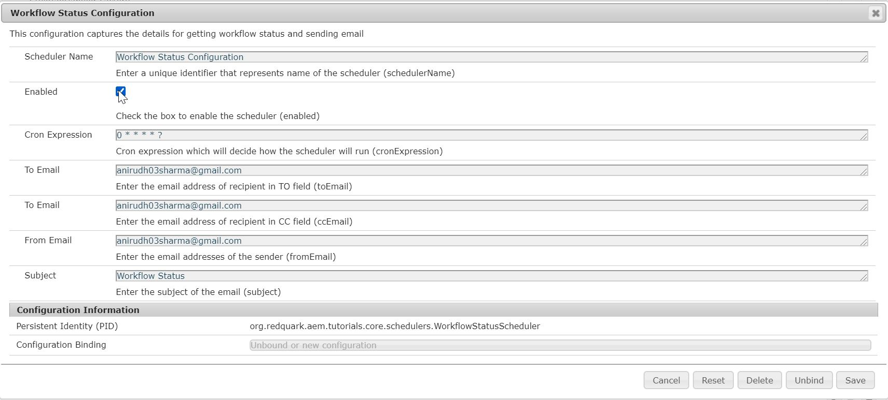
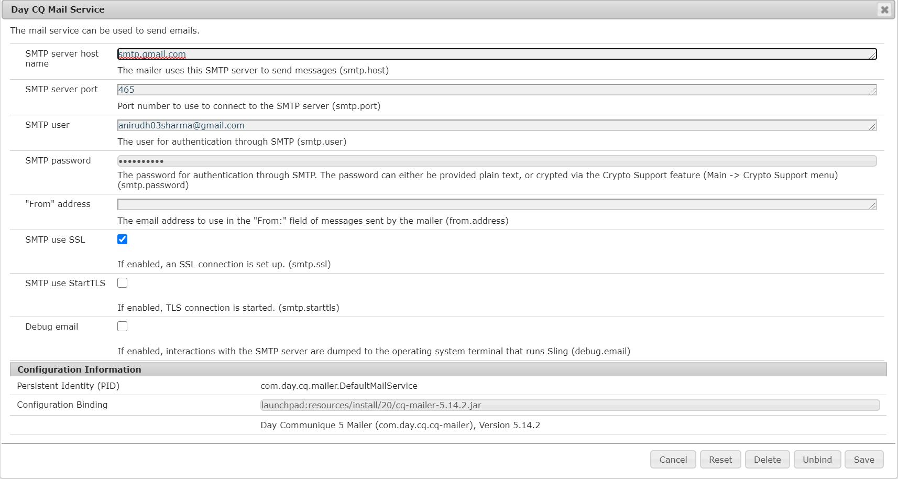

Howdy fellow devs :wave:. Welcome to day 16 of this AEM Developer Series. Today, we are going to delve into the nitty gritty details of **Schedulers** in AEM. 

What are schedulers, you ask :thinking:? In simple terms, a scheduler is a service to schedule jobs. Thus, if we want some work to happen at a particular time or at a regular interval, then [Schedulers](https://sling.apache.org/documentation/bundles/scheduler-service-commons-scheduler.html) are the way to go.

In AEM, we can create scheduler in two ways -
1. **Whiteboard Pattern** - In this, we create a Runnable thread to perform our task. This is similar to the Java Thread concept.
2. **Scheduler API** - In this, we use Apache Commons' Scheduler API to perform our task. It uses open-source [Quartz](http://www.quartz-scheduler.org/) library.

Both of these methods can be seen [here](https://sling.apache.org/documentation/bundles/scheduler-service-commons-scheduler.html). However, from AEM 6.2 onwards **Felix SCR** annotations are deprecated and are replaced with **OSGi** annotations. Therefore, in this post, we will be discussing the clean way of creating schedulers that OSGi annotations provide.

## Scheduler in AEM
To create a scheduler in AEM, we will follow the below steps - 
1. Create an OSGi configuration to read the scheduler specific values from the user i.e. cron expression, the name of the scheduler, custom parameter etc.
2. Create a sling scheduler which displays the custom parameter at an interval specified by the cron expression.

### Code Example
Let's suppose your organization wants a report comprising workflow status and this report needs to be sent to a particular group of users via email every four hours. How will you achieve this? If you thought, I'd use a scheduler, then KUDOS to you. If you were not able to figure it out, then my sympathies are with you (Just Kidding :smile:).

Enough chit chat, let's dive into code and create our first scheduler.

1. Navigate to core module in your AEM multi module project and create one interface named `org.redquark.aem.tutorials.core.configs.WorkflowStatusConfiguration` and paste the following code in it - 

```java
package org.redquark.aem.tutorials.core.configs;

import org.osgi.service.metatype.annotations.AttributeDefinition;
import org.osgi.service.metatype.annotations.AttributeType;
import org.osgi.service.metatype.annotations.ObjectClassDefinition;

import static org.redquark.aem.tutorials.core.configs.WorkflowStatusConfiguration.CONFIGURATION_DESCRIPTION;
import static org.redquark.aem.tutorials.core.configs.WorkflowStatusConfiguration.CONFIGURATION_NAME;

@ObjectClassDefinition(
        name = CONFIGURATION_NAME,
        description = CONFIGURATION_DESCRIPTION
)
public @interface WorkflowStatusConfiguration {

    String CONFIGURATION_NAME = "Workflow Status Configuration";
    String CONFIGURATION_DESCRIPTION = "This configuration captures the details for getting workflow status and sending email";
    String DEFAULT_EMAIL_ADDRESS = "anirudh03sharma@gmail.com";

    @AttributeDefinition(
            name = "Scheduler Name",
            description = "Enter a unique identifier that represents name of the scheduler",
            type = AttributeType.STRING
    )
    String schedulerName() default CONFIGURATION_NAME;

    @AttributeDefinition(
            name = "Enabled",
            description = "Check the box to enable the scheduler",
            type = AttributeType.BOOLEAN
    )
    boolean enabled() default false;

    @AttributeDefinition(
            name = "Cron Expression",
            description = "Cron expression which will decide how the scheduler will run",
            type = AttributeType.STRING
    )
    String cronExpression() default "0 * * * * ?";

    @AttributeDefinition(
            name = "To Email",
            description = "Enter the email address of recipient in TO field",
            type = AttributeType.STRING
    )
    String toEmail() default DEFAULT_EMAIL_ADDRESS;

    @AttributeDefinition(
            name = "To Email",
            description = "Enter the email address of recipient in CC field",
            type = AttributeType.STRING
    )
    String ccEmail() default DEFAULT_EMAIL_ADDRESS;

    @AttributeDefinition(
            name = "From Email",
            description = "Enter the email addresses of the sender",
            type = AttributeType.STRING
    )
    String fromEmail() default DEFAULT_EMAIL_ADDRESS;

    @AttributeDefinition(
            name = "Subject",
            description = "Enter the subject of the email",
            type = AttributeType.STRING
    )
    String subject() default CONFIGURATION_NAME;
}
```

This is nothing but an OSGi configuration (to know more about them, revisit [Day 11 = Custom OSGi Configuration](https://redquark.org/aem/day-11-custom-osgi-configuration/)).

In this configuration, we are capturing the following fields - 
```
1. Scheduler Name --> this will be used to uniquely define a scheduler
2. Enabled --> this flag, if set true, activates the scheduler
3. Cron Expression --> This expression will define when and how the scheduler will be executed
4. To Email --> email address of recipient in "to" of email
5. Cc Email --> email address of recipient in "cc" of email
6. From Email --> email address of the sender
7. Subject --> subject line of the email
```

We have also provided the default values of each field which will be taken if no custom field is defined.

2. Once the configuration is defined, we will now write our scheduler which will make use of above configuration. Create a new class named `org.redquark.aem.tutorials.core.schedulers.WorkflowStatusScheduler` and paste the following code in it -

```java
package org.redquark.aem.tutorials.core.schedulers;

import com.day.cq.workflow.WorkflowException;
import com.day.cq.workflow.WorkflowService;
import com.day.cq.workflow.WorkflowSession;
import com.day.cq.workflow.exec.Workflow;
import org.apache.sling.commons.scheduler.ScheduleOptions;
import org.apache.sling.commons.scheduler.Scheduler;
import org.osgi.framework.Constants;
import org.osgi.service.component.annotations.Activate;
import org.osgi.service.component.annotations.Component;
import org.osgi.service.component.annotations.Deactivate;
import org.osgi.service.component.annotations.Modified;
import org.osgi.service.component.annotations.Reference;
import org.osgi.service.metatype.annotations.Designate;
import org.redquark.aem.tutorials.core.configs.WorkflowStatusConfiguration;
import org.redquark.aem.tutorials.core.services.EmailService;
import org.redquark.aem.tutorials.core.services.ResourceResolverService;
import org.slf4j.Logger;
import org.slf4j.LoggerFactory;

import javax.jcr.Session;
import java.time.LocalDateTime;

import static org.redquark.aem.tutorials.core.constants.AppConstants.EQUALS;
import static org.redquark.aem.tutorials.core.constants.AppConstants.NEW_LINE;
import static org.redquark.aem.tutorials.core.schedulers.WorkflowStatusScheduler.NAME;

@Component(
        immediate = true,
        service = Runnable.class,
        property = {
                Constants.SERVICE_ID + EQUALS + NAME
        }
)
@Designate(ocd = WorkflowStatusConfiguration.class)
public class WorkflowStatusScheduler implements Runnable {

    protected static final String NAME = "Workflow Status Scheduler";

    private static final String TAG = WorkflowStatusScheduler.class.getSimpleName();
    private static final Logger LOGGER = LoggerFactory.getLogger(WorkflowStatusScheduler.class);
    @Reference
    Scheduler scheduler;
    @Reference
    WorkflowService workflowService;
    @Reference
    ResourceResolverService resourceResolverService;
    @Reference
    EmailService emailService;
    private String schedulerName;
    private String toEmail;
    private String ccEmail;
    private String fromEmail;
    private String subject;

    @Activate
    protected void activate(WorkflowStatusConfiguration configuration) {
        LOGGER.debug("{}: initializing properties for scheduler", TAG);
        this.schedulerName = configuration.schedulerName();
        LOGGER.debug("{}: name of the scheduler: {}", TAG, schedulerName);
        // Details for email
        this.toEmail = configuration.toEmail();
        this.ccEmail = configuration.ccEmail();
        this.fromEmail = configuration.fromEmail();
        this.subject = configuration.subject();
    }

    @Modified
    protected void modified(WorkflowStatusConfiguration configuration) {
        LOGGER.info("{}: modifying scheduler with name: {}", TAG, schedulerName);
        // Remove the scheduler registered with old configuration
        removeScheduler(configuration);
        // Add the scheduler registered with new configuration
        addScheduler(configuration);
    }

    @Deactivate
    protected void deactivate(WorkflowStatusConfiguration configuration) {
        LOGGER.debug("{}: removing scheduler: {}", TAG, schedulerName);
        removeScheduler(configuration);
    }

    private void addScheduler(WorkflowStatusConfiguration configuration) {
        // Check if the scheduler has enable flag set to true
        if (configuration.enabled()) {
            LOGGER.info("{}: scheduler: {} is enabled", TAG, schedulerName);
            // Configure the scheduler to use cron expression and some other properties
            ScheduleOptions scheduleOptions = scheduler.EXPR(configuration.cronExpression());
            scheduleOptions.name(schedulerName);
            scheduleOptions.canRunConcurrently(false);
            // Scheduling the job
            scheduler.schedule(this, scheduleOptions);
            LOGGER.info("{}: scheduler {} is added", TAG, schedulerName);
        } else {
            LOGGER.info("{}: scheduler {} is disabled", TAG, schedulerName);
            removeScheduler(configuration);
        }
    }

    private void removeScheduler(WorkflowStatusConfiguration configuration) {
        LOGGER.info("{}: removing scheduler {}", TAG, schedulerName);
        scheduler.unschedule(configuration.schedulerName());
    }

    private String getWorkflowStatus() {
        // This string will store the status for all workflows and other data
        StringBuilder workflowDetails = new StringBuilder();
        try {
            // Get the JCR session
            Session session = resourceResolverService.getResourceResolver().adaptTo(Session.class);
            // Get the workflow session
            WorkflowSession workflowSession = workflowService.getWorkflowSession(session);
            // States by which we want to query the workflows
            String[] states = {"RUNNING", "COMPLETED"};
            // Get the list of all the workflows by states
            Workflow[] workflows = workflowSession.getWorkflows(states);
            // Loop through all the workflows
            for (Workflow workflow : workflows) {
                workflowDetails
                        .append("ID: ")
                        .append(workflow.getId())
                        .append(NEW_LINE)
                        .append("Payload: ")
                        .append(workflow.getWorkflowData().getPayload())
                        .append(NEW_LINE)
                        .append("State: ")
                        .append(workflow.getState())
                        .append(NEW_LINE);
            }
        } catch (WorkflowException e) {
            LOGGER.error("{}: exception occurred: {}", TAG, e.getMessage());
        }
        return workflowDetails.toString();
    }

    @Override
    public void run() {
        // Getting the workflow status
        String workflowStatus = getWorkflowStatus();
        // Make the content ready
        String content = "Hi, " + NEW_LINE + "Following is the workflow status at: " + LocalDateTime.now() + NEW_LINE + workflowStatus;
        // Send emails
        emailService.sendEmail(toEmail, ccEmail, fromEmail, subject, content);
        LOGGER.info("{}: workflow status email is sent", TAG);
    }
}
```

Let us understand the code step-by-step. 

(i) First, we are registering the class as a service and implementing the `java.lang.Runnable` interface. 

(ii) At the same time, using `@Designate` annotation, we are linking the OSGi configuration created in the previous section with this class.

(iii) Now, we are injecting the `org.apache.sling.commons.scheduler.Scheduler` dependency.

(iv) In the `activate()` method, we are reading the required values. Then we are getting the various values from the configuration.

(v) The `modified()` method first removes the scheduler registered with the old configuration and then registers it with the new configuration in case the OSGi configuration is modified.

(vi) In the `addScheduler()` method, we are registering the scheduler using the Scheduler API.

(vii) The `run()` method will be defining our task. Here, we getting the workflow status from the workflow API and sending the email using our custom defined `EmailService`.


3. Create `EmailService` and its implementation `EmailServiceImpl` as follows - 

```java
package org.redquark.aem.tutorials.core.services;

public interface EmailService {

    void sendEmail(
            String toEmail,
            String ccEmail,
            String fromEmail,
            String subject,
            String content
    );
}
```

```java
package org.redquark.aem.tutorials.core.services.impl;

import com.day.cq.mailer.MessageGateway;
import com.day.cq.mailer.MessageGatewayService;
import org.apache.commons.mail.Email;
import org.apache.commons.mail.EmailException;
import org.apache.commons.mail.SimpleEmail;
import org.osgi.framework.Constants;
import org.osgi.service.component.annotations.Component;
import org.osgi.service.component.annotations.Reference;
import org.redquark.aem.tutorials.core.services.EmailService;
import org.slf4j.Logger;
import org.slf4j.LoggerFactory;

import static org.redquark.aem.tutorials.core.constants.AppConstants.EQUALS;
import static org.redquark.aem.tutorials.core.services.impl.EmailServiceImpl.SERVICE_NAME;

@Component(
        service = EmailService.class,
        property = {
                Constants.SERVICE_ID + EQUALS + SERVICE_NAME
        }
)
public class EmailServiceImpl implements EmailService {

    protected static final String SERVICE_NAME = "Email Service";
    private static final String TAG = EmailServiceImpl.class.getSimpleName();
    private static final Logger LOGGER = LoggerFactory.getLogger(EmailServiceImpl.class);

    @Reference
    MessageGatewayService messageGatewayService;

    @Override
    public void sendEmail(String toEmail, String ccEmail, String fromEmail, String subject, String content) {
        try {
            // Setting up the email message
            Email email = new SimpleEmail();
            // Get the details to send email
            email.setSubject(subject);
            email.setMsg(content);
            email.addTo(toEmail);
            email.addCc(ccEmail);
            email.setFrom(fromEmail);
            // Inject the message gateway service and send email
            MessageGateway<Email> messageGateway = messageGatewayService.getGateway(Email.class);
            // Send the email
            messageGateway.send(email);
        } catch (EmailException e) {
            LOGGER.error("{}: exception occurred: {}", TAG, e.getMessage());
        }
    }
}
```

This is a simple service which sends and email using `MessageGatewayService` API. Nothing rocket science here :smile:.

4. Deploy the code using maven and navigate to [http://localhost:4502/system/console/configMgr](http://localhost:4502/system/console/configMgr) and search for the string "Workflow Status Configuration" and open it. Fill out the fields and save. Below is the screenshot of my configuration - 



5. Since we are sending email, we need an **SMTP** server for it. Hmm, where would you get your own SMTP server? Worry not, **Google** got you covered. They provide their SMTP server for testing to anyone who has a **GMail** account. Great, huh :smiley:!. Below are the details -

```
* Outgoing Mail (SMTP) Server: smtp.gmail.com
* Use Authentication: Yes
* Use Secure Connection: Yes (TLS or SSL depending on your mail client/website SMTP plugin)
* Username: your GMail account (e.g. user@gmail.com)
* Password: your GMail password
* Port: 465 (SSL required) or 587 (TLS required)
```

We just need to configure these details in AEM. In [http://localhost:4502/system/console/configMgr](http://localhost:4502/system/console/configMgr), search for the string "Day CQ Mail Service" and add the above details. Below is the screenshot of my configuration - 



6. Now, wait for one minute, you will see an email in your inbox with the details of the workflow status.
(You might get an exception because Google doesn't allow less secure apps to send email to your GMail account. To troubleshoot this, see [Less secure apps & your Google Account](https://support.google.com/accounts/answer/6010255?hl=en)).


## Conclusion
And that's it! Phew :weary: quite a long post. But congratulations!! 🙋 we have successfully created a Sling Scheduler and I hope you enjoyed this post.

I would love to hear your thoughts on this and would like to have suggestions from you to make it better.

As usual, you can find the complete code on my [GitHub](https://github.com/ani03sha/AEM-Tutorials). If you find it useful, consider giving it a star :star:.

Happy Learning 😊 and Namaste :pray:.
