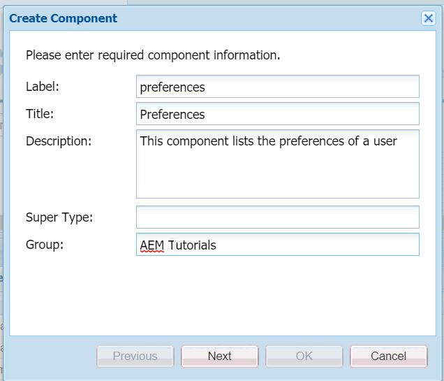
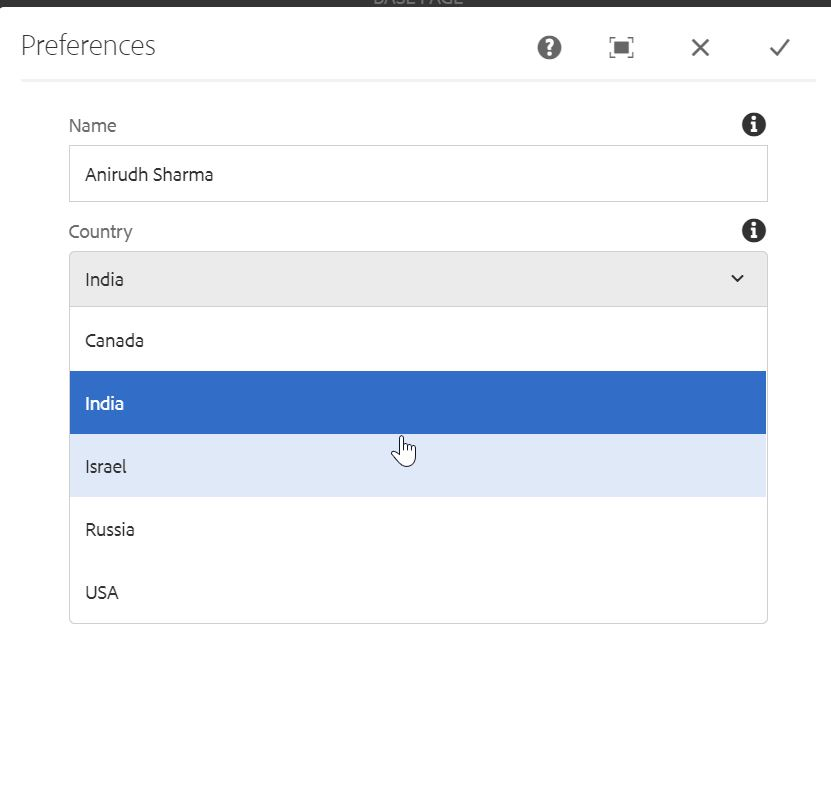
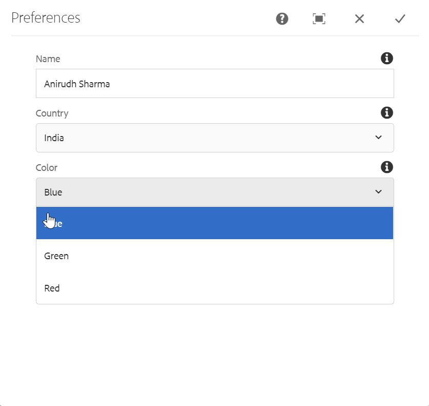
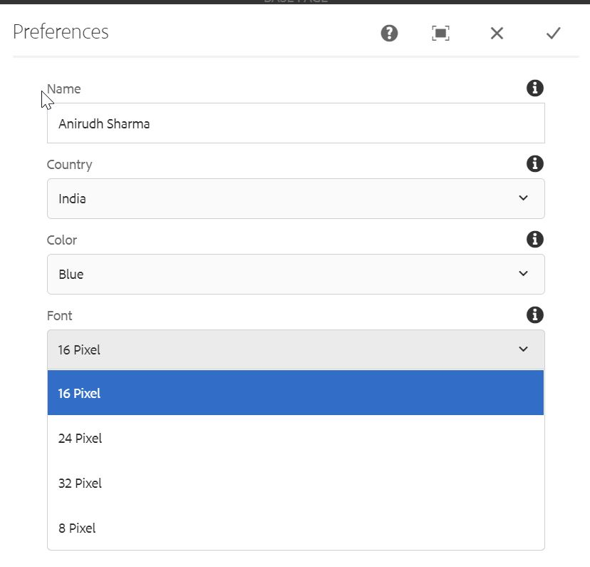

Howdy fellow devs :wave:! In AEM development, sometimes we might have requirements to populate the same data at multiple places. For e.g., suppose we have a requirement to create a text, an image and a video component and we need to provide background colour to these components in the form of a dropdown. These background colours will be same throughout our application code.

A naive way to achieve this is to create the same colour nodes under all the component's `cq:dialog`. Here we are not getting any code reusability. Wouldn't it be great if we create all the colour nodes once and reuse it anywhere we want? [Granite Datasource](https://helpx.adobe.com/experience-manager/6-5/sites/developing/using/reference-materials/granite-ui/api/jcr_root/libs/granite/ui/docs/server/datasource.html) is the answer to this question.

A datasource is the factory to provide a collection of [Resource](http://sling.apache.org/apidocs/sling8/org/apache/sling/api/resource/Resource.html) and are normally used to dynamically populate data in the dialog fields such as dropdowns. Thus, we only have to maintain our dropdown values only at one location and it can be used throughout our entire code. Pretty cool, eh :sunglasses:?


## Code Example

In this post, we are going to create a simple component which will use three dropdowns with **countries**
, **colors** and **fonts** options. Instead of following the conventional approach of creating nodes  of options underneath the dropdown node, we will use json files with all the data and then that data will be populated in the component's dialog.

So, without further ado, let's see how we can achieve this -

1. We will upload three json files in our DAM. So, start up your AEM instance and upload three json files with the following data (you can create new files with the given names and data and upload iin your dam). The location of folders should be `/content/dam/aemtutorials`. 

**country.json**

```json
[
    {
        "text": "India",
        "value": "india"
    },
    {
        "text": "USA",
        "value": "usa"
    },
    {
        "text": "Israel",
        "value": "israel"
    },
    {
        "text": "Canada",
        "value": "canada"
    },
    {
        "text": "Russia",
        "value": "russia"
    }
]
```

**color.json**

```json
[
    {
        "text" : "Red",
        "value": "#FF0000"
    },
    {
        "text" : "Blue",
        "value": "#0000FF"
    },
    {
        "text" : "Green",
        "value": "#008000"
    }
]
```

**font.json**

```json
[
    {
        "text": "8 Pixel",
        "value": "8px"
    },
    {
        "text": "16 Pixel",
        "value": "16px"
    },
    {
        "text": "24 Pixel",
        "value": "24px"
    },
    {
        "text": "32 Pixel",
        "value": "32px"
    }
]
```

Here, `text` represents the value to be displayed and `value` represents the value to be used internally.

2. Now, create a new component at `/apps/aemtutorials/components/content/` with the following configuration.



3. Rename the `preferences.jsp` to `preferences.html` and paste the following code in it -

```html
<sly data-sly-use.template="core/wcm/components/commons/v1/templates.html" />
<sly data-sly-call="${template.placeholder @ isEmpty=!properties.name}" />

<sly data-sly-test="${properties.name}">
    <h3>Name: ${properties.name}</h3>
    <h3>Country: ${properties.country}</h3>
    <h3 style="color: ${properties.color @ context='styleString'};">Favorite color: ${properties.color}</h3>
    <h3 style="font-size: ${properties.font @ context='styleString'};">Favorite font: ${properties.font}</h3>
</sly>
```

3. Under `/apps/aemtutorials/components/content/preferences` node, create a new node `cq:dialog` of type `nt:unstructured`.

4. Create the following node structure under `/apps/aemtutorials/components/content/preferences\cq:dialog`

```xml
<?xml version="1.0" encoding="UTF-8"?>
<jcr:root xmlns:jcr="http://www.jcp.org/jcr/1.0" xmlns:nt="http://www.jcp.org/jcr/nt/1.0"
          xmlns:sling="http://sling.apache.org/jcr/sling/1.0"
          jcr:primaryType="nt:unstructured"
          jcr:title="Preferences"
          sling:resourceType="cq/gui/components/authoring/dialog">
    <content
            jcr:primaryType="nt:unstructured"
            sling:resourceType="granite/ui/components/foundation/container">
        <items jcr:primaryType="nt:unstructured">
            <preferences
                    jcr:primaryType="nt:unstructured"
                    jcr:title="Preferences"
                    sling:resourceType="granite/ui/components/foundation/section">
                <layout
                        jcr:primaryType="nt:unstructured"
                        sling:resourceType="granite/ui/components/foundation/layouts/fixedcolumns"
                        margin="{Boolean}false"/>
                <items jcr:primaryType="nt:unstructured">
                    <column
                            jcr:primaryType="nt:unstructured"
                            sling:resourceType="granite/ui/components/foundation/container">
                        <items jcr:primaryType="nt:unstructured">
                            <name
                                    jcr:primaryType="nt:unstructured"
                                    sling:resourceType="granite/ui/components/coral/foundation/form/textfield"
                                    fieldDescription="Enter user name"
                                    fieldLabel="Name"
                                    name="./name"
                                    useFixedInlineToolbar="{Boolean}true"/>
                            <country
                                    jcr:primaryType="nt:unstructured"
                                    sling:resourceType="granite/ui/components/coral/foundation/form/select"
                                    fieldDescription="Select user's country"
                                    fieldLabel="Country"
                                    name="./country"
                                    useFixedInlineToolbar="{Boolean}true">
                                <datasource
                                        jcr:primaryType="nt:unstructured"
                                        sling:resourceType="/apps/aemtutorials/dropdowns"
                                        dropdownSelector="countryList"/>
                            </country>
                            <color
                                    jcr:primaryType="nt:unstructured"
                                    sling:resourceType="granite/ui/components/coral/foundation/form/select"
                                    fieldDescription="Select user's favorite color"
                                    fieldLabel="Color"
                                    name="./color"
                                    useFixedInlineToolbar="{Boolean}true">
                                <datasource
                                        jcr:primaryType="nt:unstructured"
                                        sling:resourceType="/apps/aemtutorials/dropdowns"
                                        dropdownSelector="colorList"/>
                            </color>
                            <font
                                    jcr:primaryType="nt:unstructured"
                                    sling:resourceType="granite/ui/components/coral/foundation/form/select"
                                    fieldDescription="Select user's font"
                                    fieldLabel="Font"
                                    name="./font"
                                    useFixedInlineToolbar="{Boolean}true">
                                <datasource
                                        jcr:primaryType="nt:unstructured"
                                        sling:resourceType="/apps/aemtutorials/dropdowns"
                                        dropdownSelector="fontList"/>
                            </font>
                        </items>
                    </column>
                </items>
            </preferences>
        </items>
    </content>
</jcr:root>
```

Notice that we have one text field and three dropdowns (with the `sling:resourceType=granite/ui/components/coral/foundation/form/select`) and under every dropdown node we have a `datasource` node with the following properties - 

```
sling:resourceType = /apps/aemtutorials/dropdowns
dropdownSelector = countryList | colorList | fontList
```

The `sling:resourceType` property's value will determine by which `resourceType` our serlvet will be registered.

5. After we have created the frontend, we will now write some business logic to read the aforementioned json files via a Sling Servlet. Therefore, create a new class `org.redquark.aem.tutorials.core.servlets.DynamicDataSourceServlet` with the following code in it - 

```java
package org.redquark.aem.tutorials.core.servlets;

import com.adobe.granite.ui.components.ds.DataSource;
import com.adobe.granite.ui.components.ds.SimpleDataSource;
import com.adobe.granite.ui.components.ds.ValueMapResource;
import com.day.cq.dam.api.Asset;
import com.day.cq.dam.api.Rendition;
import com.day.cq.dam.commons.util.DamUtil;
import org.apache.commons.collections4.Transformer;
import org.apache.commons.collections4.iterators.TransformIterator;
import org.apache.jackrabbit.JcrConstants;
import org.apache.sling.api.SlingHttpServletRequest;
import org.apache.sling.api.SlingHttpServletResponse;
import org.apache.sling.api.resource.Resource;
import org.apache.sling.api.resource.ResourceMetadata;
import org.apache.sling.api.resource.ResourceResolver;
import org.apache.sling.api.resource.ValueMap;
import org.apache.sling.api.servlets.SlingSafeMethodsServlet;
import org.apache.sling.api.wrappers.ValueMapDecorator;
import org.json.JSONArray;
import org.json.JSONException;
import org.osgi.framework.Constants;
import org.osgi.service.component.annotations.Component;
import org.slf4j.Logger;
import org.slf4j.LoggerFactory;

import javax.servlet.Servlet;
import java.io.BufferedReader;
import java.io.IOException;
import java.io.InputStream;
import java.io.InputStreamReader;
import java.nio.charset.StandardCharsets;
import java.util.HashMap;
import java.util.Map;
import java.util.Objects;
import java.util.TreeMap;

import static org.apache.sling.api.servlets.ServletResolverConstants.SLING_SERVLET_RESOURCE_TYPES;
import static org.redquark.aem.tutorials.core.constants.AppConstants.COLOR_LIST;
import static org.redquark.aem.tutorials.core.constants.AppConstants.COLOR_LIST_PATH;
import static org.redquark.aem.tutorials.core.constants.AppConstants.COUNTRY_LIST;
import static org.redquark.aem.tutorials.core.constants.AppConstants.COUNTRY_LIST_PATH;
import static org.redquark.aem.tutorials.core.constants.AppConstants.DATASOURCE;
import static org.redquark.aem.tutorials.core.constants.AppConstants.DROPDOWN_SELECTOR;
import static org.redquark.aem.tutorials.core.constants.AppConstants.EQUALS;
import static org.redquark.aem.tutorials.core.constants.AppConstants.FONT_LIST;
import static org.redquark.aem.tutorials.core.constants.AppConstants.FONT_LIST_PATH;
import static org.redquark.aem.tutorials.core.servlets.DynamicDataSourceServlet.RESOURCE_TYPE;
import static org.redquark.aem.tutorials.core.servlets.DynamicDataSourceServlet.SERVICE_NAME;

@Component(
        service = Servlet.class,
        property = {
                Constants.SERVICE_ID + EQUALS + SERVICE_NAME,
                SLING_SERVLET_RESOURCE_TYPES + EQUALS + RESOURCE_TYPE
        }
)
public class DynamicDataSourceServlet extends SlingSafeMethodsServlet {

    protected static final String SERVICE_NAME = "Dynamic DataSource Servlet";
    protected static final String RESOURCE_TYPE = "/apps/aemtutorials/dropdowns";
    private static final long serialVersionUID = 4235730140092283425L;
    private static final String TAG = DynamicDataSourceServlet.class.getSimpleName();
    private static final Logger LOGGER = LoggerFactory.getLogger(DynamicDataSourceServlet.class);

    @Override
    protected void doGet(SlingHttpServletRequest request, SlingHttpServletResponse response) {
        try {
            // Getting resource resolver from the current request
            ResourceResolver resourceResolver = request.getResourceResolver();
            // Get the resource object for the path from where the request is fired
            Resource currentResource = request.getResource();
            // Get the dropdown selector
            String dropdownSelector = Objects.requireNonNull(currentResource.getChild(DATASOURCE))
                    .getValueMap()
                    .get(DROPDOWN_SELECTOR, String.class);
            // Get json resource based on the dropdown selector
            Resource jsonResource = getJsonResource(resourceResolver, Objects.requireNonNull(dropdownSelector));
            // Converting this json resource to an Asset
            Asset asset = DamUtil.resolveToAsset(jsonResource);
            // Get the original rendition
            Rendition originalAsset = Objects.requireNonNull(asset).getOriginal();
            // Adapt this to InputStream
            InputStream content = Objects.requireNonNull(originalAsset).adaptTo(InputStream.class);
            // Read all the data in the json file as a string
            StringBuilder jsonContent = new StringBuilder();
            BufferedReader jsonReader = new BufferedReader(
                    new InputStreamReader(Objects.requireNonNull(content), StandardCharsets.UTF_8));
            // Loop through each line
            String line;
            while ((line = jsonReader.readLine()) != null) {
                jsonContent.append(line);
            }
            JSONArray jsonArray = new JSONArray(jsonContent.toString());
            Map<String, String> data = new TreeMap<>();
            for (int i = 0; i < jsonArray.length(); i++) {
                data.put(jsonArray.getJSONObject(i).getString("text"),
                        jsonArray.getJSONObject(i).getString("value"));
            }
            // Creating the data source object
            @SuppressWarnings({"unchecked", "rawtypes"})
            DataSource ds = new SimpleDataSource(new TransformIterator<>(data.keySet().iterator(), (Transformer) o -> {
                String dropValue = (String) o;
                ValueMap vm = new ValueMapDecorator(new HashMap<>());
                vm.put("text", dropValue);
                vm.put("value", data.get(dropValue));
                return new ValueMapResource(resourceResolver, new ResourceMetadata(), JcrConstants.NT_UNSTRUCTURED, vm);
            }));
            request.setAttribute(DataSource.class.getName(), ds);
        } catch (IOException | JSONException e) {
            LOGGER.error("{}: exception occurred: {}", TAG, e.getMessage());
        }
    }

    private Resource getJsonResource(ResourceResolver resourceResolver, String dropdownSelector) {
        Resource jsonResource;
        switch (dropdownSelector) {
            case COUNTRY_LIST:
                jsonResource = resourceResolver.getResource(COUNTRY_LIST_PATH);
                break;
            case COLOR_LIST:
                jsonResource = resourceResolver.getResource(COLOR_LIST_PATH);
                break;
            case FONT_LIST:
                jsonResource = resourceResolver.getResource(FONT_LIST_PATH);
                break;
            default:
                throw new IllegalStateException("Unexpected value: " + dropdownSelector);
        }
        return jsonResource;
    }
}
```

Notice the value of resourceTypes by which this servlet is registered. It is the same as the value of `sling:resourceType` value in the `datasource` node under the dropdowns. This way, whenever the component loads on the webpage, sling will do its magic and will execute this servlet.

In this servlet, we are first reading the values of `sling:resourceType` and `dropdownSelector` properties and according to them, we will decide the json file to read.

After that, we store all the JSON data in a Map object. This Map will then use the granite's datasource API to set the values in the `datasource` object. This object will then be returned as an attribute in the original `request` object.

6. In the above servlet, we are using the `AppConstants` class. Below is its complete code for your reference -

```java
package org.redquark.aem.tutorials.core.constants;

/**
 * @author Anirudh Sharma
 * <p>
 * This class keeps all the app level constants
 */
public final class AppConstants {

    public static final String FORWARD_SLASH = "/";
    public static final String EQUALS = "=";
    public static final String NEW_LINE = "\n";

    // TO-DO related constants
    public static final String TODO_ENDPOINT = "https://jsonplaceholder.typicode.com/todos/";
    public static final long TODO_THREAD_SLEEP_TIME = 14400000;

    // Resource Resolver Factory sub-service
    public static final String SUB_SERVICE = "tutorialSubService";

    // Workflow Process Label
    public static final String PROCESS_LABEL = "process.label";
    // Workflow Chooser Label
    public static final String CHOOSER_LABEL = "chooser.label";
    // Child page count
    public static final String CHILD_PAGE_COUNT = "childPageCount";

    // User groups
    public static final String ADMINISTRATORS = "administrators";
    public static final String CONTENT_AUTHORS = "content-authors";

    // Dynamic datasource
    public static final String DATASOURCE = "datasource";
    public static final String DROPDOWN_SELECTOR = "dropdownSelector";
    public static final String COUNTRY_LIST = "countryList";
    public static final String COUNTRY_LIST_PATH = "/content/dam/aemtutorials/country.json";
    public static final String COLOR_LIST = "colorList";
    public static final String COLOR_LIST_PATH = "/content/dam/aemtutorials/color.json";
    public static final String FONT_LIST = "fontList";
    public static final String FONT_LIST_PATH = "/content/dam/aemtutorials/font.json";
}
```

7. After this deploy your code on AEM and add the `preferences` component on a page. Open its dialog - you will see something like below - 

**Country Dropdown**


**Color Dropdown**


**Font Dropdown**


We can now use same dropdowns in any number of component in the above mentioned way. We don't have to go through the tedious process of creating nodes. Cool, eh :smile:?

## Conclusion
And that's it, we have successfully created dynamic datasources for our components in a smart way. I hope you enjoyed this post.

I would love to hear your thoughts on this and would like to have suggestions from you to make it better.

As usual, you can find the complete code on my [GitHub](https://github.com/ani03sha/AEM-Tutorials). If you find it useful, consider giving it a star :star:.

Happy Learning 😊 and Namaste :pray:.