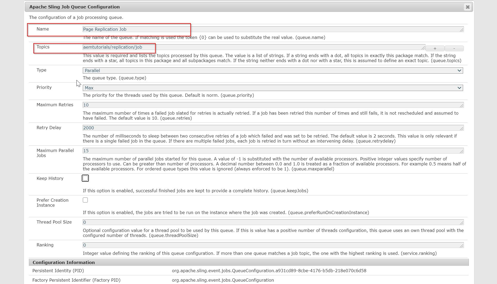
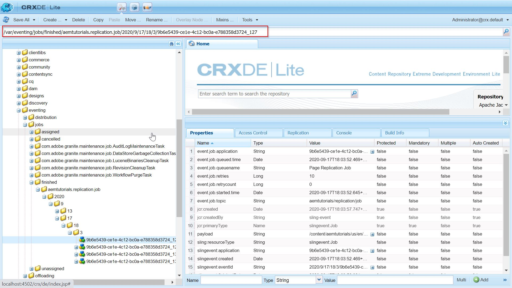

Hello happy people :wave:! In one of the earlier posts, we discussed event handling/listening mechanism in OSGi/AEM. This mechanism is handled by **OSGi Event Admin**. If you wish to refresh your knowledge, have a look at this post [Day 15 - Eventing In AEM](https://redquark.org/aem/day-15-eventing-in-aem).

However, the **OSGi Event Admin** is clueless on what is there inside the event. Since it is a dumb mechanism that doesn't understand the contents of an event, it is impossible for this mechanism to decide whether an event is important or not. Also, it is an ***F&F (fire and forget)*** mechanism, even if it processed the event successfully, there's no way for admin to know if the event is actually processed.

But there are some cases, where we need the guarantee of processing at least once. For e.g., sending a status email to a group of users, cleaning up the shit our application made during processing and many others.

But fret not, Sling takes care of these use cases as well :yum:. Sling Event Support has a concept of **Job**. A job is also an event that is guaranteed to be processed at least once (but there's a catch :thinking:).

### What's the catch?
The scenario where job execution cannot be guaranteed happens if the instance which processes a job crashes after the job processing is finished but before this state is persisted. 

Therefore a job consumer should be prepared to process a job more than once. Of course, if there is no job consumer for a job, the job is never processed. But this is more of a coding error that we have a job but no one to consume it.

## Job Fundamentals

1. A job has two parts - ***topic*** which describes the nature of the job and ***payload***, the data in the form of key-value pairs.

From the official docs -
> The job topic follows the conventions for the topic of an OSGi event. All objects in the payload must be serializable and publicly available (exported by a bundle).

2. A ***job consumer*** is a service consuming and processing a job. It registers itself as an OSGi service together with a property defining which topics this consumer can process. A job consumer can return three types of results - 

```
JobResult.OK - Job has been processed successfully
JobResult.FAILED - Job processing has failed
JobResult.CANCEL - Job processing has failed permanently
```

3. A ***job executor*** is a service processing a job. It registers itself as an OSGi service together with a property defining which topics this consumer can process.

## Code Example

To see the concept in action, we will now work on a use case. Suppose, we wish to have the latest content on our publisher as soon as some content author updates a page on the AEM author server. Pretty neat, right? Just kidding :smile:. It is the most basic use case but enough to understand the functioning of sling jobs.

Without further ado, let's roll up our sleeves and write some code.

1. Navigate to the **core** module in your AEM Multimodule project and create a new class named `PageUpdatedEventHandler` at `org.redquark.aem.tutorials.core.events.handler` and paste the following code in it -

```java
package org.redquark.aem.tutorials.core.events.handler;

import com.day.cq.wcm.api.PageEvent;
import org.apache.sling.event.jobs.JobManager;
import org.osgi.framework.Constants;
import org.osgi.service.component.annotations.Component;
import org.osgi.service.component.annotations.Reference;
import org.osgi.service.event.Event;
import org.osgi.service.event.EventConstants;
import org.osgi.service.event.EventHandler;
import org.slf4j.Logger;
import org.slf4j.LoggerFactory;

import java.util.HashMap;
import java.util.List;
import java.util.Map;

import static org.redquark.aem.tutorials.core.constants.AppConstants.EQUALS;
import static org.redquark.aem.tutorials.core.constants.AppConstants.PAGE_REPLICATION_TOPIC;

@Component(
        immediate = true,
        service = EventHandler.class,
        property = {
                Constants.SERVICE_DESCRIPTION + "= This event handler listens to the events on page modification",
                EventConstants.EVENT_TOPIC + EQUALS + PageEvent.EVENT_TOPIC
        }
)
public class PageUpdatedEventHandler implements EventHandler {

    private static final String TAG = PageUpdatedEventHandler.class.getSimpleName();
    private static final Logger LOGGER = LoggerFactory.getLogger(PageUpdatedEventHandler.class);

    @Reference
    JobManager jobManager;

    @Override
    @SuppressWarnings("unchecked")
    public void handleEvent(Event event) {
        LOGGER.debug("{}: event occurred for topic: {}", TAG, event.getTopic());
        try {
            // Get the payload path from the event
            List<HashMap<String, Object>> modifications = (List<HashMap<String, Object>>) event.getProperty("modifications");
            // Payload path
            String payload = (String) modifications.get(0).get("path");
            // Add stuff for the job
            Map<String, Object> jobProperties = new HashMap<>();
            jobProperties.put("payload", payload);
            // Add this job to the job manager
            jobManager.addJob(PAGE_REPLICATION_TOPIC, jobProperties);
            LOGGER.info("{}: job is completed successfully", TAG);
        } catch (Exception e) {
            LOGGER.error("{}: exception occurred: {}", TAG, e.getMessage());
        }
    }
}
```

This is nothing but a simple event handler listening to the events on a page of type `cq:Page`. Simply put, as soon as someone changes any page in the AEM, this handler will capture that event and perform the business logic.

This handler is bound to the page events via this line of code -

```java
EventConstants.EVENT_TOPIC = PageEvent.EVENT_TOPIC
```

As soon as we capture the event, we get the path of the page on which the aforementioned event happened. If you notice closely, we are injecting an instance of `JobManager` which will take care of, as you have guessed it, "managing the jobs". The job manager will create a new job with a **Job Topic** ("aemtutorials/replication/job" in this case) and a Map containing job related information (we are storing the path of the page for our use case).

The following line of code will add a job with the given topic. 

```java
jobManager.addJob("aemtutorials/replication/job", jobProperties);
```

This job will be processed by a `JobConsumer` who is listening to the same topic.

2. After creating an event handler for page events and adding a job with a specific top, now is the time to create a job consumer which will be listening to that topic.
For that, create a new class `org.redquark.aem.tutorials.core.jobs.PageReplicationJob` and paste the following code in it -

```java
package org.redquark.aem.tutorials.core.jobs;

import org.apache.sling.event.jobs.Job;
import org.apache.sling.event.jobs.consumer.JobConsumer;
import org.osgi.service.component.annotations.Component;
import org.osgi.service.component.annotations.Reference;
import org.redquark.aem.tutorials.core.services.ReplicationService;
import org.slf4j.Logger;
import org.slf4j.LoggerFactory;

import static org.apache.sling.event.jobs.consumer.JobConsumer.PROPERTY_TOPICS;
import static org.osgi.framework.Constants.SERVICE_DESCRIPTION;
import static org.osgi.service.event.EventConstants.SERVICE_ID;
import static org.redquark.aem.tutorials.core.constants.AppConstants.EQUALS;
import static org.redquark.aem.tutorials.core.constants.AppConstants.PAGE_REPLICATION_TOPIC;
import static org.redquark.aem.tutorials.core.jobs.PageReplicationJob.SERVICE_NAME;

@Component(
        immediate = true,
        service = JobConsumer.class,
        property = {
                SERVICE_ID + EQUALS + SERVICE_NAME,
                SERVICE_DESCRIPTION + EQUALS + "This job replicates the given payload",
                PROPERTY_TOPICS + EQUALS + PAGE_REPLICATION_TOPIC
        }
)
public class PageReplicationJob implements JobConsumer {

    protected static final String SERVICE_NAME = "Page Replication Job";
    private static final String TAG = PageReplicationJob.class.getSimpleName();
    private static final Logger LOGGER = LoggerFactory.getLogger(PageReplicationJob.class);

    @Reference
    ReplicationService replicationService;

    @Override
    public JobResult process(Job job) {
        LOGGER.debug("{}: trying to execute job: {}", TAG, job.getTopic());
        try {
            // Get the payload path from the job properties
            String payloadPath = (String) job.getProperty("payload");
            // Call the replication service
            replicationService.replicateContent(payloadPath);
            return JobResult.OK;
        } catch (Exception e) {
            LOGGER.error("{}: job failed due to: {}", TAG, e.getMessage());
            return JobResult.FAILED;
        }
    }
}
```

Notice that in the properties of this class, we have specified the same topic by which the job was added. This means that as soon as a job with the topic `aemtutorials/replication/job` is registered, this consumer will come into action and will execute the business logic. 

This consumer is doing nothing but getting the payload from the `Job` instance and performing the replication of that page using the `Replication Service` (explained later). 

That's it... whatever business logic you will write in the overridden `process (Job job)` method, it will be executed by this job consumer with the guarantee of executing it at least once.

3. The above job consumer is using a `ReplicationService` which replicates a specified page. To implement this, let's first create an interface `org.redquark.aem.tutorials.core.services.ReplicationService` and paste the following code in it -

```java
package org.redquark.aem.tutorials.core.services;

public interface ReplicationService {

    void replicateContent(String payload);
}
```

Now, create the implementation of the above interface as `org.redquark.aem.tutorials.core.services.impl.ReplicationServiceImpl` and paste the following code in it - 

```java
package org.redquark.aem.tutorials.core.services.impl;

import com.day.cq.dam.api.Asset;
import com.day.cq.dam.commons.util.AssetReferenceSearch;
import com.day.cq.replication.ReplicationActionType;
import com.day.cq.replication.ReplicationException;
import com.day.cq.replication.Replicator;
import com.day.cq.wcm.api.Page;
import com.day.cq.wcm.api.PageManager;
import org.apache.sling.api.resource.Resource;
import org.apache.sling.api.resource.ResourceResolver;
import org.osgi.service.component.annotations.Component;
import org.osgi.service.component.annotations.Reference;
import org.redquark.aem.tutorials.core.services.ReplicationService;
import org.redquark.aem.tutorials.core.services.ResourceResolverService;
import org.slf4j.Logger;
import org.slf4j.LoggerFactory;

import javax.jcr.Node;
import javax.jcr.Session;
import java.util.LinkedHashSet;
import java.util.Map;
import java.util.Objects;
import java.util.Set;

import static com.day.cq.dam.api.DamConstants.MOUNTPOINT_ASSETS;
import static org.osgi.service.event.EventConstants.SERVICE_ID;
import static org.redquark.aem.tutorials.core.constants.AppConstants.EQUALS;
import static org.redquark.aem.tutorials.core.services.impl.ReplicationServiceImpl.SERVICE_NAME;

@Component(
        service = ReplicationService.class,
        property = {
                SERVICE_ID + EQUALS + SERVICE_NAME
        }
)
public class ReplicationServiceImpl implements ReplicationService {

    protected static final String SERVICE_NAME = "Replication Service";

    private static final String TAG = ReplicationServiceImpl.class.getSimpleName();
    private static final Logger LOGGER = LoggerFactory.getLogger(ReplicationServiceImpl.class);

    @Reference
    Replicator replicator;

    @Reference
    ResourceResolverService resourceResolverService;

    @Override
    public void replicateContent(String payload) {
        LOGGER.info("{}: trying to replicate: {}", TAG, payload);
        // Getting resource resolver
        ResourceResolver resourceResolver = resourceResolverService.getResourceResolver();
        // Getting the session
        Session session = resourceResolver.adaptTo(Session.class);
        // Replicate the page
        replicate(session, payload);
        // Get all the assets on the page(s)
        Set<String> assetsOnPage = getAssetsOnPage(resourceResolver, payload);
        for (String assetPath : assetsOnPage) {
            replicate(session, assetPath);
        }
        LOGGER.info("{}: replication completed successfully", TAG);
    }

    private Set<String> getAssetsOnPage(ResourceResolver resourceResolver, String payload) {
        PageManager pageManager = resourceResolver.adaptTo(PageManager.class);
        Page page = Objects.requireNonNull(pageManager).getPage(payload);
        if (page == null) {
            return new LinkedHashSet<>();
        }
        Resource resource = page.getContentResource();
        AssetReferenceSearch assetReferenceSearch = new AssetReferenceSearch(resource.adaptTo(Node.class),
                MOUNTPOINT_ASSETS, resourceResolver);
        Map<String, Asset> assetMap = assetReferenceSearch.search();
        return assetMap.keySet();
    }

    private void replicate(Session session, String path) {
        try {
            LOGGER.info("{}: Replicating: {}", TAG, path);
            replicator.replicate(session, ReplicationActionType.ACTIVATE, path);
        } catch (ReplicationException e) {
            LOGGER.error("{}: replication failed due to: {}", TAG, e.getMessage());
        }
    }
}
```

This service is using out of the box replication API `Replicator` to replicate the content. This is a pretty straight forward class where we are getting all the assets on the page and then replicating them one by one along with the page content.

The following line of code replicates the specified path - 

```java
replicator.replicate(session, ReplicationActionType.ACTIVATE, path);
```

This code is being called for each asset and then finally the page itself.

4. For the reference, the full code of the `AppConstants.java` is as follows - 

```java
package org.redquark.aem.tutorials.core.constants;

/**
 * @author Anirudh Sharma
 * <p>
 * This class keeps all the app level constants
 */
public final class AppConstants {

    public static final String FORWARD_SLASH = "/";
    public static final String EQUALS = "=";
    public static final String NEW_LINE = "\n";

    // TO-DO related constants
    public static final String TODO_ENDPOINT = "https://jsonplaceholder.typicode.com/todos/";
    public static final long TODO_THREAD_SLEEP_TIME = 14400000;

    // Resource Resolver Factory sub-service
    public static final String SUB_SERVICE = "tutorialSubService";

    // Workflow Process Label
    public static final String PROCESS_LABEL = "process.label";
    // Workflow Chooser Label
    public static final String CHOOSER_LABEL = "chooser.label";
    // Child page count
    public static final String CHILD_PAGE_COUNT = "childPageCount";

    // User groups
    public static final String ADMINISTRATORS = "administrators";
    public static final String CONTENT_AUTHORS = "content-authors";

    // Dynamic datasource
    public static final String DATASOURCE = "datasource";
    public static final String DROPDOWN_SELECTOR = "dropdownSelector";
    public static final String COUNTRY_LIST = "countryList";
    public static final String COUNTRY_LIST_PATH = "/content/dam/aemtutorials/country.json";
    public static final String COLOR_LIST = "colorList";
    public static final String COLOR_LIST_PATH = "/content/dam/aemtutorials/color.json";
    public static final String FONT_LIST = "fontList";
    public static final String FONT_LIST_PATH = "/content/dam/aemtutorials/font.json";

    public static final String PAGE_REPLICATION_TOPIC = "aemtutorials/replication/job";
}
```

4. Now, deploy the code on the AEM instance using maven.

5. Once we deploy the code, we will also need to define the topic  `aemtutorials/replication/job` in the AEM configurations. For that, navigate to [http://localhost:4502/system/console/configMgr](http://localhost:4502/system/console/configMgr) and search for the string "Apache Sling Job Queue Configuration".

6. This is a factory configuration (which means we can create many configurations of this type). Click on it and fill it as follows and save - 



7. Now, moment of truth :hushed:, navigate to any of the pages and edit any component on it and save.

8. If everything goes fine, a job instance should be created an processed. The job should replicate the page which we can see either in the logs or directly on the publisher with the changes we made.

9. We can also check the status of jobs in [CRX DE](http://localhost:4502/crx/de/index.jsp) under `/var/eventing/jobs` - 




## Conclusion

And that's a wrap :raising_hand_man:. We have successfully create a sling job and replicated content through it. I hope you enjoyed this post.

I would love to hear your thoughts on this and would like to have suggestions from you to make it better.

As usual, you can find the complete code on my [GitHub](https://github.com/ani03sha/AEM-Tutorials). If you find it useful, consider giving it a star :star:.

Happy Learning 😊 and Namaste :pray:.