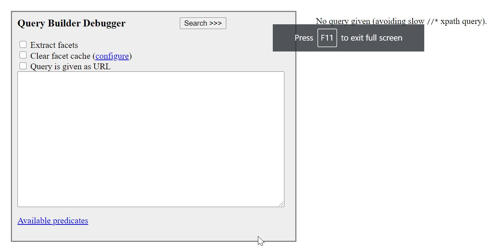
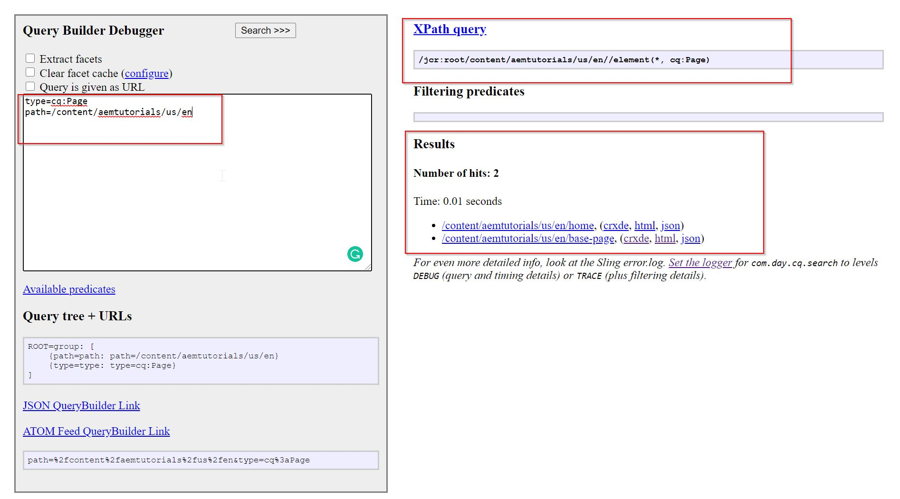
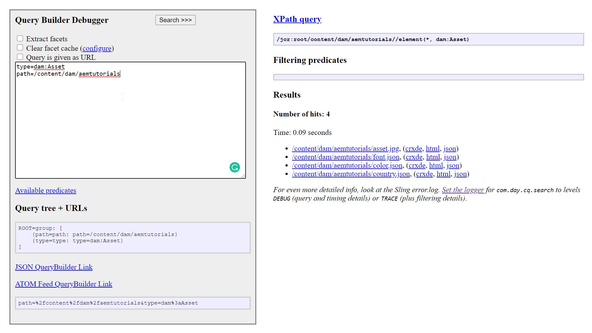
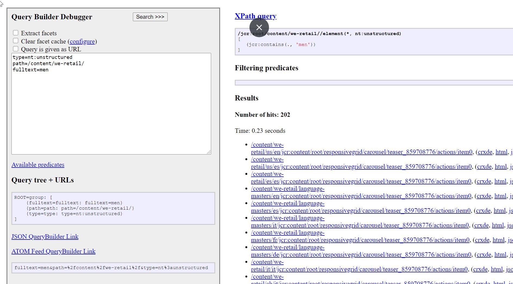
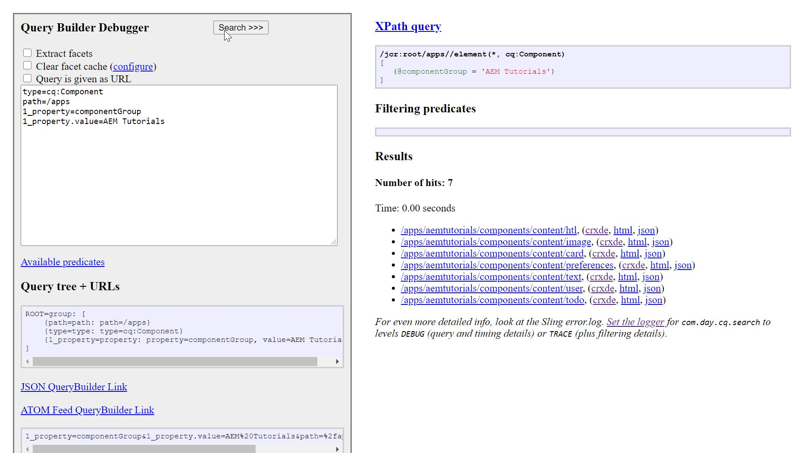
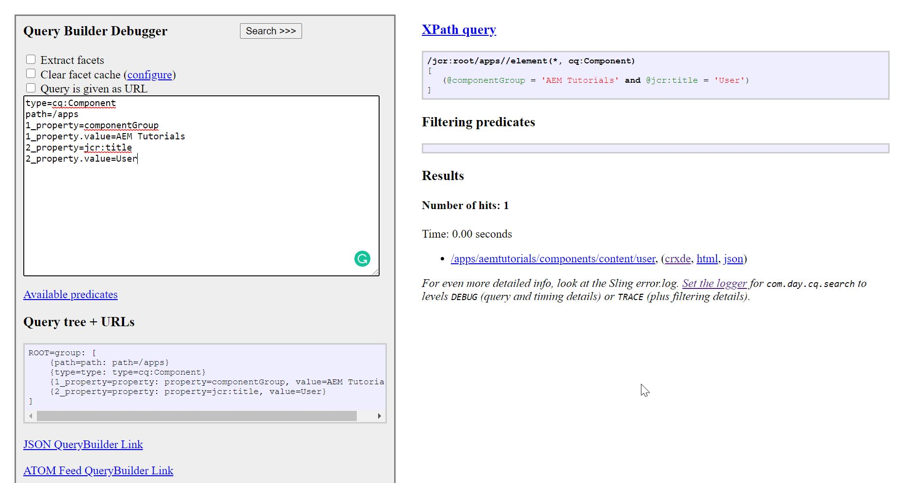

Hello good people :wave:! Welcome to yet another day of AEM Developer Series. Today, we are going to discuss **Queries** in AEM. Search functionality is the backbone of almost all the enterprise web applications and AEM is no exception. 

AEM provides the [QueryBuilder](https://helpx.adobe.com/experience-manager/6-5/sites/developing/using/reference-materials/javadoc/com/day/cq/search/QueryBuilder.html) API to perform search operations in the JCR.

A **Query Builder** is nothing but a wrapper for a query engine. What's a query engine, you ask? Read on...

## Query Engine

Simply put, a query engine is a piece of software that is positioned on top of a database which interprets commands given by the users and does what is told. In other words, it is in charge of implementing query functionalities against the database and provides answers to the users/applications.

Since we already know JCR is also a database which stores application data in the form of nodes and properties. If we wish to query this data then we would also need a query engine that understands JCR to implement query on, you guessed it right, JCR ::stuck_out_tongue_winking_eye::.

For this purpose, the intelligent folks at Adobe created a query engine for Jackrabbit Oak which is called [Oak Query Engine](https://jackrabbit.apache.org/oak/docs/query/query-engine.html). The users/applications will make queries to Oak Query Engine which will then execute and provide the results.

## Query Builder

As we just learned that **Oak Query Engine** is responsible of executing queries. But where are the queries :thinking:? Who provides them? And how would the user know what syntax they need to use for their queries? Burning questions... right? But fret not, this is why we are reading this post :stuck_out_tongue:. 

To run queries on JCR, we need an API which has some rules and if we follow those rules we should be able to get what we want (also, a good citizen always follow the rules, no matter what [Walter White](https://breakingbad.fandom.com/wiki/Walter_White) says :stuck_out_tongue:).

The API which lets us perform queries on JCR (or AEM) is Query Builder. It uses JCR XPath underneath.

### How Query Builder works internally?

1. A user/application writes a query.
2. This query is then converted to XPath.
3. The converted query is now sent to Query Engine.
4. The Query Engine converts this query to JCR SQL2.
5. The converted query is now executed by Oak Query Engine.
6. If there's an index for the query, it will pick it and if not, it will become a traversal query which means it will traverse the entire JCR.

>> A traversal query is a bad bad thing :cry:. It makes application slow and reduces performance and in turn increases frustration of users which is certainly not good for business. Hence, the developers should always try to optimize their queries either by modifying them or by creating appropriate index.

### Additional Points
1. A query engine. It uses Oak Query Engine.
2. It does not have its own index. It uses Oak indices (under `/oak:index` in CRX DE).

## Predicate
A predicate is a logical condition that evaluates to either `true` or `false`. We can define a query with a list of predicates which will filter the final results for us. For e.g., a predicate can be used in a `SELECT` statement as a `WHERE` clause. This will determine which rows are relevant for us and return only those rows.

### Common Predicates in AEM

**1. Path** - This is used to search under a given path like `/content/dam/aemtutorials`, `/apps/aemtutorials/components/content` etc. 

(i) `path.self=true` - searches the subtree including the given node 

(ii) `path.exact=true` - matches the exact path only

(iii) `path.flat=true` - searches only the direct children

**2. type** - searches for a particular node type only. For e.g. `cq:Page`, `dam:Asset`, `nt:unstructured` etc.

**3. property** - searches based on the specified JCR property. 

(i) `property.value` - the value of the property to be searched.

(ii) `property.and=true` - logical AND of multiple properties. Default is logical OR.

(iii) `property.operation` - "equals", "unequal", "like"

**4. fulltext** - searches terms for case sensitive fulltext search.

**5. daterange** - searches based on dates.

(i) `daterange.property` - date property on which query needs to run.

(ii) `daterange.lowerBound` - lower bound date range

(iii) `daterange.lowerOperation` - ">" (default) or ">="

(iv) `daterange.upperBound` - upper bound date range

(v) `daterange.upperOperation` - "<" (default) or "<="

## Query Builder UI
AEM also provides out of the box UI for quickly running queries at - [http://localhost:4502/libs/cq/search/content/querydebug.html](http://localhost:4502/libs/cq/search/content/querydebug.html).

This looks like as follows - 



Thus we can write our queries in the given text area and test them without writing any code. Once we are sure that we have reached the most optimized query then we can run those via code (which we will discuss later).

## Some Examples

### 1. Fetch the list of all pages/assets under a given path

Every query needs the type of nodes for which search needs to happen. The type is defined by the node property `jcr:primaryType`.

- For pages, the query would be - 

```
type=cq:Page
path=/content/aemtutorials/us/en
```

This will give us the following output -



If we notice it carefully we have results and corresponding XPath query as well.

- For assets also, we can have something like below - 

```
type=dam:Asset
path=/content/dam/aemtutorials
```

The result will look like below -



### 2. Full text search

If we wish to search for a "key" in our object. Then Query Builder allows us to do that as well -

```
type=nt:unstructured
path=/content/we-retail/
fulltext=men
```

The result will look like below - 



### Fetch results based on some properties

We can also pass some properties to filter our results (like `WHERE` clause). Let's fetch a list of all components with `componentGroup=AEM Tutorials`, we will have something like below -

```
type=cq:Component
path=/apps
1_property=componentGroup
1_property.value=AEM Tutorials
```

Here, we are first defining the property (1_property) and its value (1_property.value). We will get results like below - 



We can also pass multiple properties like below - 

```
type=cq:Component
path=/apps
1_property=componentGroup
1_property.value=AEM Tutorials
2_property=jcr:title
2_property.value=User
```

The result will look something like below - 



Pretty neat, right :wink:?

Like above, we can create any query as per our requirement. You can follow this [official document](https://docs.adobe.com/content/help/en/experience-manager-65/developing/platform/query-builder/querybuilder-api.html) as a guide to create queries.

But we should be careful. Why? Read on...

## Excess of queries is harmful :warning:

Every query comes with its cost and this cost impacts the performance. Therefore, we should always use queries when absolute necessary.

### Use cases where queries can be used
1. Full Text search requirements
2. When structured content is spread across the repository and we need to search it.

### Use cases where queries should not be used
1. For getting top 5 articles
2. Count of articles

For rendering content, it is better to traverse the content tree instead of running queries.

## Create custom index

Sometimes we find ourselves in a situation where we need to work with queries for which there no out of the box index is available (also called **traversal** queries, remember :bulb:?). In that case, we should create our own index. 

There is an excellent utility which lets you paste your traversal queries and creates an index definition for you. This utility is [Oak Index Definition Generator](https://oakutils.appspot.com/generate/index).

For e.g., if I want to create an index for the following query - 

```java
SELECT * FROM [cq:Page] AS a WHERE a.[jcr:content/jcr:created] = 'admin'
```

This will generated the following index definition -

```javascript
  - compatVersion = 2
  - async = "async"
  - jcr:primaryType = oak:QueryIndexDefinition
  - type = "lucene"
  + indexRules 
   + nt:unstructured 
    + properties 
     + created 
      - name = "jcr:content/jcr:created"
      - propertyIndex = true
```

You can now go in the CRX DE and create your index using the above definition and reindex once created. Word of caution :warning:, since reindexing a big repository can take huge amount of time, make sure to follow the official instructions from Adobe.

## Conclusion

Phewww :weary: we have learnt so much theory today. We have seen how can we query the JCR using Query Builder API.  I hope you enjoyed this post.

I would love to hear your thoughts on this and would like to have suggestions from you to make it better. In the next post we will continue our discussion and will see how we can implement Query Builder API in code.

Happy Learning 😊 and Namaste :pray:.