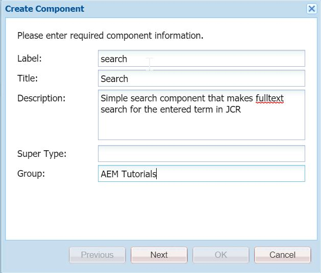

Hey fellow devs :wave:! Welcome to today's post. In the [previous](https://redquark.org/aem/day-19-queries-in-aem-1) post, we learnt concepts of queries in AEM. 

Building on that knowledge, we will now create a simple search bar that will take an input and queries the search term in the JCR repository for all the `cq:Page` nodes and under the path `/content`.

## Code Example

First we will create a simple component with one textfield and a button to execute the search. Then, we will write backend logic to search the term entered in the textfield using the `QueryBuilder` API.

Without further ado, let's see how can we achieve this - 

1. Navigate to [CRX DE](http://localhost:4502/crx/de) and under the path `/apps/aemtutorials/components/content`, create a new component with the following properties -



2. Rename the file `search.jsp` to `search.html` under `/apps/aemtutorials/components/content/search` and paste the following code in it - 

```html
<sly data-sly-use.clientlib="/libs/granite/sightly/templates/clientlib.html"></sly>
<sly data-sly-call="${clientlib.css @ categories='aemtutorials.search'}"></sly>

<form id="fulltext-search" action="/bin/aemtutorials/search" method="POST" accept-charset="UTF-8">
    <input type="text" id="keyword" class="textbox" name="keyword">
    <input title="Search" value="Search" type="submit" class="button">
</form>
```

This is a simple code where we are creating an HTML form with only two fields - textfield for keyword and a submit button.

Also, if you see in the `action` of our `form`, we are giving the path by which our Sling Servlet will be registered.

Plus, for styling and data passing, we will create client library with the relevant CSS and JS code.

3. Create a new node named `cq:dialog` of type `nt:unstructured` under `/apps/aemtutorials/components/content/search` and save.

4. Now, create one more node named `clientlibs` of type `cq:ClientLibraryFolder` and add the following two properties in the node and save -

```
allowProxy="Boolean"true
categories=aemtutorials.search
```

5. Now, create two files `js.txt` and `css.txt` under the `clientlibs` node and add following content in it - 

**css.txt**

```
#base=css
style.css
```

**js.txt**

```
#base=js
script.js
```

6. Now, create two folders under the `clientlibs` folder - `js` and `css`.

7. Create a new file `script.js` under `js` folder with the following code - 

```js
$(function () {
    $('#fulltext-search').submit(function (event) {
        event.preventDefault();

        var formEl = $(this);
        var submitButton = $('input[type=submit]', formEl);

        $.ajax({
            type: 'POST',
            url: formEl.prop('action'),
            accept: {
                javascript: 'application/javascript'
            },
            data: {
                'keyword': $('#keyword').val()
            },
            beforeSend: function () {
                submitButton.prop('disabled', 'disabled');
            }
        }).done(function (data) {
            submitButton.prop('disabled', false);
        });
    });
});
```

The above is a simple JQuery code that will be executed as soon as the `form` is submitted. We have an AJAX call in there which will extract the **keyword** from the submitted form and will pass it to the servlet via an AJAX call.

8. For some styling, we will create a new file `style.css` under the `css` folder with the following code - 

```css
form {
    outline: 0;
    float: left;
    -webkit-box-shadow: 0 1px 3px rgba(0, 0, 0, 0.12), 0 1px 2px rgba(0, 0, 0, 0.24);
    box-shadow: 0 1px 3px rgba(0, 0, 0, 0.12), 0 1px 2px rgba(0, 0, 0, 0.24);
    -webkit-border-radius: 4px;
    border-radius: 4px;
}

form>.textbox {
    outline: 0;
    height: 42px;
    width: 244px;
    line-height: 42px;
    padding: 0 16px;
    background-color: rgba(255, 255, 255, 0.8);
    color: #212121;
    float: left;
    -webkit-border-radius: 4px 0 0 4px;
    border-radius: 4px 0 0 4px;
}

form>.textbox:focus {
    outline: 0;
    background-color: #FFF;
}

form>.button {
    outline: 0;
    background: none;
    background-color: rgba(38, 50, 56, 0.8);
    float: left;
    height: 42px;
    width: 75px;
    text-align: center;
    line-height: 42px;
    border: 0;
    color: #FFF;
    font: normal normal normal 14px/1 FontAwesome;
    font-size: 16px;
    text-rendering: auto;
    text-shadow: 0 1px 1px rgba(0, 0, 0, 0.2);
    -webkit-transition: background-color .4s ease;
    transition: background-color .4s ease;
    -webkit-border-radius: 0 4px 4px 0;
    border-radius: 0 4px 4px 0;
}

form>.button:hover {
    background-color: rgba(0, 150, 136, 0.8);
}
```

9. Our front end part is done, now sync the code with the IntelliJ using the `IntelliVault` tool.

10. Now, it's the time to create our backend. Navigate to the `core` module of our AEM Multimodule project and create a new class `org.redquark.aem.tutorials.core.servlets.SearchServlet` with the following code -

```java
package org.redquark.aem.tutorials.core.servlets;

import org.apache.sling.api.SlingHttpServletRequest;
import org.apache.sling.api.SlingHttpServletResponse;
import org.apache.sling.api.servlets.HttpConstants;
import org.apache.sling.api.servlets.SlingAllMethodsServlet;
import org.osgi.framework.Constants;
import org.osgi.service.component.annotations.Component;
import org.osgi.service.component.annotations.Reference;
import org.redquark.aem.tutorials.core.services.SearchService;
import org.slf4j.Logger;
import org.slf4j.LoggerFactory;

import javax.servlet.Servlet;
import java.io.IOException;
import java.util.List;

import static org.apache.sling.api.servlets.ServletResolverConstants.SLING_SERVLET_METHODS;
import static org.apache.sling.api.servlets.ServletResolverConstants.SLING_SERVLET_PATHS;
import static org.redquark.aem.tutorials.core.constants.AppConstants.EQUALS;
import static org.redquark.aem.tutorials.core.constants.AppConstants.NEW_LINE;
import static org.redquark.aem.tutorials.core.servlets.SearchServlet.PATH;
import static org.redquark.aem.tutorials.core.servlets.SearchServlet.SERVICE_NAME;

@Component(
        service = Servlet.class,
        property = {
                Constants.SERVICE_ID + EQUALS + SERVICE_NAME,
                SLING_SERVLET_PATHS + EQUALS + PATH,
                SLING_SERVLET_METHODS + EQUALS + HttpConstants.METHOD_POST
        }
)
public class SearchServlet extends SlingAllMethodsServlet {

    protected static final String PATH = "/bin/aemtutorials/search";
    protected static final String SERVICE_NAME = "Search Servlet";

    private static final String TAG = SearchServlet.class.getSimpleName();
    private static final Logger LOGGER = LoggerFactory.getLogger(SearchServlet.class);

    @Reference
    SearchService searchService;

    @Override
    protected void doPost(SlingHttpServletRequest request, SlingHttpServletResponse response) {
        try {
            String keyword = request.getParameter("keyword");
            LOGGER.info("{}: searching for keyword: {}", TAG, keyword);
            // Getting the result from search service
            List<String> resultList = searchService.searchByKeyword(keyword);
            // Format the results
            StringBuilder formattedResult = new StringBuilder();
            for (String s : resultList) {
                formattedResult.append(s).append(NEW_LINE);
            }
            // Print the results on the screen
            response.getWriter().println(formattedResult.toString());
        } catch (IOException e) {
            LOGGER.error("{}: cannot search due to: {}", TAG, e.getMessage());
        }
    }
}
```

This servlet will be called as the form is submitted. Since we are using the HTTP POST method, we have extended this servlet from `SlingAllMethodsServlet`.

Here, we are getting the entered keyword from the `request` object and passed it in the `SearchService` which will have the actual logic of searching the JCR.

11. Now, create a new interface `org.redquark.aem.tutorials.core.services.SearchService` with the following code in it - 

```java
package org.redquark.aem.tutorials.core.services;

import java.util.List;

public interface SearchService {

    List<String> searchByKeyword(String keyword);
}
```

12. Create an implementation of the above service as `org.redquark.aem.tutorials.core.services.impl.SearchServiceImpl` and paste the following code in it - 

```java
package org.redquark.aem.tutorials.core.services.impl;

import com.day.cq.search.PredicateGroup;
import com.day.cq.search.Query;
import com.day.cq.search.QueryBuilder;
import com.day.cq.search.result.Hit;
import com.day.cq.search.result.SearchResult;
import org.apache.sling.api.resource.ResourceResolver;
import org.osgi.framework.Constants;
import org.osgi.service.component.annotations.Component;
import org.osgi.service.component.annotations.Reference;
import org.redquark.aem.tutorials.core.services.ResourceResolverService;
import org.redquark.aem.tutorials.core.services.SearchService;
import org.slf4j.Logger;
import org.slf4j.LoggerFactory;

import javax.jcr.RepositoryException;
import javax.jcr.Session;
import java.util.ArrayList;
import java.util.HashMap;
import java.util.List;
import java.util.Map;

import static com.day.cq.wcm.api.NameConstants.NT_PAGE;
import static org.redquark.aem.tutorials.core.constants.AppConstants.EQUALS;
import static org.redquark.aem.tutorials.core.services.impl.SearchServiceImpl.SERVICE_DESCRIPTION;
import static org.redquark.aem.tutorials.core.services.impl.SearchServiceImpl.SERVICE_NAME;

@Component(
        service = SearchService.class,
        property = {
                Constants.SERVICE_ID + EQUALS + SERVICE_NAME,
                Constants.SERVICE_DESCRIPTION + EQUALS + SERVICE_DESCRIPTION
        }
)
public class SearchServiceImpl implements SearchService {

    protected static final String SERVICE_NAME = "Search Service";
    protected static final String SERVICE_DESCRIPTION = "This services uses QueryBuilder API to search in JCR";

    private static final String TAG = SearchServiceImpl.class.getSimpleName();
    private static final Logger LOGGER = LoggerFactory.getLogger(SearchServiceImpl.class);

    @Reference
    QueryBuilder queryBuilder;

    @Reference
    ResourceResolverService resourceResolverService;

    @Override
    public List<String> searchByKeyword(String keyword) {
        LOGGER.debug("{}: trying to search for keyword: {}", TAG, keyword);
        // List of all the results
        List<String> resultPaths = new ArrayList<>();
        try {
            // Getting the instance of Resource Resolver
            ResourceResolver resourceResolver = resourceResolverService.getResourceResolver();
            // Adapting this resource resolver to get JCR session
            Session session = resourceResolver.adaptTo(Session.class);
            // Creating the predicates for the query using a map object
            Map<String, String> predicates = new HashMap<>();
            predicates.put("type", NT_PAGE);
            predicates.put("path", "/content/");
            predicates.put("fulltext", keyword);
            // Creating the query instance
            Query query = queryBuilder.createQuery(PredicateGroup.create(predicates), session);
            // Getting the results
            SearchResult searchResult = query.getResult();
            LOGGER.info("{}: number of results returned: {}", TAG, searchResult.getHits().size());
            // Loop through all the results
            for (Hit hit : searchResult.getHits()) {
                resultPaths.add(hit.getPath());
            }
        } catch (RepositoryException e) {
            LOGGER.error("{}: cannot search due to: {}", TAG, e.getMessage());
        }
        return resultPaths;
    }
}
```

In this service, we are constructing our query using predicates in the form of a `Map<String, String>` object. We are passing this object into the QueryBuilder instance to create a query. The query is then being executed and results are returned.

This query is equivalent to - 

```
type=cq:Page  
path=/content
fulltext=keyword
```

We can add as many predicates as we want in this map which will then be executed by the QueryBuilder API.

13. Build and deploy this code to AEM using Maven.

14. Once deployed, add the `Search` component on any of the page. It will look something like below - 


15. Enter any search query and the page will be redirected to the results page.

And that's it, we have successfully implemented and executed our queries using the `QueryBuilder` API. We should be proud of ourselves :clap:.

## Debugging the queries

Sometimes we find ourselves in a condition where we need to debug the queries to find issues. There are three major APIs on which we can set ***DEBUG*** level logger to understand what's going on - 

- ***`org.apache.jackrabbit.oak.plugins.index`***
- ***`org.apache.jackrabbit.oak.query`***
- ***`com.day.cq.search`***

## Conclusion

And that's a wrap!!!. We have successfully created a simple search component and searched the entered term using the QueryBuilder API. I hope you enjoyed this post.

I would love to hear your thoughts on this and would like to have suggestions from you to make it better.

As usual, you can find the complete code on my [GitHub](https://github.com/ani03sha/AEM-Tutorials). If you find it useful, consider giving it a star :star:.

This post also marks the end of our ***AEM DEVELOPER SERIES***. I hope you enjoyed the series and more important, learnt your way around AEM development. If you completed all the post until now, then ***Kudos*** to you :clap: :clap: :clap: :clap: :clap: :clap: :clap: :clap: :clap: :clap: :clap: :clap: :clap: :clap: :clap: :clap:.

Happy Learning 😊 and Namaste :pray:.