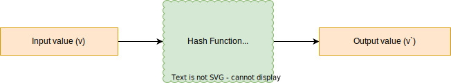
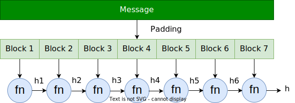

Heya fellow devs :wave:! Today we are going to discuss one of the most popular and widely used concept in Computer Science - ***Hashing***. It is an interesting topic and has many applications in the real world.

# What is Hashing?
In the simplest terms, hashing is the technique to transform a value into another value. The ***"entity"*** that converts a value into another is called a ***hash function***.

 

 

As shown in the above diagram, if we input a value **`v`** and pass it through the hash function **`h`**, we get the transformed value **`v'`**.

Let's understand this concept with an example. Suppose, you wish to divide a group of students in eight different groups from 0 to 7 based on their ID. How, would you determine who will go in which group? One such approach is to get the modulo of the IDs of students and based on the output, we can assign group to the users.

| Student ID | Group ID   |
|------------|------------|
| 34         | 34 % 7 = 6 |
| 87         | 87 % 7 = 3 |
| 28         | 28 % 7 = 0 |
| 51         | 51 % 7 = 2 |

In our case, modulo (%) is the hash function where we are inputting the student ID and after applying the modulo (hash function), we get the group ID.

Let's look at more technical example which illustrates another use of hashing - ***comparison***. Suppose, we have a reference string and a set of several long strings. Our task is to find one such string from the set which is identical to the reference string. The intuitive way to do this is to take one string at a time and compare it with the reference string character by character. This is simple but inefficient considering the size of the strings. Can we do anything better? Hashing provides us a way to do so. What we can do is below - 

1. Take a hash function which transforms a long string to a considerably shorter string.
2. Pass the reference string to the hash function to get the hash value.
3. Take every string in the set and calculate its hash value.
4. Compare every hash value of the string with the hash value of every string.
5. If the hash values are not same, we will skip that string.
6. If the hash values are equal, then only we will compare that string with the reference string character by character.

This process improves the performance manifolds as compared to the **brute force** approach. In this method, we don't have to compare every long string character by character just their hash values which are significantly smaller than the actual string.

# Properties of Hashing
A good hash function should have the following properties - uniqueness, irreversibility, deterministic, quick computation, avalanche effect. Let's understand these properties one by one -

## Uniqueness
According to this property, no two pieces of data have same hashed value. If they have same hash values, then this is called ***hash collision***. We have several techniques to avoid hash collision which we will see later.

## Irreversibility
According to this property, we can get hash value from an input, but we cannot retrieve input from the hash value. Hashing is a one way street.

## Deterministic
No matter how many times we input the same message through the hash function, the hash value remains the same. The deterministic nature is key to creating order within the system utilizing the hash function.

## Quick Computation
The hash function should be able to compute the hash value efficiently, i.e, efficient computation.

## Avalanche Effect
According to this property, the resulting hash output would change significantly or entirely even when a single bit or byte of data is changed. A hash function that does not do this is considered to have poor randomization, which would be easy to break by hackers. One good application of hashing which leverages this property is the **Blockchain Technology**.

# How does Hashing work?
In the previous section, we got an idea about hashing and how it works. A hash function is a mathematical function that converts an input value into a compressed numerical value - a hash or hash value. Basically, a hash function is a processing unit that takes in data of arbitrary length and gives you the output of a fixed length – the hash value.

The length of the hash depends on the hashing algorithm. The most popular hashing algorithms/functions have a hash length ranging from 160 to 512 bits. In order to get the hash value of a fixed length, we first need to divide data into smaller chunks or blocks of fixed size. This is because a hash function takes in the data of fixed length. The size of the data block depends on the hashing algorithm. For example, if we are using SHA-1 algorithm, the data blocks will be divided into blocks of 512 bits. Thus, if we are trying to convert a data of length 8192 bytes using SHA-1, the entire data will be divided into `8192/512 = 16` blocks.

## Padding
Once we divide the data into fixed sized blocks, they are passed through the hash function same number of times as number of blocks. Therefore, if we have 16 blocks, we will run the hash function 16 times. Here is how - the first data block `d1` will be passed through the hash function which will generate a hash value `h1`. Now, we will combine this hash value `h1` with the second data block `d2` and pass the combined value through the hash function. This time a new hash value `h2` will be generated. Now, we will combine `h2` with the third data block `d3` and so on. This process of adding some information to the data blocks is called ***Padding***.

 

 

The benefit of padding it that it provides awesome security because if someone changes even one bit in the input, every subsequent hash value will change, and we will know that the data we get is tampered with. This is known as the ***Avalanche Effect***.

# Popular Hashing Algorithm

## MD5 (Message Digest 5)
It is a cryptographic hash algorithm used to generate a 128 bit digest from a string of any length. It represents the digests as 32 digit hexadecimal numbers. It was designed in 1991, and at that time, it was considered remarkably secure. Since then, hackers have discovered way to decode the algorithm. Nowadays, it is not considered secure.

## SHA (Secure Hash Algorithm)
Algorithms in the SHA family are considered more secure. It is a modified version of MD5, and it is used for hashing data and certificates. There are many iterations of SHA.

### 1. SHA-0
This was the original version of SHA algorithm, but it was withdrawn due to an undisclosed security vulnerability.

### 2. SHA-1
SHA-0 was replaced by SHA-1. It is a 160 bit hash function which resembles the MD5 hash. Cryptographic weaknesses were discovered in SHA-1, and the standard was no longer approved for most cryptographic uses after 2010.

### 3. SHA-2
It is a family of two hash functions with different block sizes, SHA-256 and SHA-512. SHA-256 uses 32 bit words while SHA-512 uses 64 bit words. 

### 4. SHA-3
A hash function formerly called ***[Keccak](https://en.wikipedia.org/wiki/SHA-3)***, chosen in 2012 after a public competition among non-NSA designers. It supports the same hash lengths as SHA-2, and its internal structure differs significantly from the rest of the SHA family.

## RSA (Rivest Shamir Adleman)
It is an asymmetric cryptography algorithm. Since it works on different keys, **public** and **private**, it is called asymmetric. We know that it is tough to factorize a large integer. RSA takes advantage of this fact and generates public and private keys accordingly.

We take two large prime numbers and our public key is a multiplication of those two prime numbers. Private key is also derived from the same two prime numbers. To compromise the private key, it is imperative to factor the large numbers. Since, they are prime, it is difficult. Thus, the strength of our encryption lies on the key size.

# Conclusion

In this post, we looked into the most popular topics in computer science - Hashing. We looked at what hashing it, how it works and what are the different types of hashing algorithms we have. I hope you enjoyed this post.

I would love to hear your thoughts on this and would like to have suggestions from you to make it better. 

Happy coding and Namaste :smile:.