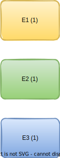
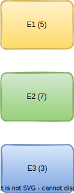
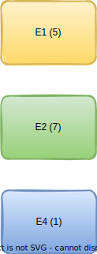
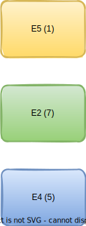

Hello fellow developers :wave:! In the last [post](https://redquark.org/design/lru-cache) we discussed about one caching strategy and in this post, we will be discussing another caching strategy - **Least Frequently Used (LFU)** cache.

# What is LFU Cache?
This is a caching strategy in which the least frequently used data element is evicted from the cache. We can determine such element by finding out the number of times that element has accessed and removing the element that is used least number of times.

There may be a case, where two or more elements have the same maximum frequency. In that case, we remove the element which is the **oldest**.

# How LFU Cache works?
As before, let's try to understand this with an example. Assume that the size of the cache is 3.

## 1. Three elements are added
Let's say we add three elements ***E1***, ***E2*** and ***E3*** one after the other in the cache. Our cache would look like below. Numbers in parentheses represent the number of time the elements are accessed.

<br/>

<br/>

## 2. Retrieve some elements
Let's say we access ***E1*** four times, ***E2*** six times and ***E3*** two times. Our cache would look like below.

<br/>

<br/>

Here, we have updated the frequencies of the elements in the cache by number of times they were accessed.

## 3. Add a new element
Let's add a new element ***E4*** in the cache. Since the cache is already full, we need to evict an element and store a new element in place of it. In our case, the element ***E3*** has the lowest frequency, so it will be removed and new element will be added in its place.

<br/>

<br/>

## 4. Evict oldest element
Let's say, we have accessed ***E4*** four times and added a new element ***E5***. This will make the frequencies of ***E4*** and ***E1*** are equal i.e., 5. When we add a new element, we have to remove an element from the cache. We will remove ***E1*** because in case of frequency-tied, we remove the oldest element (kinda like [2019 ODI World Cup Final](https://en.wikipedia.org/wiki/2019_Cricket_World_Cup_Final)).

<br/>

<br/>

# LFU Cache Implementation

In this section, we are going to implement an LFU cache in Java. Let's first define the constraints for the LFU cache APIs - 

1. The constructor to initialize the LFU cache with the given capacity.

```java
LFUCache(int capacity)
```

2. The method to check if certain data element exists in the cache or not. This should take constant time `O(1)`.

```java
boolean has(K key)
```

3. The method which returns the stored data based on the key. If the key is not present then it will return `null`. This should take constant time `O(1)`.

```java
V get(K key)
```
Where `K` and `V` are the types of key and value respectively.

4. The method to store new data in the cache. If the cache is full then we will first remove the least frequently used element (oldest in case of tie) and then store the key-value pair. This should take constant time `O(1)`.

```java
void set(K key, V value)
```

5. The method to invalidate, i.e., empties the cache.

```java
boolean invalidate()
```

We can implement an LFU cache by using three maps - 
1. Map to store actual key value pairs.
2. Map to store key and their frequencies.
3. Map to store a frequency and a set of all the keys with that frequency.

```java
import java.util.HashMap;
import java.util.LinkedHashSet;
import java.util.Map;
import java.util.Set;

/**
 * This class implements the least frequently used cache
 */
public class LFUCache<K, V> {

    // Capacity of the cache
    private final int capacity;
    // This map stores the key and value pairs
    private final Map<K, V> keyValueMappings;
    // This map stores the keys and the number of times they were accessed.
    private final Map<K, Integer> keyFrequencyMappings;
    // This map stores the counts and the set of keys which have the same
    // counts and in the order in which they were inserted in the cache.
    private final Map<Integer, Set<K>> frequencyKeyMappings;
    // Variable which will point to the minimum frequency
    private int minimum;


    public LFUCache(int capacity) {
        this.minimum = -1;
        this.capacity = capacity;
        this.keyValueMappings = new HashMap<>();
        this.keyFrequencyMappings = new HashMap<>();
        this.frequencyKeyMappings = new HashMap<>();
    }

    public boolean has(K key) {
        return this.keyValueMappings.containsKey(key);
    }

    public V get(K key) {
        // Check if the key is not present in the cache
        if (!has(key)) {
            return null;
        }
        // Get the frequency of this key
        int frequency = this.keyFrequencyMappings.get(key);
        // We will first remove this key from the set against the
        // frequency we got above as the value. We do this because
        // later we will update the set with incremented count
        this.frequencyKeyMappings.get(frequency).remove(key);
        // If there is nothing in the current minimum bucket
        if (this.minimum == frequency && frequencyKeyMappings.get(frequency).isEmpty()) {
            this.minimum++;
        }
        // Put updated frequency in the relevant maps
        addCount(key, frequency + 1);
        return this.keyValueMappings.get(key);
    }

    public void set(K key, V value) {
        // If the cache contains the key
        if (has(key)) {
            // Update the value corresponding to the key
            this.keyValueMappings.put(key, value);
            // Update key's count
            int frequency = this.keyFrequencyMappings.get(key);
            // We will first remove this key from the set against the
            // frequency we got above as the value. We do this because
            // later we will update the set with incremented count
            this.frequencyKeyMappings.get(frequency).remove(key);
            // If there is nothing in the current minimum bucket
            if (this.minimum == frequency && frequencyKeyMappings.get(frequency).isEmpty()) {
                this.minimum++;
            }
            // Put updated frequency in the relevant maps
            addCount(key, frequency + 1);
            return;
        }
        // If the cache is full
        if (this.keyValueMappings.size() >= this.capacity) {
            // Evict the key with minimum frequency and if there
            // are more than one key with same minimum frequency,
            // we will evict the oldest one. The below line of code
            // will return us the first key corresponding to the
            // minimum frequency
            K keyToBeEvicted = this.frequencyKeyMappings.get(this.minimum).iterator().next();
            evict(keyToBeEvicted);
        }
        // Update the minimum frequency value
        this.minimum = 1;
        // Add new key and count
        addCount(key, this.minimum);
        this.keyValueMappings.put(key, value);
    }

    public boolean invalidate() {
        this.keyValueMappings.clear();
        this.keyFrequencyMappings.clear();
        this.frequencyKeyMappings.clear();
        return this.keyValueMappings.isEmpty();
    }

    private void evict(K key) {
        this.frequencyKeyMappings.get(this.minimum).remove(key);
        this.keyValueMappings.remove(key);
    }

    private void addCount(K key, int frequency) {
        this.keyFrequencyMappings.put(key, frequency);
        this.frequencyKeyMappings.computeIfAbsent(frequency, keys -> new LinkedHashSet<>());
        this.frequencyKeyMappings.get(frequency).add(key);
    }
}
```

# Conclusion
In this post, we dove into the concepts and implementation of LFU cache. I hope you enjoyed this post.

You can find the complete implementation of LRU cache in my [GitHub](https://github.com/ani03sha/RedQuarkTutorials/blob/master/Design/src/main/java/org/redquark/tutorials/design/caching/LFUCache.java) repository. It also includes some [test cases](https://github.com/ani03sha/RedQuarkTutorials/blob/master/Design/src/test/java/org/redquark/tutorials/design/caching/LFUCacheTest.java). Consider giving it a star :star: if you like it :smiley:.

I would love to hear your thoughts on this and would like to have suggestions from you to make it better. 

Happy coding and Namaste :smile:.