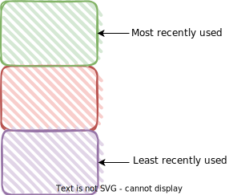

Hello fellow developers :wave:! In the [last post](https//redquark.org/design/caching), we looked into the concept of caching, why do we need caching, what challenges we may face and so on. In this post, we will discuss about one of the most popular caching strategy called **Least Recently Used (LRU)** cache.

# What is LRU Cache?
It is a cache eviction strategy where the least recently used elements are evicted first to make root for new cached data.
The phrase "least recently used" means the oldest accessed element. An item is considered accessed either if we add it to the cache or retrieved from the cache.

# How LRU Cache works?
Let's understand the working of LRU cache with an example. Suppose, we have a cache of capacity 3.

## 1. When the cache is empty
The top represents the most recently used element and the bottom represents the least recently used item.

<br/>


<br/>

## 2. Add three elements in the cache
Let's add three elements ***E1***, ***E2*** and ***E3*** in the cache in the same order. The element E1 is at the bottom because it was added before any other element thus, it is the oldest and least recently used.

<br/>


<br/>

## 3. Access an element
When we access any element using the `get` operation, it becomes the most recently used and moves to the top of the cache. Let's say we access ***E2*** here, then it will become most recently used and will be moved to the top of the cache.

<br/>


<br/>

## 4. Add a new element
Let's add a new element ***E4*** in the cache but there is no space as the cache has capacity of 3 and three elements are already present in the cache. Therefore, this is the time to evict some element from the cache. In LRU cache, this element should be the least recently used element which in our case is ***E1***. Thus, we will remove ***E1*** and add ***E4*** to the top of the cache as it is the one which is most recently accessed.

<br/>


<br/>

# LRU Cache Implementation

In this section, we are going to implement an LRU cache in Java. Let's first define the constraints for the LRU cache APIs - 

1. The constructor to initialize the LRU cache with the given capacity.

```java
LRUCache(int capacity)
```

2. The method to check if certain data element exists in the cache or not. This should take constant time `O(1)`.

```java
boolean has(K key)
```

3. The method which returns the stored data based on the key. If the key is not present then it will return `null`. This should take constant time `O(1)`.

```java
V get(K key)
```
Where `K` and `V` are the types of key and value respectively.

4. The method to store new data in the cache. If the cache is full then we will first remove the least recently used element and then store the key-value pair. This should take constant time `O(1)`.

```java
void set(K key, V value)
```

5. The method to invalidate, i.e., empties the cache.

```java
boolean invalidate()
```

To implement LRUCache, we can use a Map to store the keys and their corresponding value nodes. We also use a doubly linked list in conjunction with map to keep track of the most and least recently accessed nodes. The complete implementation in Java is below - 

```java
import java.util.HashMap;
import java.util.Map;

/**
 * This class represents the LRU cache implementation
 */
public class LRUCache<K, V> {

    // The capacity of the cache
    private final int capacity;
    // Head of the doubly linked list storing the cache elements.
    // It is a dummy node.
    private final Entry<K, V> head;
    // Tail of the doubly linked list storing the cache elements.
    // It is a dummy node.
    private final Entry<K, V> tail;
    // Map to store the key and the linked list node pair
    private final Map<K, Entry<K, V>> mappings;

    public LRUCache(int capacity) {
        this.capacity = capacity;
        this.head = new Entry<>();
        this.tail = new Entry<>();
        this.mappings = new HashMap<>();
        // Link head and tail nodes
        this.head.next = this.tail;
        this.tail.previous = this.head;
    }

    public boolean has(K key) {
        return this.mappings.containsKey(key);
    }

    public V get(K key) {
        // Check if this key exists in the cache
        if (!has(key)) {
            // Key is not found in the cache
            return null;
        }
        // If the key exists in the cache then we will return its corresponding
        // value and move it to the front of the doubly linked list (first node
        // after the dummy head node).
        Entry<K, V> valueEntry = this.mappings.get(key);
        // Move this node to the front
        moveToFront(valueEntry);
        return valueEntry.value;
    }

    public void set(K key, V value) {
        // Check if the key is already present in the cache.
        // In that case, we will just update the value and move
        // the node containing the cache to the front
        if (has(key)) {
            Entry<K, V> valueEntry = this.mappings.get(key);
            valueEntry.value = value;
            moveToFront(valueEntry);
        }
        // If the element is not present, then we will create a
        // new entry and store it in the cache
        else {
            // Create a new node with the given key and value
            Entry<K, V> entry = new Entry<>();
            entry.key = key;
            entry.value = value;
            // Add this new node to the mappings and in the list
            this.mappings.put(key, entry);
            addNode(entry);
            // Check if we have enough space to put a new element in the cache
            if (this.mappings.size() > this.capacity) {
                // Remove the node from the tail
                Entry<K, V> tail = removeFromRear();
                // Remove the tail from the mappings
                this.mappings.remove(tail.key);
            }
        }
    }

    public boolean invalidate() {
        // Point head to tail
        this.head.next = this.tail;
        this.tail.previous = this.head;
        // Clear all the entries from the map
        this.mappings.clear();
        return this.head.next == this.tail && this.tail.previous == this.head;
    }

    private void addNode(Entry<K, V> entry) {
        entry.previous = this.head;
        entry.next = this.head.next;
        this.head.next.previous = entry;
        this.head.next = entry;
    }

    private Entry<K, V> removeFromRear() {
        // Get the last node (i.e. node before tail)
        Entry<K, V> rear = this.tail.previous;
        // Remove the rear node
        removeNode(rear);
        return rear;
    }

    private void removeNode(Entry<K, V> rear) {
        Entry<K, V> previous = rear.previous;
        Entry<K, V> next = rear.next;
        next.previous = previous;
        previous.next = next;
    }

    private void moveToFront(Entry<K, V> entry) {
        // Current top node
        Entry<K, V> currentTop = this.head.next;
        // Point previous of the current top to the newly accessed node
        currentTop.previous = entry;
        // Point next of the head to the newly accessed node
        this.head.next = entry;
        // Fix previous and next pointers of the newly accessed node
        entry.next = currentTop;
        entry.previous = this.head;
    }

    /**
     * This class represents one element in the cache
     */
    static class Entry<K, V> {
        // Identifier by which we are going to search in the cache
        private K key;
        // Actual computed data
        private V value;
        // Pointer to the previous node
        private Entry<K, V> previous;
        // Pointer to the next node
        private Entry<K, V> next;
    }
}
```

# Advantages of LRU Cache
- It is fairly easy to understand and implement.
- It is reasonably fast.
- It is efficient.
- It generally performs better as the cache size increases.
- Is fairly agile to catch up with changing access patterns.

# Disadvantages of LRU Cache
- Performs poorly when elements files are accessed occasionally but consistently while other elements are accessed very frequently for a short duration and never accessed again.
- Requires more historical data to operate.
- Requires a larger cache to increase efficiency.

# Conclusion

In this post, we dove into the concepts and implementation of LRU cache. Later we learned about the advantages and disadvantage also. I hope you enjoyed this post.

You can find the complete implementation of LRU cache in my [GitHub](https://github.com/ani03sha/RedQuarkTutorials/blob/master/Design/src/main/java/org/redquark/tutorials/design/caching/LRUCache.java) repository. It also includes some [test cases](https://github.com/ani03sha/RedQuarkTutorials/blob/master/Design/src/test/java/org/redquark/tutorials/design/caching/LRUCacheTest.java). Consider giving it a star :star: if you like it :smiley:.

I would love to hear your thoughts on this and would like to have suggestions from you to make it better. 

Happy coding and Namaste :smile:.