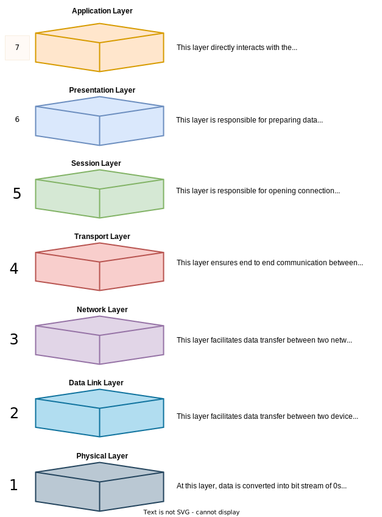
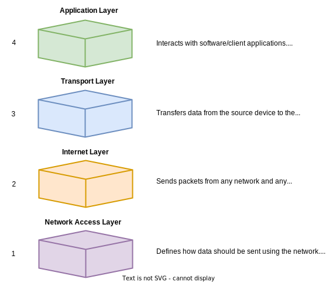

Hello happy people :wave:, what's up? In this post, we will dive deep into **Network Protocols** and will answer the following questions about them -
- What are network protocols?
- How are they implemented?
- Types of network protocols
- and so on

# What is a Network Protocol?
A network protocol is a set of rules that govern data communication among different devices in a network. A network protocol determines what, how and when is being communicated. The best thing about them is that they don't care about the types of the connected devices. If two devices are communicated which agree upon a certain network protocol, no matter if they are different in structure or type, data will be communicated.

Let's understand this in a more humane way - you are reading this blog in English and you understand it (I hope, LOL :wink:.) because you and I agreed upon **English** as a protocol to communicate stuff. Therefore, even if we speak different tongues, we both understand English (we are agreeing upon a protocol), my thoughts (data) are communicated to you.

> <div style="color: #A020F0;"><b>A network protocol is a common language for computers in a network.</b></div>

Similarly, if two computer use different protocols, they won't be able to communicate with each other.

On the internet, there are different types of protocols for different types of processes. Protocols are often discussed in terms of which OSI layer they belong to.

# OSI Model
OSI stands for **Open System Interconnection**, and it is a *conceptual* model which enables diverse communication systems to communicate using standard protocols. It has seven abstract layers, each one stacked upon the last.

<br/>


<br/>
Each layer of the OSI Model handles a specific job and communicates with the layers above and below itself. Let's discuss these layers one by one - 

## Application Layer (Layer 7)
This is the topmost layer in the OSI model, and it provides various ways for manipulating the data which allows users to access network easily. This is the only layer that interacts with the data from the user via web browsers, email clients, etc. Please, note that the client software applications are not part of this layer; rather this layer is responsible for the protocols (HTTP, SMTP etc.) and data manipulation.
This layer also makes request to the presentation layer for receiving various information from it.

At first, the client sends a command to server and the server after receiving the command allocates a port number to the client. Aft this, the client sends a connection initiation request to the server and when server receives this initiation request, it responds with an **acknowledgement (ACK)** that the connection is successfully established. After the connection is established, the data transfer between client and server takes place.

```
Data from user :arrow_left::arrow_right: Application Layer :arrow_left::arrow_right: Data from Presentation Layer
```

### Functions of Application Layer
- Allows users to access, retrieve, manage files in a remote location.
- Allows users to login as a remote host.
- Provides protocols that allow users to send and retrieve information.
- Handles stuff like network transparency, resource allocation and so on.
- And more.

### Examples of Application Layer protocols
- TELNET (Telecommunications Network) - used for managing files over the internet. Default port is 23.
- DNS (Domain Name System) - translates the domain name into the corresponding IP address on the internet. Default port is 53.
- FTP (File Transfer Protocol) - transfers different files from one device to another. Default ports are 20 for access and 21 for data control.
- SMTP (Simple Mail Transfer Protocol) - transfers e-mail from one user to another user. Default ports are 25 and 587.
- HTTP (Hyper Text Transfer Protocol) - transmits hyper media documents like HTML. Default port is 80.
- NFS (Network File System) - allows remote systems to mount file over a network and work with them as if they are mounted locally. Default port is 2049.

## Presentation Layer (Layer 6)
The main purpose of this layer is to prepare data so that it can be used by the Application Layer. Thus, this layer makes the data presentable for the applications to consume. It is also responsible for translation, encryption and compression of data.

- Suppose if two devices are using different encoding methods, thus translation is done so that data is converted into a syntax that application layer can understand.
- This layer adds encryption at the sender's end and decryption at the receiver's end.
- To improve the speed and efficiency of the data transfer, this layer also compresses the data.

```
Data from Application Layer :arrow_left::arrow_right: Presentation Layer :arrow_left::arrow_right: Data from Session Layer
```

The presentation layer converts the data sent by the application layer of the transmitting node into an acceptable and compatible data format based on the applicable network protocol and architecture.  Upon arrival at the receiving computer, the presentation layer translates data into an acceptable format usable by the application layer.

### Functions of Presentation Layer
- Formats and encrypts data to be sent across the network.
- Makes the data presentable for the Application Layer.
- Responsible for integrating all formats into a standardized format for efficient and effective communication.
- Performs serialization for transmission over network.

### Examples of Presentation Layer protocols
- SSL (Secure Socket Layer) - provides security to the data that is being transferred between the web browser and the server. This is achieved using the encryption of all the data that is passed.
- NCP (Netware Core protocol) - used to access file, print, directory, clock sync, messaging, etc. network services.

## Session Layer (Layer 5)
This layer is responsible for opening connection between the two devices. The duration for which the connection stays open is called the **session**. This layer ensures that the session stays open until the data is transferred and then quickly closes the session to avoid resource leakage.

The session layer synchronizes data transfers with checkpoints. For e.g., if a 10 MB file is to be sent then the session layer can have checkpoints at every 1 MB. So, if the transfers fails after sending 6.7 MB, the next transfer can resume and will send only the remaining 4 MB of data as opposed to start from the scratch.

```
Data from Presentation Layer :arrow_left::arrow_right: Session Layer :arrow_left::arrow_right: Data from Transport Layer
```

Now, in order to establish a connection, various things happen - 
- Session address is mapped to the shipping address.
- Required transport Quality of Service (QoS) is selected.
- Negotiations happen among session parameters.
- Transmit limited transparent user data.
- Monitor data transfer phase properly.

### Functions of Session Layer
- Allows systems to communicate in either half duplex or full duplex mode.
- Prevents two users to simultaneously access or attempting the same critical operation via token management.
- Synchronization by setting checkpoints.
- Provides mechanism of opening, managing, and closing a session.
- Responsible for synchronizing information from different sources.

### Examples of Session Layer protocols
- RPC (Remote Procedure Call) - causes a program to execute procedure in a different address space without the details for the remote interaction. This is basically a client-server interaction, via a request-response mechanism.
- PAP (Password Authentication Protocol) - password based authentication protocol to authenticate users.
- RTC (Real-time Transport Control Protocol) - provides feedback on QoS in media distribution.

## Transport Layer (Layer 4)
This layer is responsible for end-to-end communication between two devices which includes taking data from session layer and breaking it into chunks called **segments** before sending it to the network layer. The transport layer on the receiver is responsible for reassembling the segments into data that the session layer can consume.

It is also responsible for -
- **Flow control** - determines the optimal speed of transmission such that the sender with fast connection doesn't overwhelm the receiver with the low connection.
- **Error control** - ensures that the data received at the receiving end is complete, and requesting a retransmission if it isn't.

```
Data from Session Layer :arrow_left::arrow_right: Transport Layer :arrow_left::arrow_right: Data from Network Layer
```

Networking devices, like routers and switches, and end devices like, desktops and servers, have limitations on the amount of data that can be inserted in an IP packet. Due to this reason, the transport layer segments and reassembles data between the sender and the receiver respectively.

### Functions of Transport Layer
- Adds address off the sender and receiver in the header.
- Segmentation and reassembly.
- Connection oriented (TCP) and connectionless (UDP) services.
- Flow and error control.

### Examples of Transport Layer protocols
- TCP (Transmission Control Protocol) - connection oriented protocol which guarantees the delivery of the message.
- UDP (User Datagram Protocol) - connectionless protocol which transfers data without error correction.

## Network Layer (Layer 3)
This layer is responsible for transmitting data between two different networks. If the two devices are in the same network, then this layer becomes unnecessary. The network layer breaks segments from the transport layer into **packets**, on the sender's device and reassembling these packets on to the receiver's device. This layer also finds the best physical path for the data to reach its destination by placing sender's and receiver's IP addresses in the header. This process is called **routing**.

```
Data from Transport Layer :arrow_left::arrow_right: Network Layer :arrow_left::arrow_right: Data from Data Link Layer
```

### Functions of Network Layer
- Provides logical connection between different devices. It is called internetworking.
- Adds source's and destination's address to identify device on the network. It is called addressing.
- Determines the optimal physical path for data transmission. It is called routing.
- Converts segment into packets. It is called packetizing.

### Examples of Network Layer protocols
- ARP (Address Resolution Protocol) - associates an IP address with the MAC address.
- RARP (Reverse Address Resolution Protocol) - obtains IP address from the server.
- ICMP (Internet Control Message Protocol) - sends the notifications related to the IP datagram problems.
- IGMP (Internet Group Message Protocol) - identifies hosts in a LAN that are members of a group.

## Data Link Layer (Layer 2)
It is very similar to the network layer, except the data link layer facilitates data transfer between two devices on the **SAME** network. It takes packets from the network layer and breaks them into smaller pieces called **frames**. It is also responsible for flow and error control in the intra-network communication.

Data link layer is responsible for converting data stream to signals bit by bit and to send that over the underlying hardware. At the receiving end, data link layer picks up data from hardware which are in the form of electrical signals, assembles them in a recognizable frame format, and hands over to upper layer.

```
Data from Network Layer :arrow_left::arrow_right: Data Link Layer :arrow_left::arrow_right: Data from Physical Layer
```

### Functions of Data Link Layer
- Converts packets into smaller units called frames. It is called framing.
- Provides hardware addressing mechanism. Hardware address is unique, and it is encoded into hardware at the time of manufacturing.
- Synchronizes data frames that are sent on the link.
- Flow and error control mechanism.

### Examples of Data Link Layer protocols
- PPP (Point-to-Point Protocol) - transmits data between two directly connected computers.
- LCP (Link Control Protocol) - establishes, configures, tests, maintains, and terminates links for transmission.

## Physical Layer (Layer 1)
This layer deals with the physical equipment such as cables and switches involved in the data transfer. This is also the layer where the data gets converted into a bit stream, which is a string of 1s and 0s. The physical layer of both devices must also agree on a signal convention so that the 1s can be distinguished from the 0s on both devices.

```
Data from Data Link Layer :arrow_left::arrow_right: Physical Layer :arrow_left::arrow_right: Data from user
```

### Functions of Physical Layer
- Maintains the data rate, i.e., how many bits the sender can send per second.
- Performs the bit synchronization.
- Helps in physical topology (Mesh, Star, Bus, Ring) decision.
- Provides physical medium and interface decisions.
- Provides modulation and switching mechanisms.

### Examples of Physical Layer protocols
- Ethernet
- Control Area Network
- Bluetooth
- USB (Universal Serial Bus)

# Data flow in the OSI model
In order for a data to be transferred from sender to receiver in human-readable form, it has to transfer through the sever layers on the sender device (Layer 7 to Layer 1) and then through the seven layers on the receiver device(Layer 1 to Layer 7).

Let's assume I want to email my friend about the upcoming System Design session. The following events will happen when I compose an email in my email client and hit **Send** -  

1. My email application will pass this email to the application layer, which will pick a protocol (SMTP, in this case) and pass the data to the presentation layer.
2. The presentation layer will then compress and encrypt the data and pass it along to the session layer.
3. The session layer will then initialize a communication layer or open a session.
4. This data will then hit my transport layer, where it will be segmented and passed to the network layer.
5. The segments will be broken further into packets at the network layer and these packets will be transferred to the data link layer.
6. The data link layer will further break the packets into frames which will be passed to the physical layer.
7. Data received from the data link layer will be converted into bits of 0s and 1s and sent through a physical medium, such as a cable.

Once my friend's computer receives the bit stream through a physical medium, such as Wi-Fi, the data will pass through same series of layers but in the reverse order.

1. Physical layer will convert the bit stream into framers and pass to the data link layer.
2. Data link layer will then reassemble the frames into packets for the network layer.
3. Network layer further reassemble the packets into segments for the transport layer.
4. Transport layer will reassemble the segments into one piece of data. This data will be passed to the session layer.
5. The session layer will pass the data to the presentation layer and terminate the communication session.
6. The presentation layer will then decompress and decrypt the data and pass the raw data to the application layer.
7. The application layer will then feed the presentable data to my friend's email client.

The OSI model we looked at is just a logical model. It aims to describe the functions of the communication system by dividing the whole process into smaller and simpler components. We have another model called **TCP/IP** which is a concise version of the OSI model. In the next section, we will understand the TCP/IP model in detail.

# TCP/IP Model
TCP/IP stands for **Transmission Control Protocol / Internet Protocol**. The main purpose of TCP/IP is to offer highly reliable and end-to-end byte stream over a highly unreliable network, i.e., the internet. This property of TCP/IP allows communication over large distances. TCP/IP is a concise version of OSI model as it has only four layers as opposed to seven layers in the latter.

<br/>


<br/>

Let's discuss these layers in detail one by one - 

## Application Layer (Layer 4)
This layer interacts with client software to implement a communication component. It performs functions of the application, presentation and session layer of the OSI model. It is responsible for node-to-node communication and controls user-interface specifications.

### Functions of Application Layer
- Identifies communication partners, determines resource availability, and synchronizes communication.
- Allows users to log in to the remote host.
- Provides various email services.
- Offers distributed database sources and access for global information about various objects and services.

### Examples of Application Layer protocols
- HTTP/HTTPS (Hyper Text Transfer Protocol / Secure) - manages communication between web browsers and servers. HTTPS is a combination of HTTP and SSL (Secure Socket Layer). It is efficient in cases where form data needs to be submitted.
- SSH (Secure Shell) - It is similar to TELNET except that it supports encryption.
- NTP (Network Time Protocol) - synchronizes clocks on the computer to one standard time source.

## Transport Layer (Layer 3)
Transport layer builds on the network layer in order to provide data transport from a process on a source system machine to a process on a destination system. It is hosted using single or multiple networks, and also maintains the quality of service functions.
It determines how much data should be sent where and at what rate. This layer builds on the message which are received from the application layer. It helps ensure that data units are delivered error-free and in sequence.
Transport layer helps you to control the reliability of a link through flow control, error control, and segmentation or desegmentation.
The transport layer also offers an acknowledgement of the successful data transmission and sends the next data in case no errors occurred. TCP is the best-known example of the transport layer.

### Functions of Transport Layer
- Divides the message into segments and numbers them to make a sequence.
- Ensures that the message is delivered to the correct process on the destination device.
- If entire message is not arrived successfully, it retransmits the message.

### Examples of Transport Layer protocols
- TCP (Transmission Control Protocol) - connection oriented protocol which guarantees the delivery of the message.
- UDP (User Datagram Protocol) - connectionless protocol which transfers data without error correction.

## Internet Layer (Layer 2)
The responsibility of the Internet Layer is to send packets from any network and any computer irrespective of the route taken. The Internet layer offers the functional and procedural method for transferring variable length data sequences from one node to another with the help of various networks. Message delivery at the network layer does not give any guaranteed to be reliable network layer protocol.

### Functions of Internet Layer
- Logical transmission of data over the entire network.
- Choosing the best physical path to transmit data from source to the destination.

### Examples of Internet Layer protocols
- IP (Internet Protocol) - delivers packets from the source to the destination by looking at the IP addresses in the packet headers. IP has 2 versions: IPv4 and IPv6. IPv4 is the one that most of the websites are using currently. But IPv6 is growing as the number of IPv4 addresses are limited in number when compared to the number of users.
- ARP (Address Resolution Protocol) - associates an IP address with the MAC address.
- ICMP (Internet Control Message Protocol) - sends the notifications related to the IP datagram problems.

## Network Access Layer (Layer 1)
This layer defines the details of how data should be transmitted using the network. It also includes how bits should optically be signaled by hardware devices which directly interfaces with a network medium, like coaxial, optical, coaxial, fiber, or twisted-pair cables. The network access layer combines the data link and application layer of the OSI model.

Implementations of the protocols in this layer often appear as a combination of device drivers and related programs. The modules that are identified with network device names usually encapsulate and deliver the data to the network, while separate programs perform related functions such as address mapping.

### Examples of Network Access Layer protocols
- RFC 826 (ARP) - maps IP addresses to the Ethernet addresses.
- RFC 894 - specifies how IP datagrams are encapsulated for transmission over Ethernet networks.

# Conclusion
Phewww!!! I thought this post would never end :weary: but finally it has :smiley:! Though it's a long post, but we have learned so much in this. First, we discussed what are network protocols, then we understood the two models commonly used - OSI and TCP/IP.

In both models, we explained the layers they are made up of, functions of those layers, their examples and implementations. 

I hope, like me, you also enjoyed this post. I would love to hear your thoughts on this and would like to have suggestions from you to make it better.

Till next time, Namaste :pray:!
