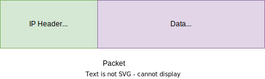
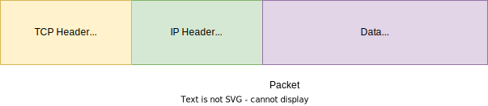

Hey happy people :wave:! In the previous [post](https://redquark.org/design/network-protocols-1/), we had discussed different protocols and the two networking models - OSI and TCP/IP. However, the discussion in the previous post was quite comprehensive, the depth of this subject demands another post where we will dive deep into the most common and important protocols. 
Therefore, without further ado, let's get started :smiley:.

# Internet Protocol (IP)
The Internet Protocol is a collection of rules and specifications that define how data packet moves through a network. In other words, this protocol standardizes the way machines in a network (more broadly, internet) route their packets based on the IP addresses.

The data from one machine to another machine or server is sent in the form of a packet. A packet is a fundamental unit of data sent between two machines. A packet is usually made up of bytes and a packet has two sections - IP header and data.

## IP Address
An IP address is a unique set of numbers that identifies a machine on the network. This machine can be anything, a computer, a server, a mobile, a router, or another device. IP addresses are essential for routing and forwarding IP packets from source to the destination. Without IP addresses, we wouldn't know where to send the data.

There are two versions of IP addresses - **IPv4** and **IPv6** which can handle 2<sup>32</sup> and 2<sup>128</sup> addresses respectively.

IPv4 addresses are written in four parts separated by dots like this: `45.48.241.198`. Each part written in conventional Base 10 numerals represents an eight-bit binary number from 0 to 255. Each of these four numbers separated by dots is written in standard decimal notation. But computers fundamentally deal with numbers in binary (using zeroes and ones, and each of the numbers in an IPv4 address represents an 8-bit binary number, which means that none of them can be higher than 255 (111111 in binary).

The newer version of the protocol, IPv6, is slowly displacing IPv4, and its addressing looks like this: `2620:cc:8000:1c82:544c:cc2e:f2fa:5a9b`.

Note that instead of four numbers, there are eight, and they’re separated by colons rather than dots. And yes, they are all numbers. There are letters in there because IPv6 addresses are written in hexadecimal (Base 16) notation, which means 16 different symbols are required to uniquely represent Base 10 numbers 1-16.

## IP Routing
The IP Routing involves forwarding packets from the source machine to the destination machine over a network, based on their IP addresses. This transmission usually occurs through a router. The router uses the destination IP address to determine the next destination through a series of routers.

## IP Packets
A packet is a small part of a larger message. Data sent over the computer networks, such as internet, is divided into packets. The packets are then reassembled at the destination machine.

Let's say you want to tweet a long text, but the character limit per tweet is only 280 and your text is much longer than that. What do you do :thinking:? We can create a thread of tweets and divide my text into smaller chunks and tweet them. One such smaller chunk is analogous to a packet.

Theoretically, it is possible to send large files or data without chopping it into packets over a network. The sender machine can send a long unbroken stream of bits - 0s and 1s. This approach quickly becomes impractical if there are more than two computers in the network. Since the communication line is being used by the sender computer, unless the complete message is not sent, no other computer can use that communication line.

In contrast, the internet is a **packet switching** network which means packets can take different network paths to the same destination as long as they all arrive at the destination. Because of packet switching, packets from multiple devices can travel over the same communication line in any order. This enables multiple connections to take place over the same networking equipment at the same time. As a result, billions of devices can exchange data on the Internet at the same time, instead of just a handful.

A typical IP packet looks like below - 

<br/>


<br/>

A packet consists of two parts - IP header, which provides information about the packet's content, origin and destination and data, which contains the actual data to be sent.

The IP header consists of essential information such as - 
- Source IP address
- Destination IP address
- Total size of the packet, version of the IP (IPv4 or IPv6), etc.

Packets actually have more than one header and each header is attaches and used by different networking protocols.

IP packet is of very small size. Therefore, sending large files involves having multiple packets to send such data and there's a high probability that some packets don't reach the destination or reach in the wrong order. Thus, IP doesn't provide any guarantee that packets will reach destination. For achieving this guarantee, we have another protocol called TCP.

# Transmission Control Protocol (TCP)
The issue with the Internet Protocol (IP) is that it does not handle packet ordering and error handling. This is where TCP comes in picture. Let us understand this with an example. Let's say someone has sent you a message written on a piece of paper (data) and then that paper is divided into smaller pieces of paper (packets) and sent those pieces of papers via postal service (communication line). Some pieces can reach to you earlier than others, and they may be out of order. The Internet Protocol makes sure pieces arrive at the destination machine. TCP can be thought of an assembler who puts the pieces in the correct order, asks the sender to resend missing pieces and once all the pieces are received, lets the sender know that the puzzle message has received.

> <div style="color: #A020F0;"><b>TCP maintains the connection between sender and receiver before the first piece is sent to after the last piece is sent.</b></div>

IP is a connectionless protocol which means each packet is individually received and routed from the sender to the receiver. The receiver does not send acknowledgement back to the sender. TCP is used in conjunction with IP in order to maintain a connection between the source and the destination and to ensure packet order.

The connection between the sender and the receiver happens in three stages - 
- The sender sends an **SYN** "initial request" packet to the receiver in order to start the communication.
- Then the receiver sends the **SYN-ACK** packet to the sender to agree to the communication request.
- Lastly, the sender sends the **ACK** packet to the receiver to confirm the communication, after which message contents can be sent.

The way this connection is established is called the **handshake**.

A typical TCP packet looks like below - 

<br/>


<br/>

It is similar to the IP packet with an additional header containing information about the way in which the connection is established.

Even though TCP is a more powerful and more functional wrapper around IP, it still lacks a robust framework developers can use to define easy to use and meaningful channels for clients and servers in a system.

# User Datagram Protocol (UDP)
This is a transport layer (layer 4) protocol typically used for time-sensitive operations. It sends the message without the initiation of connection, which makes the data transfer real quick.

UDP is a connectionless and unreliable protocol. Unlike TCP, there is no mechanism of packet recovery in UDP. Similarly, it also does not have any error checking mechanism. The features make it unreliable but faster than TCP.

Since TCP keeps a conversation flow between connected devices, there is always the need to synchronize and receive the acknowledgement for the sent messages. However, UDP doesn’t maintain such a connection, which means the sender device will keep sending responses to a request without the necessity for an acknowledgement message.

UDP is used in real-time services like video communication, online gaming, live-streaming of videos, etc.

# Hypertext Transfer Protocol (HTTP)
HTTP is built on top of TCP/IP and provides a higher level of abstraction. The communication between two machines is done via **request-response** model. The sender sends the request and the receiver sends response in return. Since HTTP is a wrapper around TCP/IP, we don't have to worry about TCP/IP packets. Along with data transfer, HTTP also provides us with the ability to incorporate business logic via its different methods - GET, POST, PUT, DELETE, POST, HEAD, etc.

## HTTP Request
An HTTP request is the way web browsers or any other communication platforms ask for the information they require. A typical HTTP request contains -
- HTTP version type
- A URL
- An HTTP method
- Request headers
- Body (optional)

### HTTP Methods
They define the action an HTTP request expects from the server/receiver. Let's define the job of various HTTP methods -
- **GET** - retrieves data from the server
- **POST** - sends data to the server and creates a new resource on the server.
- **PUT** - replaces the specified resource on the server. It does not create a new resource.
- **DELETE** - deletes the specified resource from the server.
- **HEAD** - same as GET but transfers only status line and header section.
- **OPTIONS** - describes the communication options for the target resource.
- **PATCH** - applies only partial modifications to the specified resource.
- **CONNECT** - establishes a tunnel to the server identified by the target resource.
- **TRACE** - performs a message loop-back test along the path to the target resource.

### HTTP Request Headers
They contain text information in the **key-value** format and are included in every HTTP request. The purpose of request headers is to deliver core information such as the browser type, host, encoding etc. A typical request header from my [GitHub](https://github.com/ani03sha) home page is as below - 

```yml
GET /ani03sha HTTP/2
Host: github.com
User-Agent: Mozilla/5.0 (Windows NT 10.0; Win64; x64; rv:106.0) Gecko/20100101 Firefox/106.0
Accept: text/html,application/xhtml+xml,application/xml;q=0.9,image/avif,image/webp,*/*;q=0.8
Accept-Language: en-GB,en;q=0.5
Accept-Encoding: gzip, deflate, br
Referer: https://github.com/ani03sha/redquark
Connection: keep-alive
Upgrade-Insecure-Requests: 1
Sec-Fetch-Dest: document
Sec-Fetch-Mode: navigate
Sec-Fetch-Site: same-origin
Sec-Fetch-User: ?1
If-None-Match: W/"5f44de0ac705f114db3aa22ec90c4e98"
```

### HTTP Request Body
It contains the payload/data which the request is transferring to the server. A sample HTTP body in JSON format looks like below - 

```json
{
  "Id": 78912,
  "Quantity": 1,
  "Price": 18.00
}
```

## HTTP Response
When the sender makes a request to the receiver, the receiver returns the response. The response communicates the information based on what was asked in the request. A typical HTTP response contains - 
- Status code
- Response headers
- Response body (optional)

### HTTP Status Codes
These are three-digit codes that indicate the status of the request - whether it was successfully completed or not.

- 1xx (informational) - the server is thinking through the request
- 2xx (success) - the request was successfully completed and server gave the expected response.
- 3xx (redirect) - request is redirected to somewhere else.
- 4xx (client error) - the request is faulty and this is at the sender's end.
- 5xx (server error) - the request was valid, but the server failed to complete the request.

Here, ***xx*** is a number between 0 and 99. Read more about HTTP status codes [here](https://developer.mozilla.org/en-US/docs/Web/HTTP/Status).

### HTTP Response Headers
Like request headers, response headers also convey important information about the response such as the language and the format of data being sent from the server. Typical response headers on my [GitHub](https://github.com/ani03sha) homepage look like below - 

```yml
HTTP/2 200 OK
server: GitHub.com
date: Sat, 05 Nov 2022 09:55:44 GMT
content-type: text/html; charset=utf-8
etag: W/"914a63fa431123245b7c5c414762af4c"
cache-control: max-age=0, private, must-revalidate
strict-transport-security: max-age=31536000; includeSubdomains; preload
x-frame-options: deny
x-content-type-options: nosniff
x-xss-protection: 0
referrer-policy: origin-when-cross-origin, strict-origin-when-cross-origin
vary: X-Requested-With, X-PJAX-Container, Turbo-Frame, Turbo-Visit, Accept-Encoding, Accept, X-Requested-With
content-encoding: gzip
x-github-request-id: 630F:37A0:7C940:1050A5:6366331F
X-Firefox-Spdy: h2
```

### HTTP Response Body
Successful HTTP responses to **GET** requests generally have a body which contains the requested information. In most web requests, this is HTML data which a web browser translates into a web page.

# Address Resolution Protocol (ARP)
Computer applications use logical address to communicate with other applications. But to communicate with the device, we need physical address of the computer (Media Access Control or MAC address).

ARP maps network address to the physical addresses used by the data link protocol. It is the process of finding the address of a computer in a network. ARP translates addresses of the network layer (layer 3) to the addresses of the data link layer (layer 2) in the OSI model.

# File Transfer Protocol (FTP)
It is a standard network protocol provided by TCP/IP to transfer files from one server to another efficiently and reliably.

Transferring a file from one server to another is simple, but several problems may arise. The sender system and the receiver server may have different file conventions or different ways to represent data. In some cases, the directory structures of two systems may differ from each other. FTP resolves all of these issues.

While transferring a file between two systems, it establishes two connections. One connection is for the data transfer, and the other one is for control connection.

The advantage of the FTP is speed and efficiency. Also, it provides security. The user needs to have a username and password to access the data from the FTP server. The FTP supports the back and forth movement of the data. So sender and receiver both can send data to each other.

The FTP has some drawbacks as well. The data that can be sent through the FTP is limited to 2 GB. Therefore, any file bigger than 2 GB can’t be transferred through the FTP. Also, it is not compatible with every system.

# Secure Shell (SSH)
It is a cryptography-based network protocol for operating network services securely and reliably over an unsecured network. Some particular applications include remote command-line, remote command execution, login, but any network service can be made secure with the help of SSH.

# SSH File Transfer Protocol (SFTP)
The SSH File Transfer Protocol (SFTP) is used to secure the connection when a file is sent remotely from one system to another. It uses s public-key encryption to secure communication over the Internet as well as facilitate strong user authentication.

The secure connection with the server can be established in two ways - password authentication and private/public key encryption. Also, file transfer using SFTP is much faster as it transfers files in binary format. It supports operations related to permission and attributes manipulation and file locking.

# Remote Procedure Call (RPC)
An RPC is an inter-process communication (IPC) technique that is used for client-server based applications. It is also called a subroutine call or a function call.

A client has a request message that the RPC translates and sends to the server. This request may be a procedure or a function call to a remote server. When the server receives the request, it sends the required response back to the client. The client is blocked while the server is processing the call and only resumed execution after the server is finished.

# Conclusion
If you are here, it means you have read through the entire article. You deserve a pat on the back :clap:. 

After discussing the details of network models in the previous post, in this post we dove into the details of some common network protocols, their workings and their functions.

I hope, like me, you also enjoyed this post. I would love to hear your thoughts on this and would like to have suggestions from you to make it better.

Till next time, Namaste :pray:!