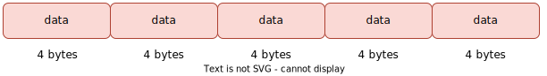

Arrays are one of the most common data structures used in programming. An array is a collection of elements of the same type, arranged in contiguous memory locations. They are used to store and manipulate a group of related data items. In this blog post, we'll explore the basics of arrays, how they are used in programming, and how memory is allocated for arrays. Later on, we will also discuss some of the limitations of arrays and see how we can use dynamic arrays to overcome some of the problems.

## Basics
An array is a collection of elements of the same data type that are stored in a contiguous block of memory. By same data type, I mean that an array of integers can store only integers but not strings, characters, etc.

Each element in an array is accessed by its index. The index is an integer value that represents the position of the element in the array. In most programming languages, the index starts from 0. Thus, if we wish to access the fifth element in the array, we would access the element at index 4.

Arrays are commonly used to store collections of data, such as numbers, characters, or strings. For example, an array of integers could be used to store a list of grades, and an array of characters could be used to store a word.

Arrays can be declared in many programming languages using the following syntax:

```
datatype array-name [size];
```

Here, `datatype` is the data type of the elements in the array, `array-name` is the name of the array, and `size` is the number of elements in the array. For example, to declare an array of integers with 10 elements, we would use the following code:
```
int myArray[10];
```

Once an array is declared, its elements can be accessed using the index of the element. For example, to access the third element of the array, we would use the following code:
```
myArray[2];
```

This is because arrays are 0-indexed, so the first element is at index 0, the second element is at index 1, and so on.

## Uses of Arrays
Arrays are used in many programming applications, including data processing, sorting, and searching algorithms. They are also commonly used to store data in databases and file systems.

One common use of arrays is to store large sets of data that can be processed efficiently. For example, an array of integers could be used to store the heights of all students in a class, which could then be used to calculate the average height of the class.

Another use of arrays is to implement sorting algorithms. Sorting algorithms require the ability to compare and swap elements in the array. By storing the elements in an array, sorting algorithms can be implemented efficiently.

## Memory Allocation for Arrays
Memory allocation is an important concept to understand when working with arrays. When an array is declared, memory is allocated for the array based on the size of the array and the size of each element in the array.

In most programming languages, memory for arrays is allocated from the **heap**, which is a region of memory reserved for dynamic allocation. The size of the array determines the amount of memory that is allocated.

For example, if we declare an array of 5 integers, the memory allocation would be as follows:



Here, each element in the array is 4 bytes in size (assuming an integer is 4 bytes in size). The total size of the array is 20 bytes, which is allocated as a contiguous block of memory.

## Common Array operations
Below are some examples of common array operations in Java:

### Initializing an array:
```java
int[] numbers = new int[]{1, 2, 3, 4, 5};
```
This creates an integer array with five elements and initializes each element with a value.

### Accessing array elements:
```java
int firstNumber = numbers[0];
int thirdNumber = numbers[2];
```
This accesses the first and third elements of the array, respectively.

### Changing an array element:
```java
numbers[4] = 10;
```
This changes the value of the fifth element in the array to 10.

### Looping through an array:
```java
for (int i = 0; i < numbers.length; i++) {
    System.out.println(numbers[i]);
}
```
This loops through each element in the array and prints its value to the console.

### Creating a multidimensional array:
```java
int[][] matrix = new int[3][3];
```
This creates a 2D array with three rows and three columns.

## Problem with the arrays
Arrays are a powerful data structure, but they have some limitations that can cause issues in certain situations. Here are some of the problems with arrays:

### Fixed size 
Static arrays have a fixed size, which means that the amount of memory allocated for the array is determined at compile time. This can be a problem if the size of the array needs to change during runtime, as it requires reallocation of memory, which can be inefficient.

### Wasted memory
Static arrays allocate memory for all elements, even if they are not used. This can lead to memory waste, especially if the size of the array is large.

### No automatic bounds checking
Arrays do not provide automatic bounds checking, which means that if the program tries to access an element outside the array bounds, it can cause a memory access violation. This can result in program crashes or other errors. In Java, `ArrayIndexOutOfBoundsException` is thrown at runtime.

### Insertion and deletion
Inserting or deleting elements in an array can be inefficient, as it requires shifting elements in the array to make space for new elements or to fill gaps left by deleted elements.

### Inflexibility
Arrays are inflexible in terms of the types of data they can hold. In a static array, all elements must be of the same type, and the size of each element must be fixed. This can be a limitation in certain programming situations.

To overcome the static nature of array, we have a concept called ***Dynamic Arrays***.

## Dynamic Arrays
Dynamic arrays are a powerful data structure that are commonly used in programming. They allow for the efficient allocation and reallocation of memory at runtime. This means that the size of the array can be adjusted as needed, making them more flexible than traditional static arrays.

## What are Dynamic Arrays?
Dynamic arrays are a type of data structure that allow for the efficient allocation and reallocation of memory at runtime. They are similar to traditional static arrays, but have the added benefit of allowing the size of the array to be adjusted as needed.

The main benefit of dynamic arrays is that they allow for more efficient use of memory. With a static array, the amount of memory allocated is fixed at compile time, even if the array is not fully utilized. This can result in a waste of memory. Dynamic arrays, on the other hand, only allocate memory as needed, resulting in a more efficient use of memory.

## How do Dynamic Arrays Work?
Dynamic arrays are implemented using pointers. When a dynamic array is created, a block of memory is allocated from the **heap**, and a pointer is used to point to the first element of the array. The size of the array is not fixed, and can be adjusted as needed. When more memory is required, a new block of memory is allocated, the contents of the old array are copied over to the new array, and the old memory is freed.

The use of pointers in dynamic arrays means that they require more careful management than traditional static arrays. If a pointer is not properly managed, it can result in memory leaks or other errors. Careful use of pointers is necessary to ensure that the dynamic array functions correctly.

## Dynamic Array Implementation
Below is the implementation of dynamic array in Java. 

> Note: This implementation assumes that we are storing only integer values in the array. We can modify this implementation to store any data type by using **Generics**. Since, Generics is mainly related to Java, I am assuming our array can store only integer values. See more on Generics [here](https://docs.oracle.com/javase/tutorial/java/generics/index.html).

```java
public class DynamicArray {

    // Internal array to store elements of the dynamic array
    private int[] elements;
    // Size of the array - it represents the current number of elements in the array
    private int size;

    /**
     * Constructor for initialization
     */
    public DynamicArray(int capacity) {
        // Initialize the internal array with the specified capacity
        this.elements = new int[capacity];
        this.size = 0;
    }

    /**
     * Time complexity: O(1)
     *
     * @return size of the array
     */
    public int size() {
        return size;
    }

    /**
     * Time complexity: O(1)
     *
     * @param index at which we need to find the element
     * @return element at the given index
     */
    public int get(int index) {
        if (index < 0 || index >= size) {
            throw new IndexOutOfBoundsException();
        }
        return elements[index];
    }

    /**
     * Time complexity: O(1)
     *
     * @param index at which the element is to be added
     * @param value element to be added
     */
    public void set(int index, int value) {
        if (index < 0 || index >= size) {
            throw new IndexOutOfBoundsException();
        }
        elements[index] = value;
    }

    /**
     * Time complexity: O(n)
     *
     * @param index at which the element is to be inserted
     * @param value value to be inserted
     */
    public void insert(int index, int value) {
        // If we have reached the capacity. we will double the size
        // of the dynamic array
        if (size == elements.length) {
            int[] newArray = new int[elements.length * 2];
            for (int i = 0; i < size; i++) {
                newArray[i] = elements[i];
            }
            elements = newArray;
        }
        // Shifting elements after index to right by one step
        for (int i = size; i > index; i--) {
            elements[i] = elements[i - 1];
        }
        // Setting the value to be inserted at the index
        elements[index] = value;
        size++;
    }

    /**
     * Time complexity: O(n)
     *
     * @param value to be added at the end
     */
    public void append(int value) {
        insert(size, value);
    }

    /**
     * Time complexity: O(n)
     *
     * @param index at which the element to be removed
     * @return removed element
     */
    public int remove(int index) {
        if (index < 0 || index >= size) {
            throw new IndexOutOfBoundsException();
        }
        // Shifting values after index one step left
        int removedValue = elements[index];
        for (int i = index; i < size - 1; i++) {
            elements[i] = elements[i + 1];
        }
        size--;
        return removedValue;
    }
}
```

In this implementation, we have created a `DynamicArray` class that has an underlying integer array `elements`, a `size` variable to keep track of the number of elements in the array, and several methods to manipulate the array.

- The `size()` method returns the number of elements in the array. 
- The `get(int index)` method returns the element at the specified index, throwing an `IndexOutOfBoundsException` if the index is out of bounds. 
- The `set(int index, int value)` method sets the element at the specified index to the specified value, throwing an `IndexOutOfBoundsException` if the index is out of bounds.
- The `insert(int index, int value)` method inserts the specified value at the specified index, shifting all subsequent elements to the right. If the array is full, the method doubles the size of the array before inserting the new value. 
- The `append(int value)` method is a convenience method that appends the specified value to the end of the array.
- The `remove(int index)` method removes the element at the specified index, shifting all subsequent elements to the left. The method returns the value that was removed, throwing an `IndexOutOfBoundsException` if the index is out of bounds.

## Conclusion
In this post, we discussed about arrays and its characteristics, benefits and limitations. Then, to overcome the static nature of arrays, we delved into the concept of dynamic arrays. Dynamic arrays have the benefit of adjusting the their size as per requirement.

You can find the code in the GitHub [repository](https://github.com/ani03sha/AccioAlgorithms/blob/main/src/main/java/org/redquark/accioalgorithms/datastructures/arrays/DynamicArray.java). I hope you enjoyed the post. Feel free to share your thoughts. Till next time… Happy learning 😄 and Namaste :pray:!