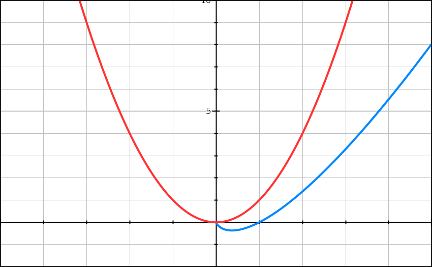
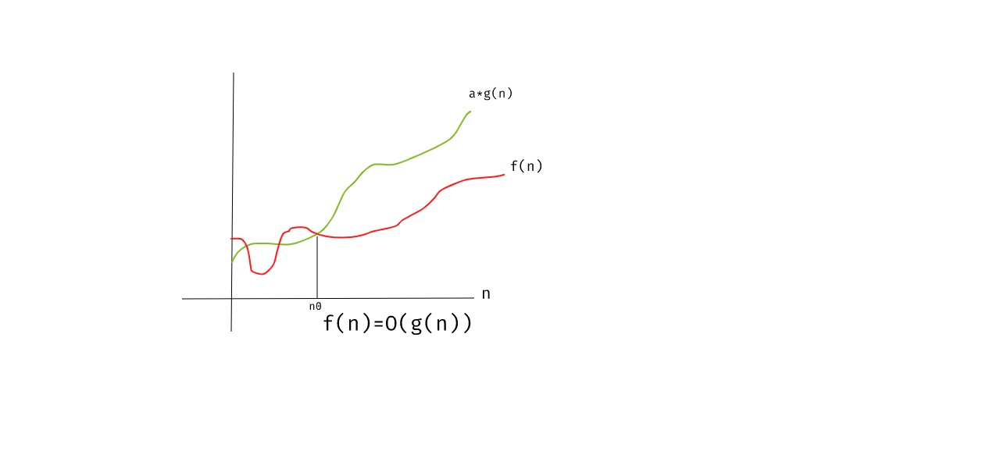
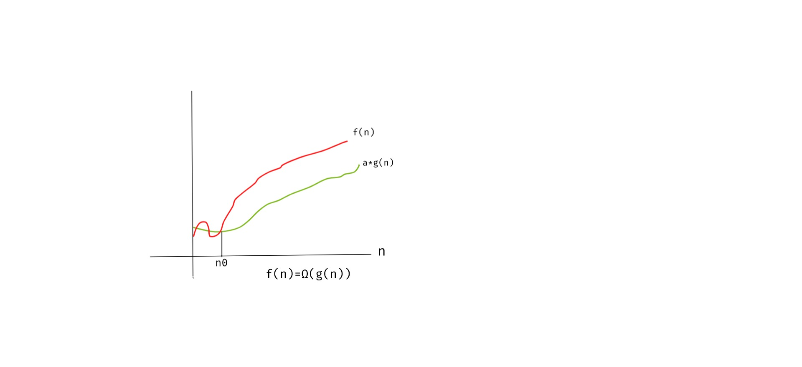
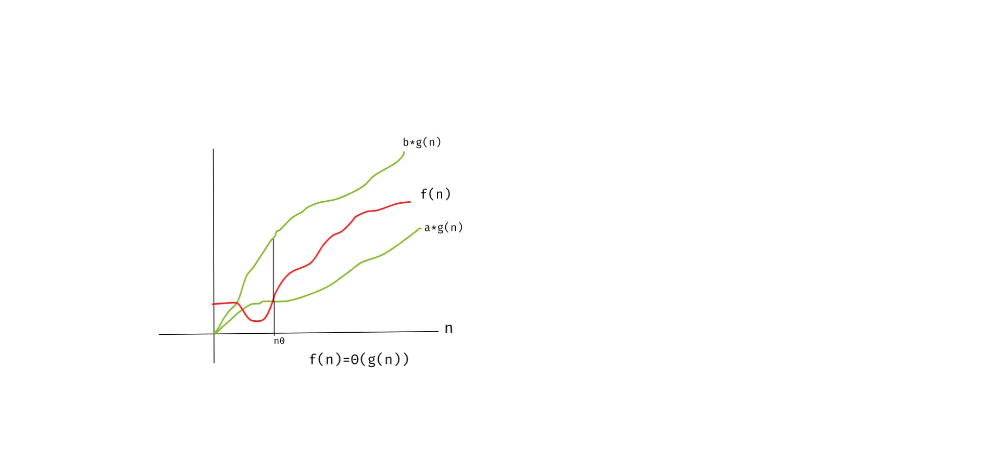

Heya fellow devs :wave:! Welcome to the another post on analysis of algorithms. In the [last post](https://redquark.org/dsa/analysis-of-algorithms/), we discussed how we can analyze the time and space used by a program. In this post, we will dig deeper into the mechanics of algorithms. 

This post will use mathematical approach to analyze an algorithm i.e., how can we represent an algorithm in mathematical formulae and the detailed steps of deriving those formulae.

I can understand this can be daunting but believe me when I say it's not that complicated :smiley:. The knowledge of high school mathematics should be enough to get the idea. Later on, you can analyze any algorithm using the tools described in this post.

So, without further ado, let's dive into the amazing world of analysis of algorithms :smile:.

## What is Asymptotic analysis :thinking:?
In the [last post](https://redquark.org/dsa/analysis-of-algorithms/), we discussed steps to mathematically calculate the time and space used by any program or algorithm. What we learned from that post was as the input size grows, the impact of lower order terms decreases. For sufficiently large inputs, we can ignore the lower order terms completely. See [this](https://redquark.org/dsa/analysis-of-algorithms/#approximation) for getting more clarity.

Thus, the asymptotic behavior of a function **f(n)** (such as **f(n) = cn** or **f(n) = cn<sup>2</sup>**, etc.) refers to the growth of **f(n)** as n gets large. We typically ignore small values of **n**, since we are usually interested in estimating how slow the program will be on large inputs. A good rule of thumb is: ***the slower the asymptotic growth rate, the better the algorithm (although this is often not the whole story)***.

To understand the last bit of the above paragraph, let's take an example, assume to solve a problem **P**, there are two algorithms **A** and **B** with time complexities **T(A) = n * log(n)** and **T(B) = n<sup>2</sup>**.

Below is the graph representing plots of both these graphs. Here, `x-axis` represents the input size and `y-axis` represents the time taken.



In this graph, <span style="color: red;">red</span> plot represents **T(B) = n<sup>2</sup>** and <span style="color: blue;">blue</span> plot represents **T(A) = n * log(n)**.

It is clear from the graph that as the input size grows, the growth of time becomes slower for **T(A)**. Thus, for the large inputs, clearly algorithm **A** is a better choice for solving problem **P**.

We can thus say that a quadratic algorithm is better than a cubic algorithm, a linear algorithm is better than a quadratic algorithm, a logarithmic algorithm will be better than a linear algorithm and so on.

In this post, the functions to which we apply asymptotic notation will usually characterize the running times of algorithms but the same can be applied to other characteristics as well like space etc.

Let's now understand various notations which we use in Asymptotic analysis.

## Asymptotic Notations
You must have noticed that we are using the term “running time” repeatedly in this post. Which running time are we talking about :thinking:? If you followed the [last post](https://redquark.org/dsa/analysis-of-algorithms/#approximation), then you know that we emphasized on the worst running time of an algorithm. This is often sufficient while analyzing an algorithm but of course, it doesn't show us the full picture. Our analysis should be such which covers all input sizes, small or medium or large.

Theoretical Computer Scientists are smart :sunglasses:. They have defined different notations for dealing with different input sizes. In this section, we will learn about those.

### O (Big-O) Notation
Let's start with what we are familiar with. As mentioned earlier, we are often interested in the worst case of an algorithm. Let's take an example of linear search. Here, we are given an array of `n` integers, and we need to search for a number `k`.

A sample code for this will be as follows (the code is in python but it should be understandable) - 

```python
def linear_search(arr, k):
  for x in arr:
    if x == k:
      return True
  return False
```

The worst case will happen when the number we need to search is either the last element in the array `arr` or it is not present in it. In both the case, we need to traverse the whole array. If there are `n` elements in `arr`, then for the worst case, `n` elements will be traversed. 

Above example illustrates the case where our algorithm performs worst. In other words, this is the upper bound i.e., the time complexity will never exceed `n` (for this case). It can be less than that but never more. Therefore, for linear search we can represent the time complexity as ***O(n)*** (pronounced as “Big O of n”).

Mathematically, it can be defined as

```
O(g(n)) = { f(n): there exists positive constants a and n0 such that 0 <= f(n) <= a*g(n) 
            for all n >= n0 }
```

This means for any value of `n`, the running time does not cross the time provided by `O(g(n))`. In simpler words, we can say that the maximum time of an algorithm is represented by `O(g(n))`.

Below graph also represents the same thing, for any value of n >= n<sub>0</sub>, running time will not exceed `O(g(n))`.



### Ω (Big-Omega) Notation
Taking the linear search example again, what about the case if the element to be searched is found at the first place? Yes, the time complexity will then be constant and it can be represented as ***Ω(1)***.

Clearly, the Ω notation describes the lower bound of any algorithm or it defines the best case of an algorithm. In other words, Ω notation defines the minimum amount that an algorithm can take.

Mathematically, it can be defined as

```
Ω(g(n)) = { f(n): there exists positive constants a and n0 such that 0 <= a*g(n) <= f(n) 
            for all n >= n0 }
```

This means that for any value of n >= n<sub>0</sub>, there exists a positive constant `a` such that it lies above `a*g(n)`.

Below graph also represents the same thing, for any value of n >= n<sub>0</sub>, running time will not come below `Ω(g(n))`.



### Θ (Big-Theta) Notation
If we consider the linear search algorithm defined above, the average case will be when the element to be searched is found somewhere in the middle of the array (not at the first place and not at the last place).

The Θ-notation defines the average case complexity, or we can say that it is between the ***O*** and ***Ω***. In more formal terms, Θ notation defines the tight bound i.e., a function that has both upper and lower bound. 

By tight bounds, we mean that the time complexity is like the average value or range within which the actual time of execution of the algorithm will be.

Mathematically, it can be defined as

```
Ω(g(n)) = { f(n): there exists positive constants a, b and n0 such that 
            0 <= a*g(n) <= f(n) <=b*g(n) for all n >= n0 }
```

This means if there exist positive constants `a` and `b` such that it can be sandwiched between `a*g(n)` and `b*g(n)`, for sufficiently large `n`. In simpler words, `f(n)` is bound from both sides upper and lower.

Below graph also represents the same thing, for any value of n >= n<sub>0</sub>, running time will always lie between the boundaries represented by `Θ(g(n))`.



## Which time complexity to choose :thinking:?
When we say that an algorithm runs in time `T(n)`, we mean that `T(n)` is an upper bound on the running time that holds for all inputs of size `n`. This is called worst-case analysis. The algorithm may very well take less time on some inputs of size `n`, but it doesn't matter. If an algorithm takes **T(n) = c*n<sup>2</sup> + k** steps on only a single input of each size `n` and only `n` steps on the rest, we still say that it is a quadratic algorithm.

A popular alternative to worst-case analysis is average-case analysis. Here we do not bound the worst case running time, but try to calculate the expected (average) time spent on a randomly chosen input. This kind of analysis is generally harder, since it involves probabilistic arguments and often requires assumptions about the distribution of inputs that may be difficult to justify. On the other hand, it can be more useful because sometimes the worst-case behavior of an algorithm is misleadingly bad. A good example of this is the popular Quick Sort algorithm, whose worst-case running time on an input sequence of length n is proportional to **n<sup>2</sup>** but whose expected running time is proportional to **n*log(n)**.

Therefore, the time/space complexity we choose depends on the situation. Mostly we choose Big-O to define the complexities but Big-Theta is equally important.

## Conclusion
Phew!!! In this post, we learned about the tools to analyze an algorithm.

I know that was a complex post but it is very important to understand the tools described here as they allow us to quantitatively define the performance of an algorithm. Using these, we can decide which algorithm to choose to solve our problem.

Feel free to share your thoughts. Till next time… Happy learning 😄 and Namaste :pray:!