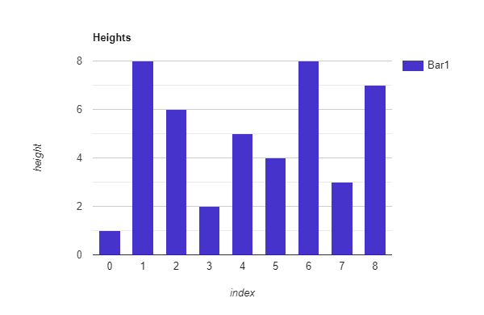

What's up LeetCode enthusiasts :wave:! Today we are going to discuss problem number 11 on LeetCode.

- [Container With Most Water](https://leetcode.com/problems/container-with-most-water/)

## Problem Statement
Given n non-negative integers a<sub>1</sub>, a<sub>2</sub>, ..., a<sub>n</sub> , where each represents a point at coordinate (i, a<sub>i</sub>). n vertical lines are drawn such that the two endpoints of the line i is at (i, a<sub>i</sub>) and (i, 0). Find two lines, which, together with the x-axis forms a container, such that the container contains the most water.

Notice that you may not slant the container.

### Constraints:
- n = height.length
- 2 <= n <= 3 * 10<sup>4</sup>
- 0 <= height[i] <= 3 * 10<sup>4</sup>

### Examples

Example 1: 

```
Input: height = [1,8,6,2,5,4,8,3,7]
Output: 49
Explanation: The above vertical lines are represented by array [1,8,6,2,5,4,8,3,7]. In this case, the max area of water (between 8 and 7 )the container can contain is 49.
```

Example 2: 

```
Input: height = [1,1]
Output: 1
```

Example 3: 

```
Input: height = [4,3,2,1,4]
Output: 16
```

Example 4: 

```
Input: height = [1,2,1]
Output: 2
```

## Analysis
From the examples, we can conclude that each element a<sub>i</sub> in the `height` array represents a pole of height a<sub>i</sub>.

Let's see first example to understand it better — 



If you see the above figure, we are representing each height with a bar where `x-axis` represents the index of that bar and `y-axis` represents the actual height of the bar.

Water can be filled between two bars and the horizontal surface between them. Consider these two bars and horizontal surface as the walls of the container. If the heights of both bars are equal then no problem at all, we can fill water up to the height of the bars. But if the walls are of different lengths then we can only fill water up to the height of the shorter bar. This is pretty intuitive :smile:.

Thus, the container made by any two bars is a rectangle whose —  
- ***Width*** = horizontal distance between two bars or the difference between their indices.
- ***Length*** = shorter of the two bars.
- ***Area*** = ***(Length * Width)***

If we take bars `a[1] = 8` and `a[8] = 7` as a container then its area will be — 

```
Area = min(a[1], a[8]) * (8 - 1)
     = min(8, 7) * 7
     = 7 * 7
     = 49
```

If we take bars `a[2] = 6` and `a[6] = 8` as a container then we can calculate its area as — 

```
Area = min(a[2], a[6]) * (6 - 2)
     = min(6, 8) * 4
     = 6 * 4
     = 24
```

Similarly, we can calculate the area of all the pairs and find out which one is maximum.

## Approach
The naive approach is pretty intuitive. We will calculate areas for all pair of bars and return maximum value. This will take two nested loops and the time complexity will be ***O(n<sup>2</sup>)***.

Can we do better :thinking:? Yes, we can :bulb:. We can start with the container of maximum width and then if there is we find a bar whose height is greater than the shorter of the previous two bars we took into consideration, then we can calculate the area between those two bars and so on. 

Since we are starting with the container of maximum width which is represented by the indices of the array, we will have to maintain two pointers who will keep track of width of the container.

Therefore, the steps will be something like this — 

1. Initialize two pointers ⇨ `left = 0` (first index) and `right = height.length - 1` (last index).
2. Loop until the two pointers meet.
3. Inside loop, calculate the height of the shorter bar — one bar is represented by `height[left]` and the other bar is represented by `height[right]`.
4. Calculate the area between the two bars and compare it with the current maximum.
5. Move the pointers if there exists a bar whose height is greater than the current one.

And that's it, We will return the maximum area at the end.

### Time Complexity
Since we are scanning each element of an array only one, the time complexity will be ***O(n)***.

### Space Complexity
We are not using any data structure for intermediate results, therefore, the space complexity will be ***O(1)***.

Let's look at the code now.

## Code

### Java

```java
public class ContainerWithMostWater {

    public int maxArea(int[] height) {
        // Maximum area will be stored in this variable
        int maximumArea = Integer.MIN_VALUE;
        // Left and right pointers
        int left = 0;
        int right = height.length - 1;
        // Loop until left and right meet
        while (left < right) {
            // Shorter pole/vertical line
            int shorterLine = Math.min(height[left], height[right]);
            // Update maximum area if required
            maximumArea = Math.max(maximumArea, shorterLine * (right - left));
            // If there is a longer vertical line present
            if (height[left] < height[right]) {
                left++;
            } else {
                right--;
            }
        }
        return maximumArea;
    }
}
```

### Python

```python
def maxArea(height: List[int]) -> int:
    # This variable will store the maximum area
    max_area = -maxsize
    # Left and right pointers
    left = 0
    right = len(height) - 1
    # Loop until the two pointers meet
    while left < right:
        # Shorter of the two lines
        shorter_line = min(height[left], height[right])
        max_area = max(max_area, shorter_line * (right - left))
        # If there is a longer vertical line present
        if height[left] < height[right]:
            left += 1
        else:
            right -= 1
    return max_area
```

### JavaScript

```javascript
var maxArea = function (height) {
    // Maximum area will be stored in this variable
    let maximumArea = Number.MIN_SAFE_INTEGER;
    // Left and right pointers
    let left = 0;
    let right = height.length - 1;
    // Loop until left and right meet
    while (left < right) {
        // Shorter pole/vertical line
        let shorterLine = Math.min(height[left], height[right]);
        // Update maximum area if required
        maximumArea = Math.max(maximumArea, shorterLine * (right - left));
        // If there is a longer vertical line present
        if (height[left] < height[right]) {
            left++;
        } else {
            right--;
        }
    }
    return maximumArea;
};
```

### Kotlin

```java
fun maxArea(height: IntArray): Int {
    // Maximum area will be stored in this variable
    var maximumArea = Int.MIN_VALUE
    // Left and right pointers
    var left = 0
    var right = height.size - 1
    // Loop until left and right meet
    while (left < right) {
        // Shorter pole/vertical line
        val shorterLine = height[left].coerceAtMost(height[right])
        // Update maximum area if required
        maximumArea = maximumArea.coerceAtLeast(shorterLine * (right - left))
        // If there is a longer vertical line present
        if (height[left] < height[right]) {
            left++
        } else {
            right--
        }
    }
    return maximumArea
}
```

### Complete Code
- [Java](https://github.com/ani03sha/RedQuarkTutorials/blob/master/LeetCode/Java/src/main/java/org/redquark/tutorials/leetcode/ContainerWithMostWater.java)
- [Python](https://github.com/ani03sha/RedQuarkTutorials/blob/master/LeetCode/Python/src/Container_With_Most_Water.py)
- [JavaScript](https://github.com/ani03sha/RedQuarkTutorials/blob/master/LeetCode/JavaScript/src/container_with_most_water.js)
- [Kotlin](https://github.com/ani03sha/RedQuarkTutorials/blob/master/LeetCode/Kotlin/src/main/kotlin/org/redquark/tutorials/leetcode/ContainerWithMostWater.kt)

## Conclusion

Congratulations :clap:! We have solved another problem from LeetCode.

I hope you enjoyed this post. Feel free to share your thoughts on this.

You can find the complete source code on my [GitHub](https://github.com/ani03sha/RedQuarkTutorials/tree/master/LeetCode) repository. If you like what you learn, feel free to fork 🔪 and star ⭐ it.

Till next time… Happy coding 😄 and Namaste :pray:!