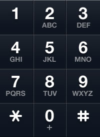

Hello fellow devs :wave:! Today we are going to discuss a popular problem which is asked by many tech giants in coding interviews.

- [Letter Combinations Of A Phone Number](https://leetcode.com/problems/letter-combinations-of-a-phone-number/)

## Problem Statement
Given a string containing digits from `2-9` inclusive, return all possible letter combinations that the number could represent. Return the answer in any order.

A mapping of digit to letters (just like on the telephone buttons) is given below. Note that 1 does not map to any letters.



### Constraints:
- 0 ≤ digits.length ≤ 4
- `digits[i]` is a digit in the range `['2', '9']`.

### Examples

Example 1:

```
Input: digits = "23"
Output: ["ad","ae","af","bd","be","bf","cd","ce","cf"]
```

Example 2:

```
Input: digits = ""
Output: []
```

Example 3:

```
Input: digits = "2"
Output: ["a","b","c"]
```

## Analysis
We all have seen above image in the good olden days :heartpulse: where we used to have better music and better life :smiley:. Before the time of touch screen, mobile phones used to have this keypad where each button represented some symbols — numbers, letters, etc.

In this question also, we need to find all the combinations of letters which can be obtained if a number is pressed. For e.g., from the above image `3` represents `def` and `5` represents `jkl` so if someone were to press `35`, they will get one of the following combinations — 

```
dj, dk, dl, ej, ek, el, fj, fk, fl
```

We need to find these combinations. If we look at it more closely, there are a few things to notice —
1. We need to take care of only numbers `2,3,4,5,6,7,8,9`.
2. There can be a maximum of 4 characters in a given string.
3. The result needs to be the Cartesian product of the given letters' combination.

## Approach
How do we solve it? If you are thinking about ***recursion***, then you are on the right track. At each stage of recursion there will be a digit that will represent some characters, and then we will recursively send the next digit to look for those set of characters that could be appended in our result string.

We can follow below steps — 
1. Construct an array where each index represents the corresponding letters on the keypad corresponding to that number. Since there are no letters with respect to `0` and `1`, for the sake of ease of accessibility, we will put dummy values on those indices. Such an array will look something like this —

```
lettersAndNumbersMappings = [
        "Anirudh",
        "is awesome",
        "abc",
        "def",
        "ghi",
        "jkl",
        "mno",
        "pqrs",
        "tuv",
        "wxyz"
    ]
```

2. Write a helper function which will contain the crux of our logic. This function will be called recursively.

3. In the recursive function, we should have a terminating condition. In our case, think when our recursion will stop :thinking:? It will stop when we have scanned all the characters in the given string. At that point, we will return.

4. If the terminating condition is not met then we will first find the letters corresponding to the current characters in the given string by referring to our mappings array. 

5. We will then loop for all the characters in the string obtained in the previous step and call make recursive calls with the strings after appending the current character and the string in the previous step.

### Time Complexity
The numbers in input string can represent strings of length of `3` or `4`. Let `m` be the number of digits that map to `3` letters and `n` be the number of digits that map to `4` letters. Thus, the overall time complexity will be ***O(3<sup>m</sup> × 4<sup>n</sup>)***.

### Space Complexity
The recursive call will use the stack memory equal to ***O(3<sup>m</sup> × 4<sup>n</sup>)*** and this will be the space complexity.

## Code

### Java

```java
public class LetterCombinationsOfAPhoneNumber {

    private static List<String> letterCombinations(String digits) {
        // Resultant list
        List<String> combinations = new ArrayList<>();
        // Base condition
        if (digits == null || digits.isEmpty()) {
            return combinations;
        }
        // Mappings of letters and numbers
        String[] lettersAndNumbersMappings = new String[]{
                "Anirudh",
                "is awesome",
                "abc",
                "def",
                "ghi",
                "jkl",
                "mno",
                "pqrs",
                "tuv",
                "wxyz"
        };
        findCombinations(combinations, digits, new StringBuilder(), 0, lettersAndNumbersMappings);
        return combinations;
    }

    private static void findCombinations(List<String> combinations, String digits, StringBuilder previous, int index, String[] lettersAndNumbersMappings) {
        // Base condition for recursion to stop
        if (index == digits.length()) {
            combinations.add(previous.toString());
            return;
        }
        // Get the letters corresponding to the current index of digits string
        String letters = lettersAndNumbersMappings[digits.charAt(index) - '0'];
        // Loop through all the characters in the current combination of letters
        for (char c : letters.toCharArray()) {
            findCombinations(combinations, digits, previous.append(c), index + 1, lettersAndNumbersMappings);
            previous.deleteCharAt(previous.length() - 1);
        }
    }
}
```

### Python

```python
def findCombinations(combinations, digits, previous, index, lettersAndNumbersMapping):
    # Base condition to stop recursion
    if index == len(digits):
        combinations.append(previous)
        return
    # Get the letters corresponding to the current index of digits string
    letters = lettersAndNumbersMapping[int(digits[index])]
    # Loop through all the characters in the current combination of letters
    for i in range(0, len(letters)):
        findCombinations(combinations, digits, previous + letters[i], index + 1, lettersAndNumbersMapping)


def letterCombinations(digits: str) -> List[str]:
    # Resultant list
    combinations = []
    # Base condition
    if digits is None or len(digits) == 0:
        return combinations
    # Mappings of letters and numbers
    lettersAndNumbersMapping = [
        "Anirudh",
        "is awesome",
        "abc",
        "def",
        "ghi",
        "jkl",
        "mno",
        "pqrs",
        "tuv",
        "wxyz"
    ]
    findCombinations(combinations, digits, "", 0, lettersAndNumbersMapping)
    return combinations
```

### JavaScript

```javascript
var letterCombinations = function (digits) {
    // Resultant list
    let combinations = [];
    // Base condition
    if (digits == null || digits.length == 0) {
        return combinations;
    }
    // Mappings of letters and numbers
    const lettersAndNumbersMappings = [
        "Anirudh",
        "is awesome",
        "abc",
        "def",
        "ghi",
        "jkl",
        "mno",
        "pqrs",
        "tuv",
        "wxyz"
    ];
    findCombinations(combinations, digits, "", 0, lettersAndNumbersMappings);
    return combinations;
};

function findCombinations(combinations, digits, previous, index, lettersAndNumbersMappings) {
    // Base condition for recursion to stop
    if (index == digits.length) {
        combinations.push(previous);
        return;
    }
    // Get the letters corresponding to the current index of digits string
    let letters = lettersAndNumbersMappings[digits[index] - '0'];
    // Loop through all the characters in the current combination of letters
    for (let i = 0; i < letters.length; i++) {
        findCombinations(combinations, digits, previous + letters[i], index + 1, lettersAndNumbersMappings);
    }
};
```

### Kotlin

```java
fun letterCombinations(digits: String): List<String> {
    // Resultant list
    val combinations: MutableList<String> = mutableListOf()
    // Base condition
    if (digits.isEmpty()) {
        return combinations
    }
    // Mappings of letters and numbers
    val lettersAndNumbersMappings = arrayOf(
            "Anirudh",
            "is awesome",
            "abc",
            "def",
            "ghi",
            "jkl",
            "mno",
            "pqrs",
            "tuv",
            "wxyz"
    )
    findCombinations(combinations, digits, StringBuilder(), 0, lettersAndNumbersMappings)
    return combinations
}

fun findCombinations(combinations: MutableList<String>, digits: String, previous: StringBuilder, index: Int, lettersAndNumbersMappings: Array<String>) {
    // Base condition for recursion to stop

    // Base condition for recursion to stop
    if (index == digits.length) {
        combinations.add(previous.toString())
        return
    }
    // Get the letters corresponding to the current index of digits string
    // Get the letters corresponding to the current index of digits string
    val letters = lettersAndNumbersMappings[digits[index] - '0']
    // Loop through all the characters in the current combination of letters
    // Loop through all the characters in the current combination of letters
    for (c in letters.toCharArray()) {
        findCombinations(combinations, digits, previous.append(c), index + 1, lettersAndNumbersMappings)
        previous.deleteCharAt(previous.length - 1)
    }
}
```

### Complete Code
- [Java](https://github.com/ani03sha/RedQuarkTutorials/blob/master/LeetCode/Java/src/main/java/org/redquark/tutorials/leetcode/LetterCombinationsOfAPhoneNumber.java)
- [Python](https://github.com/ani03sha/RedQuarkTutorials/blob/master/LeetCode/Python/src/Letter_Combinations_Of_A_Phone_Number.py)
- [JavaScript](https://github.com/ani03sha/RedQuarkTutorials/blob/master/LeetCode/JavaScript/src/letter_combinations_of_a_phone_number.js)
- [Kotlin](https://github.com/ani03sha/RedQuarkTutorials/blob/master/LeetCode/Kotlin/src/main/kotlin/org/redquark/tutorials/leetcode/LetterCombinationsOfAPhoneNumber.kt)

## Conclusion

Congratulations :clap:! We have solved one more problem from LeetCode.

I hope you enjoyed this post. Feel free to share your thoughts on this.

You can find the complete source code on my [GitHub](https://github.com/ani03sha/RedQuarkTutorials/tree/master/LeetCode) repository. If you like what you learn, feel free to fork 🔪 and star ⭐ it.

Till next time… Happy coding 😄 and Namaste :pray:!