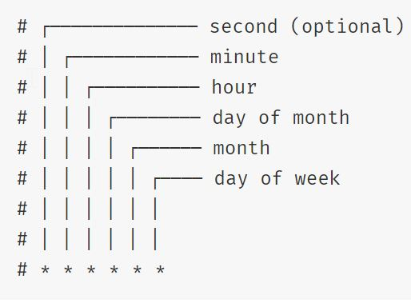

Hello fellow devs :wave:! This post contains the common and most frequently used JavaScript snippets. I am sure like me you have also found yourself in a situation where you are googling the most trivial stuff irrespective of your years of experience. To be honest, I still google how to parse `Date` to show it in the desired way :thinking:.

Therefore, the idea behind writing this post is to document some of the commonly used code snippets that a regular developer encounters in his/her daily life. My intention is to write this sheet to serve two purposes - 

- As a cheat sheet to quickly refer stuff while developing
- As a revision utility for interviews (hence the small explanation of the code snippets)

## Index
1. [Run Cron Job](#1-run-cron-job)
2. [Read From File](#2-read-from-file)
3. [Write To File](#3-write-to-file)
4. [Delete File](#4-delete-file)
5. [Send Email](#5-send-email)

## 1. Run Cron Job
There's a nice NPM module **[node-cron](https://www.npmjs.com/package/node-cron)** that lets us implement a cron Job very easily.

1. Install the NPM module in your project

```
npm install node-cron
```

2. Add following code at appropriate place in your code

```javascript
// Import module
const cron = require('node-cron');

// This expression defines the cron
const CRON_EXPRESSION = "*/10 * * * * *";

// Actual task to execute i.e., your business logic
const jobToExecute = () => {
    console.log('Running a task every ten seconds');
}

// This function runs the job based on the CRON_EXPRESSION
const run = () => {
    cron.schedule(CRON_EXPRESSION, () => {
        jobToExecute();
    });
}
```

3. Run the code and you will see the output as below

```
Running a task every ten seconds
Running a task every ten seconds
Running a task every ten seconds
Running a task every ten seconds
Running a task every ten seconds
Running a task every ten seconds
Running a task every ten seconds
    .
    .
    .
```

Below is a quick summary of how the cron expression is defined ([source](https://www.npmjs.com/package/node-cron#cron-syntax)).



## 2. Read From File

Reading from files is a common thing we do when we build an application using Node JS. Node provides a core module **[fs](https://nodejs.org/api/fs.html)** which lets us read file from the system easily.

We can read files in two ways - asynchronous (non-blocking) and synchronous (blocking). Usually the preferable way is non-blocking i.e., ask node to read a file, and then to get a callback when reading is finished.

1. Since it is a core module, we don't have to install it explicitly.

2. Include the following code in your application - 

```javascript
// Import the module
const fs = require('fs');

// This function reads the file and prints the data on the console using the callback function
const readFile = () => {
    fs.readFile('files/sample-text-file.txt', 'utf8', (err, data) => {
        if (err) {
            return console.log(err);
        }
        console.log(data);
    });
}

module.exports = { readFile };
```

Here, we are passing the path of the file to be read and the type of encoding.

3. The output will be - 

```
Lorem ipsum dolor sit amet, consectetur adipiscing elit, sed do eiusmod tempor incididunt ut labore et dolore magna aliqua. Ut enim ad minim veniam, 
quis nostrud exercitation ullamco laboris nisi ut aliquip ex ea commodo consequat. 
Duis aute irure dolor in reprehenderit in voluptate velit esse cillum dolore eu fugiat nulla pariatur. 
Excepteur sint occaecat cupidatat non proident, sunt in culpa qui officia deserunt mollit anim id est laborum.
```

If we wish to read the file synchronously then we can use the function `readFileSync` instead of `readFile`.

## 3. Write To File

Like reading from file, a common use case is to write into file. We can leverage the core **File System (fs)** Node JS module.

1. Since it is a core module, we don't have to install it explicitly.

2. Include the following code in your application - 

```javascript
// Import the core node js fs module
const fs = require('fs');
// The content to be written into the file
const contentToWrite = 'This content will be written into the file';

const writeFile = () => {
    fs.writeFile('files/sample-file-to-write.txt', contentToWrite, (err) => {
        if (err) {
            throw err;
        }
        console.log('File is saved!');
    });
}

module.exports = { writeFile };
```

3. If everything goes well, then the output will be - 

```
File is saved!
```

Here we are writing the file asynchronously. To write into a file in synchronous fashion we can use `writeFileSync` function instead of `writeFile`.

## 4. Delete File
So far we have seen reading to the file and writing to the file. Sometimes we need to delete a file. The core module of Node JS also allows us to do both synchronously and asynchronously.

1. Since it is a core module, we don't have to install it explicitly.

2. Include the following code in your application - 

```javascript
// Import the core node js fs module
const fs = require('fs');
// Relative path of the file to be deleted
const fileName = 'files/sample-file-to-write.txt';

// This function deletes the file
const deleteFile = () => {
    fs.unlink(fileName, (err) => {
        if (err) {
            throw err;
        }
        console.log("File deleted successfully");
    });
}

module.exports = { deleteFile };
```

This will delete the file from the mentioned path. If we wish to use the file synchronously, then we can use `fs.unlinkSync` instead of `fs.unlink`.

## 5. Send Email
We can easily send emails via the ***[nodemailer](https://www.npmjs.com/package/nodemailer)*** module in Node JS. Below are the steps -

1. Install ***nodemailer*** module in your project using the following command - 
```
npm install nodemailer
```

2. Now create a new file `sendEmail.js` and paste the following code in it.

```javascript
const nodemailer = require('nodemailer');

const toEmail = '<recipient-email-id>';
const fromEmail = '<sender-email-id>';
const subject = '<subject-of-the-email>';
const message = '<message-of-the-email>';

const transporter = nodemailer.createTransport({
    service: 'gmail',
    auth: {
        user: '<your-email-id>',
        pass: '<your-password>'
    }
});

const sendEmail = () => {
    const details = {
        from: fromEmail,
        to: toEmail,
        subject: subject,
        html: message
    };

    transporter.sendMail(details, (error, data) => {
        if (error) {
            console.log(error);
        } else {
            console.log(data);
        }
    });
};

module.exports = {
    sendEmail
};
```

3. First, we are importing the `nodemailer` module in our code. 

4. To send the email, we need to have `transport` object which will authenticate the sender. Here, you need to pass valid email address and password and the email client (`GMail` in our case).

5. Then we need to have some constants like sender's and recipient's email address, subject and message of the email.

6. At last, we will call `transporter.sendEmail` function to send and email.

> **NOTE:** You need to allow 'less secure apps' in GMail using the steps mentioned [here](https://hotter.io/docs/email-accounts/secure-app-gmail/).

## Conclusion

This post is currently in "Work In Progress". I will add more snippets to this post as and when I think of them. I would love if you awesome people also suggest some commonly used code snippets you encounter in your daily work.

As usual, you can find the complete code on my [GitHub](https://github.com/ani03sha/RedQuarkTutorials/tree/master/Snippets/JavaScript). If you find it useful, consider giving it a star :star:.

Happy Learning 😊 and Namaste :pray:.